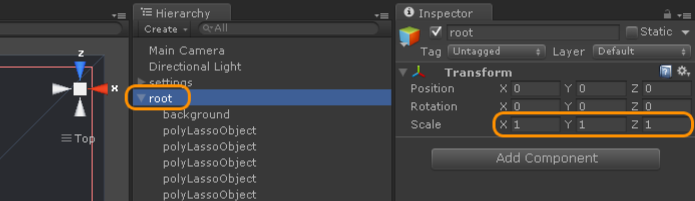
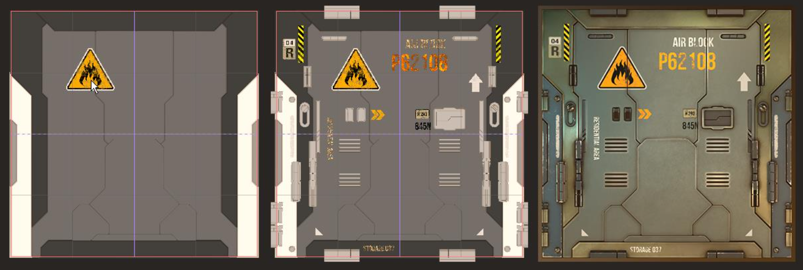
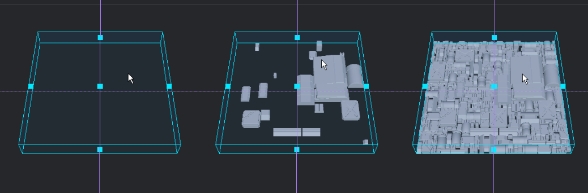

# Poly Lasso Tool

Poly Lasso 是构建 geometry 的工具。

类似 3D 建模软件中的 extrude，基于绘制的 2D 形状 extrude 为 3D 模型，但是更先进。Poly Lasso tool 使用一组 points 构成的形状和一个 profile 来 extrude poly。

Profile 是一个 2D Shape 如何成为 3D Model 的规则。

所有 Poly Lasso objects 作为一个 shape + profile set 保存在 scene。

Surforge 所有工具（纹理细节工具）都是创建、修改 poly lasso object。很多工具可能将一个 poly lasso object 分解为多个新的 poly lasso object，甚至创建 child poly lasso object，来得到特定的 geometry。

当一个 poly lasso object 被分割为两部分时，将会创建两个新的 shape，mesh 被重建，每个 object 继承 parent 的属性。

这使得 poly lasso object 极为灵活。poly lasso object = shape + profile。可以在任何时候改变一个 polly lasso object 的 profile，还可以 shrink/expand 来创建 outline effects。因此在 textureing 中非常重要。

Surforge 提供了丰富的 profiles，包括 child profiles 和 smart behavior，例如基于 edge length 和 corner 的 mesh 构建。

可以使用 Unity 标准的 transform tools 操作 poly lasso object。

## Poly Lasso tool actions

### 1. 使用 points 构建 shape

基本的 poly lasso 操作。

Left Click 设置 point，设置 point 后 Double Click 或 Enter 封闭形状。

Hold + Shift 45 度约束

默认开启对齐 Snapping（可以在 snap setting panel 改变对齐行为）。对齐任何东西：已创建的 poly lasso objects，grid，UVs，使得它非常方便和灵活。

### 2. 填充 UV island 或 background

Double Click

Time saver tool 用来创建 Poly Lasso objects，非常适合 UV islands。

可以配合 shrink/expand 一起使用来创建 outline effects。

绝大多数 Poly Lasso profiles 被设计为 protrude（突出）并向 shape 外面  slope down（向下倾斜），创建 edge padding。

如果它覆盖了相邻的 empty UV island，你可能也想填充它，来获得它们之间完美的 padding。

### 3. 分割被选中的 poly lasso objects

Ctrl + Left Click

将选中的 poly lasso objects 分割为不同的部分。

symmetry，multiple objects，self crossing。

Surforge 不使用带 holes 的 shapes。

用于分割的形状必须和 object 的边缘交叉或在其上面。

### 4. 删除最后一个 point

Backspace

### 5. 从左到右重复 shape points

Numpad 5

用来创建重复 pattern 的形状。在 Warp 模式下使用时，可以创建诸如齿轮类的形状。

### 6. 创建对称的连续形状

使用 numpad key 方向键控制对称的方向（numpad arrow：2，8，4，6）。是否可以用 1，3，7，9 表示对角方向？

在对称的方向上创建 points 副本，并将最后一个 point 和它的对称点连接起来。

### 7. 设置对称轴

Left Click，移动鼠标，Right Click。

设置 Poly Lasso 和 Add Detail 工具的对称轴。

Left Click 设置 center，Right Click 设置对称轴（两个顶点连线是 +X 方向）

### 8. 设置 UV island 的对称中心

Shift + Right Click

允许快速设置对称的 UV island 的对称轴。对称轴是对齐到纹理空间上的（水平和垂直），而不是 UV island。如果一个 UV island 是对称的，但是不是沿着水平或垂直方向对称，则需要手动设置对称轴。

### 9. 沿着对称轴（x轴或y轴）镜像最后一个 shape action

将刚才的形状操作沿着对称轴镜像重做一次。

Right Click：沿着 Y 轴镜像

Ctrl + Right + Click：沿着 X 轴镜像

用于快速访问对称操作（不需要先开启 symmetry 并对它进行设置）。

镜像最后创建的 shape，或者镜像地重复最后一次 split。

非常方便用于实时创建对称形状。

### 10. 重置对称轴

Ctrl + Shift + Right + Click

### 11. Arc mode toggle

Ctrl + Middle Click

组合 hard 和 rounded shape。

开启 arc mode，将最后一个 shape segment 转换成可调整的 arc。关闭 arc mode 记录上一次 arc setting。

### 12. 改变 Arc curvature 曲率

Ctrl + Scroll

### 13. 改变 Arc points 细分密度

Ctrl + Alt + Scroll

### 14. 设置曲率到 1/4 圆

Ctrl + Alt + Middle Click

默认的曲率，如果你想重置到这个默认值。

### 15. 设置当前active 的 warp shape（弯曲）

Alt + Shift + Right Click

从 active shape 或者选中的 Poly Lasso object 设置弯曲形状 Warp Shape 为之后使用。

Warp Shape 可以认为是一个自由曲线的坐标系。就是水平垂直的坐标系中，X 轴变换成曲线，Y 轴在曲线上个位置垂直于曲线。之前在垂直相交的坐标系中绘制的形状按照曲线坐标系进行弯曲。直线坐标系中 pattern 的位置，通常需要在 Y = 0 附件绘制（不必在原点附近，只采用 warped objects 的左右边界之间的相对区域），因为 X 轴将会沿着曲线弯曲。

用于沿着其他 objects 的边缘排列或者弯曲 objects，例如从一个 circle 创建一个齿轮。这是围绕一个 fantasy models 边缘弯曲排列装饰物的最好方法。

### 16. 重置 warp shape

Ctrl + Alt + Shift + Right Click

### 17. 弯曲选择的形状 / 创建选择的形状 /  重复弯曲

Alt + Shift + Left Click

使用前设置的 warp shape 弯曲一个 Poly Lasso object。

当 Poly Lasso tool active 时，warp 功能将创建新的 poly lasso objects，就像 active shape horizontal（x 轴）坐标系沿着 warp shape 弯曲，而 vertical（y）则沿着曲线法线方向偏移。

如果 shape 与 texture edges（0~1 矩形）相交，shape 将会被缩放来匹配 warp shape（应该是，如果 warped 之后的形状超过了 texture 矩形空间，则将它缩放到 0~1 矩形区域内）。

当 Poly Lasso tool inactive 时，可以弯曲已经创建的选择的 poly lasso objects。

Poly Lasso tool active 时，使用当前正在创建的形状，可以是不闭合的；Poly Lasso tool inactive 时，使用选择的 poly lasso objects 的 shape，总是闭合的。

如果两个 poly lasso objects 被选中，它们将会被沿着 warp shape 无缝地重复（轻微的缩放来完全匹配 warp shape 的长度，即不会最后只剩下不完整的空间，保证 warp shape 的长度是缩放后的 poly lasso objects 的长度的整数倍）。

### 18. Warped split

Ctrl + Alt + Shift + Left Click

和 warp creation 功能一样，但不创建新的 objects，而是使用 warped shape 分割 split 被选中的 poly lasso objects。

使用方法都是提前设置一个 warp shape（就像一个全局寄存器，是一个全局状态）。之后在任何时候，绘制 warped shape，然后激活响应的功能（shortcut），

## Construction plane

构建平面，类似 UModeler Floor，新创建的 poly lasso objects 所在的平面，定义垂直位置。

这允许创建多层次的，3D 外观的纹理。你可以使用固定步长快速向上向下移动构造平面。你还可以在场景中使用 Unity 标准操作移动 poly lasso objects。

## Poly Lasso profiles

Poly Lasso Mode 可以选择一个 profile 用来创建新的 objects，也可以在 Poly Lasso Mode inactive 时，选中已经创建的 object，点击一个 profile icon，改变现有 object 的外观。

尝试不同的 profiles，联合使用向下向上移动 objects（Up Arrow，Down Arrow），copy/paste 以及 shrink/expand（Left Arrow，Right Arrow）来获得无限的独特纹理。

Profiles Type

- Simple profiles

  extrude(blender 推挤 2d 形状）。shape 边缘自上向下，从内向外倾斜。所有 profiles 被设计可以在 border 上形成优美的空隙 gap（在 geometry top 向内 offset，bottom 向外 offset）。因此当你将 Poly Lasso object 分割为两部分，就可以立即得到好看的缝隙。

- Floater profiles

  inside-out 由内向外 extrude shapes。当把它放到其他 objects 上时，Surforge 将它们的 normals 作为 negative 渲染，形成下层 deepening 外观。

- Closed loft profiles

  环形 object，内部是空的。用来创建 outlines 和 线条 形状。

- Open loft profiles

  各种类型的管道和管线，非常适合 sci-fi 和 technical 纹理。

  

- Smart profiles

  具有反应 edge length 和 corners mesh detail 的 profiles。

  

- Convex hull profiles

  形成一个 convex hull mesh，就好像它被包裹以一个有弹性的布料。这些 profile 忽略 shape 水平的凹陷（即在水平上面创建凸包），并具有更高的 height。

  用于 volumetric stones，砖块，和宝石。

- Celtic ornmaent profiles

  凯尔特装饰物 profile。特殊的闭合 loft profiles，允许 shape self-crossing，并自动形成 overlaps，编织它们为凯尔特风格装饰物。非常适合添加 fantasy texture 细节。

  

  

  同时，profiles 可以具有 chamfered 或 rounded edges，child Poly Lasso follower objects，own normal 和 ambient occlusion texture 和 内置 noise。

  还可以创建自定义 profile assets。

## Grids

显式网格和 UVs，用于参考

1. Show Grid：显示常规 grid，默认隐藏
2. SHow UVs：显示当前预览模型的 UVs，允许 snap，reference，双击填充 UV islands，以及使用 UV based 对称。这个 mode 和 UV Grid mode 是互斥的
3. Show UV Grid
4. Show Actions
5. Show/Hide symmetry axes

Surforge 提供了独特的 UV Grid 特性。当加载一个 model 用于预览时，Surforge 尝试为每个 UV island 构造单独的 grid lines。结果 grid lines 将会被显示而不是 UV polygons lines，以及 UV island borders。

如果 UV island 太复杂，可能不会为它添加 grid lines。对于复杂模型和随机朝向的 UVs，则只使用常规的 UV mode。

## Snapping

1. Trun snapping on/off, 默认 on
2. Snap to grid：默认 off
3. Snap to UVs：对齐到 UV points 和 poly lines，或 UV Grid lines/points/border，不对齐到 UV poly lines
4. Snap to object：对齐到现有 Poly Lasso Objects 的 points 和 lines。还对齐到 Poly Lasso objects seamless instances（创建无缝纹理的重复实例）的 points
5. 对齐到此时创建的 shape。 这会 react 到当前 shape 的 直角和相对的 points

对齐到 Grids，UVs 的 point，line，boder。

对齐到现有 poly lasso object shape。

对齐到正在创建的 shape。

## Symmetry

Symmetry 用于 Poly Lasso 和 Add Detail Tool，创建对称纹理。

快捷键 S。Symm x z \ 设置对称（x，z，对角）

对称轴一个实线一个虚线。默认在 texture 中心。

可以手动设置对称轴 (在 Poly Lasso mode，左键单击，移动一点，右键单击)。对称中心是左键单击的位置，对称轴（x 轴）对齐到右键单击方向。

Shift + Right Click 设置对称轴原点到 UV island，在 Poly Lasso 和 Add Detail Tool 模式下。这允许快速使用基于 UV island 的对称。对称轴将会是纹理对齐的，而不是 UV island 对齐的。对于随机朝向的 UV island，你可以手动设置对称轴。

Ctrl + Shift + Right Click 重置对称轴。

使用 Poly Lasso tool 你可以创建单独的对称 objects（master shape 和对称的 spape 是分开的）。如果 master 和 symetry objects 的 endponits 是匹配的，Poly Lasso tool 还会将它们合并为一个对称的 object。

可以在 Poly Lasso mode 下使用 symmetrical split shapes 分割多个 objects，例如对于复杂对称的装饰品，装饰瓷砖，镶嵌图案。但是注意，Spliting 是 CPU 密集的操作，而且有时会产生错误的结果，此外 undo 复杂的 split 操作也是缓慢的。

在 Poly Laso 模式下，你还可以在一个 solid line（Right Click）或 dotted line（Ctrl + Right Click）上使用 Mirror last shape 操作。

使用它来快速访问 symmetry（而不需要切换 symmetry on 并修改它的控制）。这会在对称线两侧 mirror 上次 created shape，或重复上一次 split。它和快速设置对称轴联合使用，可以非常方便。

## Seamless mode

除了 3d model texturing，你可以使用 Surforge 很容易地创建 seamless square textures，通常用于 level design。

Seamless mode 和 Poly Lasso 和 Add Detail tool 一起使用。当 Seamless 模式打开，Surforge 将会创建你创建的所有 objects 的 matching instances，在你的 texture space 快速重复。这些 instances 被连接到它 master objects，实时更新它们的 shapes，transform，material masks。这开启非常高级的 seamless 3d mixing，允许你创建极好的 seamless 3d textures。

Surforge 被设计为最精确地匹配 master objects 和 instances，很少有 objects 可能失去同步（desynchronize）（Surforge 不会实时深度遍历完整的 children tree，以优化性能）。这可以通过切换 Seamless mode off and on 来快速修复，并且在最终渲染前建议这样做。

## Root object and global texture scale

Poly Lasso object profiles 使用默认的 size 设置以得到对绝大多数游戏开发任务最佳的匹配 - low poly meshes 使用中等大小的 UV islands 和单独的矩形 textures。对于复杂 meshes（带有很大 surface 区域和很小 UV islands），你可能想改变你的 global texture scale，以使 Poly Lasso objects 更好地匹配你的 model scale。

这个非常容易地在 Unity inspector 或标准 scale tool 通过 Root object 的一致缩放来完成。Root object 是所有 Surfoge 创建的 geometry 的 parent object，而且大多数 Surforge tools 可以正确地处理它的 scale（除了 Warping 操作，现在还不能，会在将来改善）。

你还可以在操作 texture 时，随时改变 Root size，所有的现有 child objects 都会一起改变。Poly Lasso objects 将会保持交互性，继续正确地处理 splitting 和 shrink/expand。这对操作特别好和大的细节非常方便。

## Warping

当使用 Poly Lasso tool 时，如果想要，可以在 deformed 坐标空间 coordinate space 上工作。X 轴是沿着 Warp object 边缘的曲线，Y 轴是曲线上的处处垂直向外的法线。坐标轴（coordinate axes）可以沿着任意 shape 弯曲。

Warping 操作用于 deforming 现有 Poly Lasso objects，创建 warped objects，并沿着其他 objects 或想要的 shape 的边缘排列编写 objects 的许多实例。例如，你可以从一个 circle 和一个 笔直的锯齿线创建一个 gear 形状的 object。非常适合用来沿着一个 fantasy models 的边缘弯曲装饰物。

它如何工作：

1. 设置 warp shape (Alt + Shift + Right Click).

   从 active shape 或 selected Poly Lasso object 的 shape，设置 Warp Shape 为将来使用，在 Scene View 中将会出现紫色的 shape。现在它将是你进行 Warping 操作时的水平轴（X）。垂直的小直线显示你的 warped coordinate space 的开始和结束的点。之后的 warped object 的 Shape 的垂直坐标（Y）将会是相对于 warp shape 边缘垂直（法向量）。

   你还可以在任何时间重置 warp shape (Ctrl + Alt + Shift + Right Click)，或设置为其他 shape。

2. Warp selected / Create warped shape / Repeated warp (Alt + Shift + Left Click).

   使用之前设置的 warp shape 执行一个 Poly Lasso object。这个操作是上下文敏感的。

   当 Poly Lasso tool 激活时，它将会使用 deformed coordinate system 创建一个新的 object。因此如果你的 warp shape 是一个 circle，而你的 poly lasso shape 是一个 line，你将会得到一个 circle。如果 poly lasso shape 是一个锯齿线（jagged line），将会得到一个齿轮形状 object。

   如果 shape 和一个 texture 边缘在水平方向上相交，shape 将会被缩放以匹配 warp shape（不再相交）。

   当 Poly Lasso tool 非激活时，这个功能可以 wrap 选择的已创建的 Poly Lasso objects。

   如果两个类似的 Poly Lasso objects 被选择，它们将会在 warp shape 上无缝地重复（略微 scaled 以完全匹配 warp shape 长度）。

3. Warped split (Ctrl + Alt + Shift + Left Click).

   和上面一样，但是使用一个 warped shape splits 选择的 Poly Lasso objects。

   为了可预测的和很好的结果，将你要 warp 的 shapes 放置在你的 texture space 接近水平轴（X）的地方。你要 warp 的形状的 point 和 texture space 的水平坐标轴（X）的距离越大，约会导致弯曲过度的效果，并且可能是不合适的 warping。

   

   用于 warping object Shapes（蓝图，profile，边缘线），可以位于 texture space 中的任何地方，但是形状不应该太极端（曲率太大，边缘变化太剧烈）。

## Add Detail tool

纹理添加细节工具，你可以容易地添加有趣的特征到纹理上，使它更具有吸引力。实际上，这个工具是一个丰富的 model 和 label kitbash library，以及简单高效的设置工具。它支持对称 symmery 和 seamless 无缝模式。

Library 中的 Details 和 Labels 是基于 mesh 的，因此是分辨率无关 resolution-independent 的，并可以任意缩放。（Text titles 具有高分辨率的字体和 noise textures）。

当激活 detail tool 时，简单地从 tool panel 上的滚动列表中选择想要的 object（detail 或 label），并设置它到 Scene View 中。

你还可以添加自定义的 Detail tool assets 到 library 中。

## Add Detail tool actions

1. Set objects (Left Click).

   将选择的 object（detail 或 label）设置到 scene 中

   

2. Rotate (Left Button hold + drag).

   旋转 object（detail 或 label）。这个 workflow 是在 setting 之前旋转 object。旋转时候它不会被设置或保持位置不变，因此可以预览旋转时候的效果。

3. Rotate and Scale (Left Button hold + Shift + drag).

   和上面类似，但是同时缩放 object。

4. Constraint Move, Rotate, Scale (Hold Ctrl).

   约束移动，旋转，缩放（步长，对齐）

5. Move object up and down(Up Arrow, Down Arrow).

   上下移动 object，object 就是具有 mesh 的 gameobject。

6. Object scale increase/decrease (Right Arrow, Left Arrow).

   缩放 object sacle。

7. Flip object or randomize text (Right Click).

   对于具有不同变体 variants 的 objects，右键点击来随机变化它。目前，library 中只有一个 asset 支持它 —— “simple rock”

8. Set symmetry center to UV island (Shift + Right Click).

   设置对称 symmetry 中心到 UV island 上。

9. Reset symmetry axes (Ctrl + Shift + Right Click).

   

   

## Label objects

Label objects 是 Add Detail tool library object 类型中的一个。它们有自己的内置的 mask 用于 render，单独的 specular/glossiness values。Label objects 正确处理底层 material 的 ambient occlustion，dirt 和 worn（磨损） 边缘 edge。例如，如果一个 label 被设置到一个磨损边缘上，磨损边缘的底层金属将会透过 label 磨损暴露出来，就像它本来应该的那样。

## Text title generator

当添加 text titles 到你的 sci-fi 纹理上，你可能想要生成它的随机 text。Surforge 使用一个简单的 titles generator 节省你的时间，移除了你需要发明和手动输入 title texts 的需求。只需要右键点击 title text 就可以随机文本，直到你满意为止。

当然你可以输入这些文本。还有，你可以使用 Unity Inspector 改变文本颜色和噪声程度（就像 Unity 3D Text object 一样）。

## Render

这个模式中，tool panel 展示 render 和 model preview 设置，skybox 控制，material mask 操作工具，screenshots 控制，和 maps 导出。

你可以使用 Space hotkey 在任何时间渲染你的 texture，而不需要切换到这个 panel

### Material masks

Panel 顶部的数字 button 是用于为选择的 objects 赋值 material masks 的，而 E1 和 E2 buttons 是用于为选择 objects 赋值 emission masks 的。你可以使用数字键设置 material masks，而不需要切换到 Render panel。

键 1-9 代表 material masks，9 和 0 键用于 emission masks。相同 mask 的 objects 将会被赋予相同的 material，类似 Material ID map（which Surforge creates on the fly during the render）。

Surforge 可以处理 8 个 material masks，2 个 emission masks，和用于 labels 的单独的 render layer。因为 Surforge material system 是基于 GPU 的，这个 mask 数量是出于性能和理性的原因指定的，使得它允许实时的工作，并且另一方面，这对于绝大多数赋值的 texture 设计足够了。

### Material mask and object tools

Materials mask button 下面的 controls group 用于一些 scene objects 的 material masks 和 vertical position 的便捷操作。

1. 为选择的 objects 赋值随机 Material Masks 

   如果没有 objects 被选择，它赋值 random material mask（1-8） 到 Poly Lasso 和 Add Detail tool 创建的所有 objects 上。非常适合制作 mosaic textures，以及发行合适的 texture color 设计。

2. Shift selection Material Masks.

   Shift 是一个轻量的 material mask 随机：一些 objects 被 mask+1，一些不变。非常适合添加一些 nice random 到 texture color schemes 上。例如，你可以添加一些 errors 到 mosaic texture，使它更有趣和真实。

   如果没有选择任何 objects，为所有 objects shift material masks

3. Assign same Material Masks to similar objects.

   通常用于随机化 material masks 之后，使得对称的 details 具有相同的 material masks。

   如果没有选择任何 objects，为 scene 中所有类似的 objects 赋予相同的 material masks。

4. Assign random vertical offset to selected PolyLasso objects.

   和上面类似，但是随机化 objects 的位置，而不是 material masks。Ambient occlusion 显著地强调 objects 的高度，因此垂直 offset 的改变在一些情况下很方便。例如 stone block texture。如果需要重复几次以得到显著的效果。

5. Assign same vertical offset to similar PolyLasso objects.

   为相似 PolyLasso objects 赋予相同的 vertical offset。

### Render resolution

一个设置渲染分辨率的 dropdown menu。你可以选择 1024，2048，4096. 通常在现代硬件上 1024 会立即渲染，而 4096 需要花费几秒钟。

### Model preview fields

拖放你的模型到这里，用于预览 texture，在 Unity Scene View 中的 texture workspace 上显式模型的 UVs。模型的 UVs 将会用于一些 amazing 功能，例如基于 UV island 的对称和对齐 symmetry and snapping。如果 model 已经 baked ambient occlusion 或 normal maps，将它们拖放到相应的字段，Surforge 将使用它们作为 base。如果你只想创建方形纹理，将这些字段保留为空。当你操作 texture 时，你可以在任何时间改变这些。如果没有选择任何模型，Surforge 将会在 cube 上预览你的 texture。

### Export maps

Albedo, Normal, Ambient Occlusion, Specular(Glossiness on alpha channel), Height and Emission maps will be saved. Drag them to Unity Standard shader fields to get exactly the same result as in Texture Preview. You could use Ctrl + E hotkey for it.

Albedo, Normal, Ambient Occlusion, Specular(Glossiness on alpha channel)，Height 和 Emission maps 将会被保存。将它们拖放到 Unity 标准 shader 字段中将得到和 Texture Preview 完全一样的结果。快捷键 Ctrl + E。

### Screenshot taking controls

捕获 texture preview 的 screenshots 的按钮。截屏将会被保存到 Assets/Screenshots.

Show wireframe 按钮在 Texture Preview 中使用 wireframe shader 创建 model 的副本，以及 textured model（用于 screenshots）。你可以在 hierarchy 中选择并移动到想要的位置。次卧，这个 button toggles screenshot layouts。Screenshots 可以有两个不同的 layouts：

1. Textured model 和 wireframe model, 以及在底部的 material probes（Show wireframe 打开）w
2. Textured model 和 the maps preview 在旁边 (Show wireframe 关闭).

### Skybox selection

用于 preview 模型的 skyboxes 的列表。

## Greebles tool

A greeble (/ˈɡriːbliː/ GREE-blee) 是一个添加在一个很大 object 表面的出色的装饰细节，使它看起来更加复杂，因此视觉上更加有趣。它通常给观众增大规模的印象（impression of increased scale）。细节可以从简单的 geometry primitives（例如 cylinders，cubes，rectangles）生成，或者更复杂的形状，例如机械的部分（cables 管线，tanks 水箱，sprockets 链齿轮）。Greebles 经常出现在虚幻的 spacecraft 或科幻题材中的建筑结构的模型上，并且被用于电影工业（特效）。

A cube and its greebled version

Greeble effects on a Lego spaceship model

A filming model of the mother ship from

Greebles tool 使用大量随机散布的小细节填充矩形形状区域。它几乎总是用于 sci-fi 纹理。对于大多数其他任务，应该使用 Poly Lasso 和 Detail Tool。

Greebles tool 有一些 tricky，但是难以置信的强大，它允许你得到独特的效果和极好的 sci-fi texture 元素。

Random greebles scattering 想法不是新颖的，你一定看过这样的软件，但是 Surforge de Greebles tool 更加先进。Greebles 工具的主要功能是 greebles 彼此交互（影响）。Greebles 之间的基本交互时避免和周围其他 greebles 相交。一些 greeble 集合表现的更加智能，可以改变它们的外观，形成 borders 和 corners。

Greebles tool 是基于体素的，因此它倾向于形成矩形模式 patterns。Greebles 自身是 meshes，并且它们有附加的 voxels，来处理它们的碰撞和逻辑。

Greebles 响应周围 greeble objects，并且不响应 Poly Lasso 和 Add Detail tool objects。

### Greeble tool actions

1. 改变 greebles 区域大小（拖拽蓝色方块）

   Greebles 只在选择的 volume 中出现，从不会超出它。一些 greeble 集合可能和 volume edges 交互，形成 borders 或 改变它们 grow 的方向。Greebles 工具工作于 3D 中，因此 greebles 还在 height 中 grow，根据选择的 greeble set 和可用的空间，可以形成层次化模式 layered patterns。Greeble volume controls 为此包含 height control，当你从 side 看时就会看见。

2. Scatter (Left Click).

   在选择的 volume 中的构造平面 construction plane 上随机创建 greebles。

   

3. Grow (Shift + Left Click).

   在选择的 volume 中其他 greebles 周围创建 greebles。Grown greebles 将会根据 greeble set 的 design 被选择和设置方向（例如 tubes 将会在正确的方向上 grow 其他 tubes）。注意，不是所有 greeble sets 都被设计为 growing。如果什么都没有发生，则使用 Scatter。

4. Reroll (Right Click).

   移除最近添加的 greebles，并重新 scatter/grow 它们，随机它们的位置和外观。

5. Remove in order (Shift + Right Click).

   以被创建的顺序移除 greebles。因为 greebles 是基于体素的，并且存储为 octree，手动删除或移动它们将在 octree 中留下它们的 voxels（不可见但真实存在的），并打破它们的逻辑（greeble models 仍然可以被正确移动和渲染）。目前阶段，它是移除 greebles 唯一正确的方法（以后将会改进）。

   请注意，包含大量 greeble objects 的 scenes 可能会占用大量的磁盘空间，并需要花费一些时间保存和加载。

## Materials Tool

这个工具模式提供对预定义 materials 的访问，用于拖放它们到 texture view。

当拖放 material 到 texture view 时，它将会根据 object 的 material masks 实时更新 cursor 下方的 texture 区域。你可以拖放 material 到 texture view 的合适区域，或者将它移动回来并选择另一个。这对于快速发现你的 texture 的合适的颜色和 material 设计非常有用。

你还可以添加自定义 materials 到这个 list 中，但是创建和操作 material sets 而不是单个的 material 非常方便。

## Decals, Deform, Shatter

用于 Poly Lasso objects 的 3 个使用工具组。用于为 Poly Lasso objects 添加一些特殊效果，例如 mosaic（马赛克），randomly shaped stone blocks（随机成型石块），以及在 poly lasso objects edges 添加细节散布。选择一个或几个 Poly Lasso objects，从每个 group 的 tool list 选择一个想要的 preset，并点击 button。

### Decals tool

在 Poly Lasso object 的 shape 或 corners 周围散布 tiny geometry 集合。用于在 object corners 添加铆钉，或在石块或 boards 上添加一些随机外观磨损（worn-looking）的细节。可以添加不知一个 set。

Remove decal 按钮从 poly lasso object 上移除最后添加的 decal set。

### Deform tool

选择使用的 noise preset 变形 poly lasso object（基于噪声变化 mesh 的 vertices）。对于 object，只可以应用一个 noise preset。下一次 deform button 按下随机这个结果。

Remove noise 按钮移除选择的 poly lasso objects 的 noise。

### Shatter tool

将 poly lasso objects 粉碎为很多部分。非常适合制造 mosaic 和砌石 stonework 纹理。你可能想要将它和 “convex ston” polay lasso profile 和 deform tool 一起使用。有一些简单的 preset，和一些不同密度的 Voronoi（泰森多边形）模式 pattern。在很大的 objects 上应用高密度的 shatter 可能要花费一些时间。

