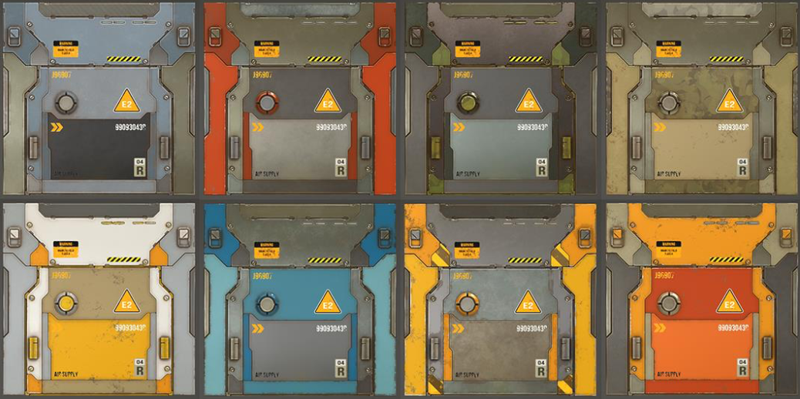

# Surforge material system

Surforge 使用强大的，基于 GPU 的，高度可定制的 material system。它实际上是一个复杂的高级 shader，具有大量可以调整的参数，以及一些令人惊叹的内置特性。

Surforge 的一个主要特性，就是它所有的 material 的操作都是事实的，因为它是基于 shader 的 （GPU based）。

这指的是完全实时的，而不是 ”just fast“。它允许使用 mouse scroller 查找 variants，或者实时拖放 results previewing。和传统方式相比，它就像魔法一样。在以前，你必须等待你的 changes 被应用，在 Surforge 你可以简单地通过 scrolling 大量 variants 来找到合适的 material solution。

## Material sets

为了优化生产力，Surforge 使用 Material Sets 进行操作。Material Set 是一个包含 8 个 material 的 group，被相应的 material masks 使用，被赋予到 scene objects 中。除了操作单独的 material，Surforge 允许立即在整个 Material Sets 中切换，用于快速发现合适的 color schemes，或同时操作多个 texture variants。

和 8 个 materials 一起，每个 Material Set 还包含 2 个 emission materials，2 个单独的 dirt layers，以及一组全局控制 global controls（同时影响 set 中的全部 materials）。

Material sets 自己存储 materials，而不是 links 到这些 materials。因此改变一个 set 的 material， 不会影响其他 set 中的 material。

## Materials

每个单独的 material 有它自己的属性，例如 albedo，specular 和 glossiness 设置，worn edges 设置，和两个单独的 paint layers。
