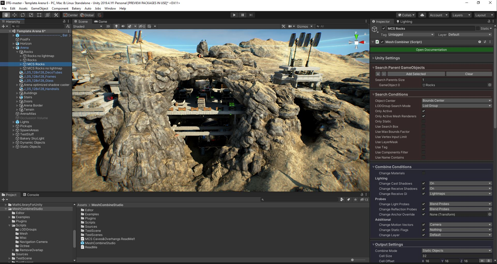
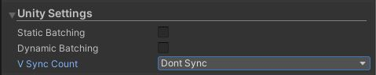
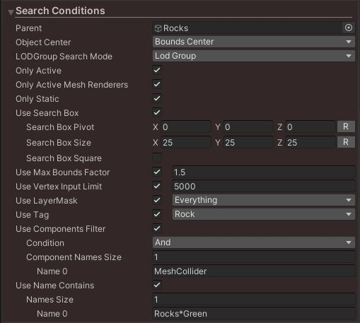
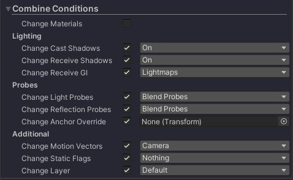
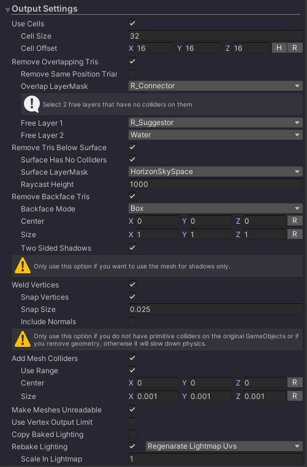
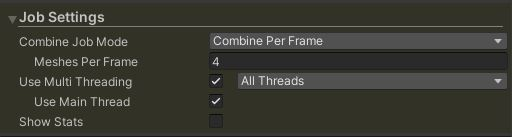
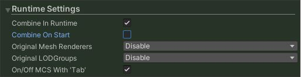
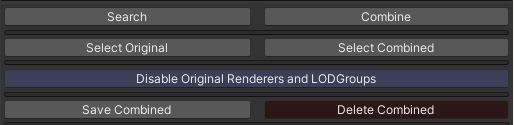
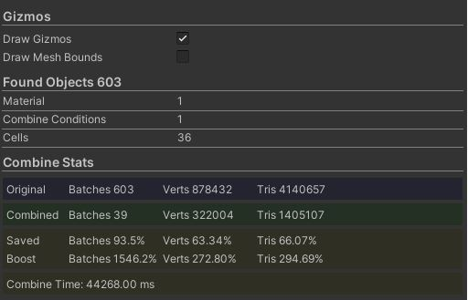

## MCS in our Game and Demos

We make extensive use of Mesh Combine Studio in our game D.R.O.N.E. which we release step by step on Steam Early Access. We use MCS in our Arena Editor and pre-made Arenas. Without MCS in our Arena Editor, that build would run at 1-3 fps as we use very small meshes for our modular buildings which leads to massive draw calls, with MCS combining the draw calls get very low and buildings render super fast. Also MCS gives a huge performance boost on our pre-made arenas, where we are able to not only combine but also remove ~60-80% geometry from the rocks, and some arenas are build almost entirely out of rocks.

没有 MCS，build 将会以 1-3 fps 运行，因为我们为模块化 building 使用了大量非常小的 meshes。

MCS boosts performance about 2170%! (from 37 to 805 fps) on my Nvidia 980TI compared to Unity’s batching.

## Getting Started

简单拖拽 MeshCombineStudio prefab 到 scene 中。你可以使用多个 MCS prefabs 用于同一个场景中的不同设置。如果你在运行时使用 MCS，确保你关闭了 Unity 的 static batching，否则 Unity 的 static batching 将会先合并 meshes，然后 MCS 会再次合并，这将导致两次合并产生错误的结果。

MCS 是完全自动化的，就像 Unity 的 static batching，你不需要做繁琐的手动合并。MCS 使用一个聪明的 cell-based 合并技术来工作，它是对 culling，z-sorting 和 LOD switching 的优化。让 MCS 与众不同的是它支持 LOD meshes，并且 MCS 可以移除对于相机不可见的 geometry。例如在一个 terrain/mesh 下面的三角形，以及背景 terrain 的 backface triangles 等等。和 MCS Caves & Overhangs 扩展一起，你可以从重叠的 meshes 中移除三角形，例如重叠的 rocks。需求时这些 meshes 是靠近的。LODs 是逐 cell 合并，逐 cell 切换的。这提供了更好的性能，并且作为奖励，可以给出更少的 LOP popping（LOD Mesh 突然出现）的不自然现象。

如果你在原始 GameObjects 上有任何 scripts，colliders，audio sources 等等，这些将会保持工作，因为 MCS 只会在原始 GameObjects 上关闭 MeshRenderers。在 geometry removal 场景中，你可以选择生成新的 mesh colliders，这会 deactivate 原始的 colliders。合并可以很容易地翻转，或者通过点击 Delete Combined 按钮，或者可以点击按钮在 original state 和 combined state 之间切换来比较性能。记住 Unity Editor 可能给出不准确的性能报告（不总是），最好在 build 中测试和比较。有时在 MCS 合并之后，Unity Editor 可能会给出被合并前更慢的性能，而在 build 中性能则更好。

MCS Inspector 分为 8 个部分：

- Unity Settings
- Search Conditions
- Combine Conditions
- Output Settings
- Job Settings
- Runtime Settings
- Execute Buttons
- Gizmos & Combine Stats

记住 MCS prefab 的默认设置是一个很好的开始。

### Unity's Settings

这是访问 Unity settings 的快速方式（Player and Quality Settings）

- Static Batching

  Enable/Disable Unity’s static batching (same setting as in Player Settings).

- Dynamic Batching

  Enable/Disable Unity’s dynamic batching (same setting as in Player Settings).

- V Sync Count

  Enable/Disable Unity’s V Sync Count settings (same settings as in Quality Settings). Disable V Sync to measure true fps gain, otherwise Unity will cap to 60 fps.

### Search Conditions

使用 Search Conditions，你可以过滤出 MCS 将会合并的 meshes 的 GameObjects。不满足条件的 GameObjects 将会被跳过。

- Parent

  The GameObject parent to search inside. Any GameObject child that meets the search conditions will be combined.

- Object Center

  Which position should be used to determine in which cell the mesh will be placed, the center of the mesh bounds in world space or the transform pivot.

- Only Active

  Only combine active GameObjects.

- Only Active Mesh Renderers

  Only combine GameObject with an active Mesh Renderer.

- Only Static

  Only combine GameObjects that have any static editor flag set.

- Use Search Box

  Only combine meshes that are within the bounds of the search box.

  - Search Box Pivot/Size

    The pivot position and the size of the search box.

  - Search box square

    Makes the search box square.

- Use Max Bounds Factor

  Only include meshes which bounds are not bigger than x times the cell size (Cell Size can be chosen in Output Settings). This option limits that too big objects are included which would make cell bounds too big for optimal camera frustum culling.

- User Vertex Input Limit

  Only combine meshes that don’t exceed this vertex limit. MCS works best on small and medium meshes. Combining takes more memory than without, so having a good balance with only combining the necessary smaller meshes is important. I recommend to use a vertex input limit of around 5000. Unity’s static batching doesn’t have such filter option and it would all need to be selected manually to save memory, which can be tedious. For LOD Group meshes this option will be ignored, as combining the lower LOD levels is very beneficial.

- Use LayerMask

  Only combine GameObjects who’s Layer is in this selected LayerMask.

- Use Tag

  Only combine GameObjects with this selected Tag.

- Use Components Filter

  Only combine GameObjects with a certain component.

  - Condition And: Only include GameObjects that have all components.

  - Condition Or: Include GameObjects that have one of the components.

  - Condition Not: Exclude GameObjects that have one of these components.

- Use Name Contains

  Only combine GameObjects with a certain name (similar to windows explorer file search). E.g. can use Rocks*Green and will include all GameObjects that contain the word ‘Rocks’ and ‘Green’.

### Combine Conditions

合并条件决定哪些 meshes 将会合并到一个 mesh 中。如果任何 "Change" 类 setting 被关闭，MCS 将会合并那个指定 setting 的 objects 到一个合并的 mesh 中。例如，在上图中，Change Materials 被关闭，意味着 MCS 将会合并相同材质的 objects 到一个 mesh 中。因此如果原始 objects 有 3 个材质，则它将会产生 3 个合并的 meshes。开启它，MCS 将会合并所有 meshes 到一个 mesh 中，伴随你选择的 output material。例如，你有需要和不需要 lightmap baking 的 meshes。使用关闭的 Change Static Flags，MCS 会自动分别合并这两种 meshes。

因此使用任何 disabled 的 "Change" setting，MCS 将会使用 original setting 和 separate combining，并且合并的 meshes 将会具有 original setting。使用任何 enabled 的 "Change" setting，MCS 将会忽略 original setting 并合并所有到你选择的 output setting 中。这样你精确控制什么应该合并到一起。否则，你将需要使用多个 MCS prefabs 在不同的 parents 中分类 objects。

使用全部 enabled 的 "Change" settings，包括 "Same Material"， 所有具有不同 materials 的 meshes 将会合并到一个 material（一些 meshes 仍然会需要一个特殊的 material，例如在 cut-out shader 的场景，这通常用于 vegetation 和 billboards 的场景）。合并所有 materials 到一个甚至可以减少 shadow rendering 需要的 draw calls，因为 shadow rendering 是非常昂贵的，尤其是使用多个 shadow cascades 的时候。对于每个 shadow cascade，Unity 需要重绘 geometry。可以在 Unity stats window 中看见增加的 draw calls。在那之上，你还可以开启 Output Settings 中的 weld vertices 选项。这会移除相同位置上的 vertices。

为了这个选项可以工作，你需要 2 个 MCS prefabs：

在第一个 prefab 正常地合并 meshes：

- 开启 Change Cast Shadows 开关，并且 output = Off
- 开启 Change Receive Shadows 开关，并且 output = On

在第二个 prefab 合并 shadow meshes：

- 开启 Change Material 开关，并选择一个带有一个支持 shadows shader 的简单 material（这可以是 Unity standard shader）
- 开启 Change Cast Shadows 开关，并且 output = Shadows Only
- 开启 Change Receive Shadows 开关，并且 output = Off

### Output Settings

- Use Cells

  基于 cell 合并，例如只对合并动态物体的部分关闭 cells

  - Cell Size

    将被合并到一个 mesh 的 cells 的大小。Cell size 越大，draw calls 越小。但是 camera frustum culling 将会更低效。基于你的 Scene，有一个理想的 ideal cell size 可以给出最好的性能，有时需要在 build 中测试多个 cell sizes。

  - Cell Offset

    cells 的 Offset position。Based on your Scene, using or not using a cell offset can give less cells. Less cells is always better as it will lead to lower draw calls.

- Remove Overlapping Tris (This option is only available with the MCS Caves & Overhangs extension)

  Removes triangles inside overlapping meshes. E.g. 2 rocks that overlap, both have triangles inside each other that are never visible, with this option MCS will remove these. Remove Overlapping Tris gives us ~60-80% geometry removal on the rocks in our arenas. Which obviously will render them ~3x faster. The requirement for the meshes that you want to remove the geometry from is that they need to be closed, so no holes in them. This also removes vertices/normals/tangents/uvs, etc to save memory.

  - Remove Same Position Triangles

    This will remove triangles that share the same position while not being visible on the outside. E.g. the insides of snapped together cubes.

  - Overlap LayerMask

    Put the meshes you want to remove insides from on the layer, but also meshes outside of the search parent can be included on the layer (and they don’t necessarily need to be closed). E.g. our marching cube terrain mesh we include in this layer as well as Remove Tris Below Surface only works on a heightmap based mesh (our older arenas use a heightmap based terrain). Meshes outside the search parent don’t necessarily need to be closed, like a heightmap terrain is not closed but will work. Important is that the collider backfaces shouldn’t be visible to the camera, if they are, removal doesn’t work correctly.

- Free Layer 1 & 2

  选择 2 个上面没有 colliders 的 layers。MCS 使用 mesh colliders 和 raycasts 检测内部 geometry，并且需要 2 个 layer 来隔离检测场景中剩余的 colliders。

- Remove Tris Below Surface

  移除任何 surface（terrain and/or meshes）下面的三角形。his works collider or camera based. 这还移除 vertices/normals/tangents/uvs 等，以节省内存。

  - Surface Has No Colliders

    If the surface has no colliders or inaccurate colliders you can use this option to use a camera instead. MCS will take a depth capture with a camera above the cell and will accurately remove triangles below the surface.

  - Surface Layer Mask

    The layers on which the surface mesh/es are.

  - Raycast Height

    This needs to be at least the maximum height of your surface. This is the height where the rays are cast from or where the camera takes the depth capture from.

- Remove Backface Tris

  Removes triangles that will never be visible for the camera if the camera stays within a certain box volume or is always facing a certain direction. E.g. if you have an inner area where the player cannot go beyond and outside of this area you placed objects (even big mountain meshes) you can remove the back part of those meshes as the player will never see them. This can also work for a top down game or side scroller game where the player is never able to see a certain angle. This also removes vertices/normals/tangents/uvs, etc to save memory.

  - Backface Mode
    - Box based: Case where Camera stays within the box volume.
    - Direction based: Case where Camera is orthogonal and doesn’t rotate.

  - Center/Size

    The center and size of the box volume.

  - Two Sided Shadows

    When using shadows this probably needs to be enabled to keep correct shadows, otherwise they will be cut-out because the backface triangles of the meshes are missing. Double sided shadows are more expensive as backface triangles that normally will be skipped by the GPU will cast shadows as well. That’s why if you need shadows it’s important to not include meshes that don’t need backfaces removed. It’s better to combine those meshes with another MCS prefab without backface removal and with normal shadow mode.

- Weld Vertices

  Only use this option if you combine the meshes separately for shadows. This will remove vertices that share the same position. It can slightly change the shadows but likely the difference is so small it isn’t noticeable.

  - Snap Vertices

    This will remove a vertex if it’s close to another vertex. The distance can be chosen with ‘Snap Size’, a too big snap size can change the shadows too much.

- Include Normals

  The normals will be included with the mesh with gives more accurate shadows and will react to shadow bias settings. In some cases normals might not be needed.

- Add Mesh Colliders

  Adds mesh colliders to the combined Meshes and disabled colliders on the original objects. Only use this options if you don’t have any colliders on the original GameObjects or if you remove geometry. It’s much faster to use primitive colliders on the original GameObjects if it’s possible.

  - Use Range

    Only add mesh colliders that are within a box. E.g. if you have a limited area and you want the objects to react to bullets they need collider on them, but far away objects wouldn’t.

- Center/Size

  The center and size of the box.

- Make Meshes Unreadable

  Removes the copy of the mesh arrays from CPU memory, which saves CPU memory. Only disable this option if you need to read from the meshes.

- Use Vertex Output Limit

  Limit the maximum vertices for combined meshes. This can be used in runtime if you need to keep frame-rate high, otherwise don’t use this option as it will lead to more draw calls.

- Copy Baked Lighting

  The Lighting of the original meshes will be copied to the combined meshes. Copy baked lighting can result in more combined meshes (more draw calls than with rebaking) as the source objects need to have the same lightmap index. The advantage is that the Scene file size doesn’t increase when used with ‘Combine In Runtime’.

- Rebake Lighting

  Rebake the lighting on the combines meshes. The lightmap uv’s can be copied but in case of geometry removal it’s best to regenerate them as this can save a lot of lightmap texture space.

  - Scale in Lightmap

    The scale of the combined meshes in the Lightmap, default value is 1 and a smaller value will create Lightmaps with less file size.

### Job Settings

These are the settings for the multi-threaded combine job manager. There’s one global job manager that handles all combine jobs, and there can be many MeshCombineStudio prefabs which all send the jobs to the job manager. The job manager is designed to have as low memory and garbage allocation as possible. Each mesh type is only cached once and new combined mesh arrays are reused with pooling. I made a special plugin to have mesh arrays assigning without creating garbage by re-using the arrays pool.

- Combine Job Mode

  - Combine At Once: Use this options if you quickly want to combine all meshes as fast as possible e.g. in the Unity Editor or in Runtime after loading a level.
  - Combine Per Frame: Choose the amount of meshes that will be combined per frame to keep FPS up. This can be used for any Runtime editing like players creating levels, etc or when removing overlapping geometry in the Unity Editor which can take some time.

- Use Multi Threading (Optional)

  The combine part itself can be done on multiple threads. This can speed up the combining linearly with the amount of cores/threads available.

- Use Main Thread

  This option can be disabled when using multi threading. This will keep FPS higher on the main thread. Still the assigning of the meshes can only be done on the main thread, since it needs to use the Unity Mesh API, which doesn’t allow calling from another thread. But the more compute intense combining itself can be done on the other threads.

- Show Stats

  Show the stats of the Job Manager. Amount of meshes cached, amount of pending jobs, etc.

### Runtime

- Combine in Runtime

  Combine meshes that meet the Search Conditions in runtime.

- Combine on Start

  Combine meshes automatically on Start or call the `meshCombiner.CombineAll()` method on the MeshCombiner script yourself from another script.

- Original Mesh Renderers

  What needs to be done with the original MeshRenders? (Disable or Delete).

- Original LODGroups

  What needs to be done with the orginal LOD Groups? (Disable or Delete).

- Use Combine swap key

  Switch between MCS and original GameObjects to see the performance difference.

### Execute Buttons

- Search

  Search and report the found GameObjects (based on Search Conditions) for combing.

- Combine

  Combine the GameObjects into new combined meshes (this doesn’t require to click on ‘Search’ button first). The new GameObjects will be spawned as children of the MeshCombineStudio GameObject.

- Select Original

  Multi select all the original GameObjects that were found with the ‘Search’ button. This can be useful to change a setting on e.g. the Mesh Renderer component.

- Select Combined

  Multi select the combined GameObjects that are created after combining. This can be useful to change a setting on e.g. the Mesh Renderer component.

- Disable/Enable Original Renderers and LodGroups

  Switches between rendering the original and combined Mesh Renderers.

- Save Combined

  Saves the combined meshes to a folder in the project so they can be used in other Scenes.

- Delete Combined

  Deletes the combined GameObjects, use this to reset to the original state. MCS will automatically re-enable the Mesh Renderers/LODGroups/Colliders on the original meshes.

### Gizmos and Stats

- Draw Gizmos

  This will show the gizmos for the cells, search box and add mesh collider box. The mesh bounds will show the bounds of the original or the combined meshes.

- Found Objects

  The number of GameObjects with meshes and the amount of materials/combine conditions and cells they use.

- Found LOD Groups

  The number of LOD Groups and meshes per lod level found.

- Combine Stats

  MCS reports how it improved the Batches (draw calls) and the vertices/triangles in case of geometry removal.

## Combining Caveats

- Increased vertex and triangle count after combining in the Unity stats window

  The vertex and triangle count in the ‘Combine Stats’ should never be higher than the original. In the Unity Stats window it can be higher, but shouldn’t be too high compared to the original:

  - The bigger the cell size the lower the draw calls but frustum culling gets less efficient because of mesh bounds getting bigger (which increases vertices and triangle count as more triangles get outside of screen bounds. This is quite fast on the GPU as pixel shader will be skipped for that triangle, but vertices still will be processed, which can have some overhead). There’s a sweet spot for best cell size depending on the situation, best is to check different cell sizes to see which works best. It’s best to experiment with a total cell count between 50-300 which gives the best performance.

  - Forward Rendering. For each point/spot light each mesh in their light range will be redrawn, same applies here regarding cell size. Deferred Rendering doesn’t have this issue because all lights are rendered in screen-space.

  - Directional Light shadows, same applies here regarding cell size.

  - Point/Spot Light shadows, same applies here as the forward rendering, only the shadows in range need the meshes to be redrawn, also same applies here regarding cell size.

- Combining in HDRP

  The Unity HDRP scriptable render pipeline uses a depth-prepass which draws all the opaque meshes with a very cheap shader first to avoid overdraw. This will result in double draw calls. Therefor combining in HDRP is important to reduce these draw calls.