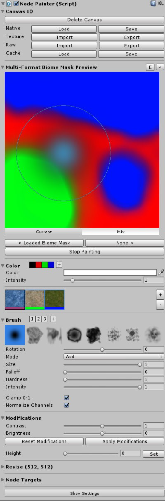
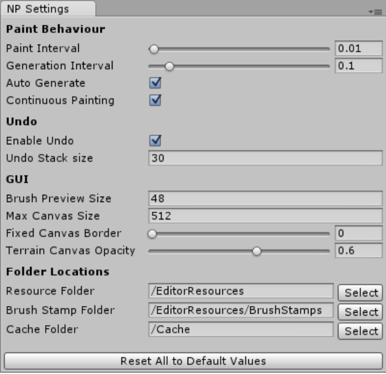

TC2 Node Painter 是 TC2 的 painting 扩展。

这个工具被构建用于改进你的 TC2 中的 workflow，提供给你更多自由和能力来创建你想象的 terrains。

## Getting Started

- 下载 TC2 和 Node Painter 并导入它们
- 在 TC window 创建一个新的 TC2 project（Window/Power of Nature Software/Terrain Composer 2）
- 添加一个 node 到 graph 用于 painter，例如在 height output，它会在下一个步骤中被自动转换为一个合适的 image node
- 添加 NodePainter 脚本到 Node 上，会出现一个 TC2 Node Painter UI
- 通过指定一个想要的分辨率来创建一个新的 canvas 来开始绘制

## Interface Explanation

### Canvas IO

创建、加载和保存 canvas。当没有加载 canvas 时，可以使用指定的区域、大小和格式创建一个 canvas。

Canvas Input/Output 格式包含 lossy PNG，lossless RAW 和一个自定义 native byte format，每个有它们自己的优势和劣势。

可以保存和加载 cache file，提供快速和安全地备份点。

### Canvas Preview

在 preview 区域，可以看到 canvas 的可视化显示，你可以在 canvas 上直接绘制。你可以设置  preview 周围的 Canvas Borders 以帮助 edge painting。

点击 E 按钮来编辑 canvas 的名字并设置一个自定义 cache file 来在 scenes 之间同步 painters。旁边的 eye-icon 开启 canvas 到 terrain 上的投影，让你更好地理解 canvas 如何影响 terrain。

当 canvas 被设置为 Color 或 Multi-Mask 格式，更多的可视化选项在 preview 下面出现。下面是 undo/redo 按钮，以及 Stop/Start Painting 按钮，用于开关 painting，允许你使用诸如 move handle 之类的工具。

### Color

只显示 color 格式，这个区域允许你编辑颜色和它的强度。使用 header 旁边的 bar，你可以创建和加载 color presets。

### Multi Channels

只显示 Multi-Mask 格式，你可以选择并修改单独的 channels（红黄蓝）。使用上下文菜单允许显式一个自定义 texture 而不是默认的 channel 颜色。

### Brush

编辑当前 brush，并使用带数字的 brush preset bar 保存或加载 presets。

第一个 bar 显式可用的 brush shape，其中第一个是一个可调整的功能。Brush bar 下面是当前 brush 的设置。

Mode 下来菜单选择 Blending Mode。更进一步，你可以调整 rotation，size，intensity，对于 function brush 还有 falloff 和 hardness 参数。一些 mode 还具有额外的 options 例如 target 和 bias。

绝大多数参数还可以通过一个快捷键调整。最后，选中 clamp 开关 clamp canvas 到 0-1，并且在 Multi-Mask 格式，你可以开关 canvas normalization。

### Modifications

这个区域应用 post-effects 到 canvas 上（当前只在 Color 和 Value 格式有效）。

你可以调整整体的对比度和亮度，以及在 color format 中每个独立 channels 的对比度和亮度。因为它是一个后期效果 post-effect，在显式应用到 canvas 之前，你可以使用相应按钮重置并应用这些修改。

此外，你可以在这个区域设置 canvas 到一个单一 value/color。

### Bottom

Resize 区域允许你重新调整或扩展你的 canvas 到一个特定的分辨率。

下面的 Node Targets 列表包含这个 canvas 应用的所有 Nodes —— 在 Multi-Mask 格式中尤其重要。

最后，按下 Show Settings 按钮打开 setting 窗口。

## Settings Window

你可以通过点击 Show Setting 按钮访问 setting 窗口，后者 Window/TC2 Node Painter Settings

### Paint Behaviour

你在这里可以改变 painter 绘制和 TC2 生成的 interval，通常你想要一个更长的 generation  interval 以允许 generation 之间可以有几个 paint passes。如果当绘制 terrains 时出现卡顿，而你不能临时降低 terrain 的分辨率，考虑增加 generation interval，甚至关闭 Auto Generate。

Enabling Continuous Painting 使得当你按住 mouse 时 painter 可以连续绘制（连续应用绘制强度）。

### Undo

你可以完全关闭 undo 或者降低 undo stack 大小，当你遇到内存问题时这尤其有用。所有超过这个数量的 undo entries 将会自动被删除，并且不能恢复。

### GUI

这个区域允许你做一些简单的 GUI 调整，例如 display 大小（当你在一个比 Full HD 更小更大的显示器）。你还可以在你的 canvas preview 周围添加一个 border，这可以帮助你在 GUI preview 中绘制 borders，以及改变 canvas 投影到 terrain 的 visualization 的不同明度。

### Folder Locations

你可以在这里移动各个 folder 位置，以便你想要完全移动 Node Painter 目录或者导出（outsource）指定部分。它们基于每个项目被保存到 ProjectSettings 目录的文本文件中，因此你可以基于每个项目选择 paths。

当想要在运行时改变 painter 时，可能需要改变 Resource folder，则你可以简单移动它到一个名为 Resources 的目录即可。BrushStamps 和 Cache 目录可以被移动到 project 中一个不同路径，甚至一个绝对外部路径。

BrushStamps 目录可能指向一个共享的 brush 目录 —— 目录中的所有 images 将会被作为 brushes。Cache 目录存储当前所有工作的 canvases —— 它们没有保存到 scene 中。你可能想要移动它到一个外部目录，如果你正在使用一个 source control。

## Canvas Formats

Canvas 格式定义绘制的目的。然而，它的内部表示总是 RGBA。当创建 canvas 时有 3 个格式可以选择：

### Value

一个灰度 canvas，用于高度图绘制，以及任何 output 中的简单 masks。

### Color

一个 color canvas 不直接被用在任何 output 中，但是可以用于各种目的。它可以被用于 TC2 应用程序之外的目的，或者当 mixing 和 blending 单独的 channels 到一起时来得到有趣的结果（TC2 将它们解释为 max(rgba)）。Inspector 中的 Color region 只在这种格式中显示，并且你还可以逐 channel 修改。

### Multi-Mask

这个复制的格式允许你以最多 24 个 channels 绘制，和 splat painting 相似。一个理想的应用场景是用于绘制生物群落或森林。

使用这个格式可以在 inspector 中显示 Multi Channel 区域，在此你可以选择、编辑、添加和移除 channels。在下面的 Node Targets 区域中为每个 channel 指定不同的 node targets 是很重要的。例如，你可以在这里添加对应你要绘制的生物群落的 height，splat 和 tree nodes。

强烈建议在 brush region 中选择标准化 channel values，因为重叠的 channels 将会冲突，而具有最高 value 的 channel 获胜，这通常会导致不想要的结果。Basically this will replace the color of all other channels while painting, eliminating the overlapping regions.

在内部，这个格式的 canvases 可能由多个 textures 组成：每 4 个 channels 被一个 texture 表示，就像 splat maps。但使用很多 channels 时，这可能导致技术问题，比如内存短缺。

## IO Formats

有一些不同的 Input/Output 格式可以用来保存 canvas，每个都有各自特定的应用场景。基本上，绝大多数时间最好使用 native 格式。如果你需要在外部程序中打开 canvas，尝试使用 RAW（如果它们支持），并且如果没有其他方式，你应该使用 8-Bit PNG 格式。

### Custom Native Byte Format

一个 lossless 16-Bit combined BYTE 格式，完美地存储 canvas 到一个 .bytes 文件。在内部，它存储所有 canvas meta 信息，并嵌入所有 canvas 纹理作为 uncompressed，lossless 16-Bit RAW 数据。它被 cache system 使用，因为由于 .bytes 扩展，它被作为一个 TextAsset 因此可以被引用。

### Texture / Image

一个 lossy 8-Bit PNG 纹理格式，用于导出到各种不支持 RAW format 的 image editors。对于 multi-format，保存的文件被划分为多个名为 name(n) files，每 4 个 channels 一个。

### Raw

一个 lossless 16-Bit RAW 文件导出格式，用于直接导出到 terrains 和少数支持 RAW 格式的 image 编辑器（例如 Photoshop）。它不支持任何 canvas meta 信息。

## Blend Modes Explanation

- Add / Substract

  到 canvas 上的 intensity 的基本的加减法

- Lerp

  这个模式插值 canvas 到指定的 target。强度设置 lerp 的速度。这还可以被用作一个 smoother add brush 并且可以通过 shift 翻转效果。

- Replace

  按照 intensity 指定的速度，使用 target value 线性替换 canvas value。Shift 翻转

- Smoothen / Contrast

  使用 bias 属性指定的 detail level 递减/递增 canvas texture 的细节。Shift 在两者之间切换。

## Color/Brush Presets

这个 Preset 系统同时用于 color 和 brush 区域。你可以通过点击它的 button 来加载一个 preset，通过 + 按钮创建一个。右键菜单删除。

Presets 保存到 EditorPrefs，它们将在 sessions 之间保持。

## Shortcuts

快捷键用于在绘制时调整 brush 参数。它们可以在 GUI 和 scene view 中同时工作。

- Invert Brush

  Holding Shift while painting inverts the paint blend mode, depending on the current mode. All modes have an inverted version.

- Adjust Brush Size

  Holding Control and using the Mouse Wheel changes the brush size.

- Adjust Brush Intensity

  Holding Shift and using the Mouse Wheel changes the brush intensity.

- Adjust Brush Rotation

  Holding Space and using the Mouse Wheel changes the brush rotation.

- Adjust Special Brush Value

  Holding Control + Shift and using the Mouse Wheel in supported blend modes changes the brush target or bias.

- Sample Brush Target

  Holding Control and dragging the Left Mouse Button samples the target from the value under the mouse.

- Switch to last mode

  Pressing Tab switches to the last blend mode used, allowing you to quickly switch between two blend modes.

## Notes On Performance

### Performance

The performance of the painter is obviously a lot slower than the default terrain brush due to the fact it has to go through several steps to finally reach the terrain. Node Painter is fully GPU-powered, just as TC2 is, but even the simplest setup requires several passes on the GPU which adds up quite fast.
Then comes the most performance-hungry operation: Assigning the result on the terrain. This step has been optimised to only assign the region under the brush but still takes alot of time.
Compared to the default terrain brush it appears to take longer because Node Painter allows for much higher brush sizes - resulting in bigger areas to cover - which may not be so apparent.

### Memory

If you use a high resolution or many canvas channels (in Multi-Mask format) memory consumption can quickly become a problem if you're not careful. For each action performed on the canvas, an undo record is created, copying all involved textures. These live in the memory until the maximum undo stack size is reached (30).
It is recommended to lower this value if you're on a rig with under 8GB of RAM

## Glossary

- NodePainter (script)

  The script used to manage, paint and assign the canvas to the nodes. It is possible to assign the canvas to multiple nodes by specifying additional node targets.

- Node Targets
 
  Nodes the canvas are assigned to. All node target transformations of a NodePainter script are kept in sync to prevent misalignment. Either transform the NodePainter object itself or, in order to scale the node targets individually, use their height/opacity.

- Canvas

  The buffer of textures used for the painting data that is assigned to all node targets.

- Biome

  A grouping of several outputs, like height, splat, trees, etc. to represent different flora and fauna on the terrain, defined through multiple node targets per channel in a Multi-Mask canvas, each representing one respective output.