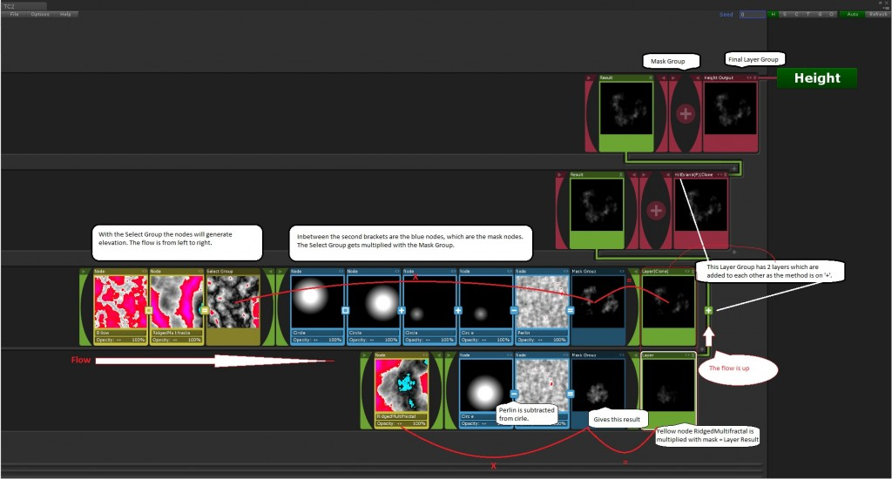

TC2 提供即时结果，使得创建 terrains 更快更容易。TC2 的 layer system 和 workflow 非常类似 Photoshop，这意味着在 workflow 期间可以完全控制并在任何时候快速改变。

使用 TC2 可以创建大规模以及无限制生物群落的地形。

TC2 有一个带有 preview textures 线性图形化 node 接口，你可以精确地看见每个 node，每个 group，每个 level 上发生什么。

整个系统是线性的，TC 会自动对齐 nodes，layers，和 layer-groups，因此 node graph 中没有交错复杂的连接。TC2 node window Hierarchy 使用 Unity GameObject 系统，因此你可以跳过这个学习曲线。如果你了解 Unity 的 GameObject，可以在几分钟内学会 TC2。

TC2 Node Painter 是一个用于 TerrainComposer2 的扩展。

TC2 Node Painter 允许你直接在 editor 中绘制 TC2 nodes，极大改善你的 terrain creation workflow，无论是过程化 procedural 还是 manual 手动。使用这个工具，你可以绘制任何东西，从简单的 heights 和 splats 到整个生态群落，由于 TC2 简单的 node 编辑器接口，这只需要很少的设置。它基本上可以比作 Unity 的 terrain brushes，但是是用于 multi terrain tiles，并且强大的多。相比 Unity terrain brushes 的最大优势是你可以绘制无限数量的 layers 和 masks，就像 Photoshop 中的图层和蒙版一样，并且可以使用 TC2 强大的 node transforms 来 move/rotate/scale 这些。

Node Painter 可以改进 terrain generation workflow 的方式：

- 绘制任何东西 —— 甚至是真个生物群落
- 高级条件绘制能力
- 不需要额外的 image editor（消除了来回切换应用和迭代的需要）
- 更精确的 positioning 而不仅是 noise
- 非破坏性的 Layer painting sessions
- 开箱即用的处理 multiple terrains

## TC2 的功能

- 包含很多 examples 和 presets
- 开箱即用的 multi terrain-tile 支持，TC2 将它视为一个 terrain
- 基于 node 的线性图形 GUI 接口（清晰）
- Folder 就像 layer system，和 Photoshop 的 layer system 类似
- 高级 masking，在一个 layer 和 layer group 上可以使用无限数量 masks
- 使用最新的 GPU 技术实时得到结果。不需要视觉提示，猜测，以及等待结果
- 没有 node graph 中交错复制的 connection。只需要拖放 node 到你想要的地方，它会自动对齐到那里
- 一个强大的 workflow，来创建具有 height-maps，splat texturing，color-maps，放置 vegetation 和 objects
- 高级 presets。使用 Unity 拖放 prefab 系统来保存和加载 preset，preset 可以是 node，layer，或者整个 layer group
- 生物群落，无限自由的 nodes，groups 和 levels 数量。每个 group/level 可以使用拖放来 mask，transform，clone，save/load。这使得你可以在 terrain 中创建 terrains
- Terrains 是完全可缩放和可扩展的。TC2 在 world space 中生成的。因此不管你如何放置 terrains 或者多少个 terrain tiles，它总是在相同位置产生。因此你可以在 workflow 期间的任何时间扩展和收缩你的 world，而不需要nodes 的 re-positioning 或 re-scaling
- 导出 height-maps，splat-maps，color-maps 以及 normal maps
- 基于手动放置的 objects 自动调整 terrain。Terrain 和 spawned objects 调整的方式全部是基于你如何设置 TC2 中的 rules nodess
- 内置完整的 noise library 包含侵蚀外观 noises：Perlin, Billow, Multi-fractal, Cell noise, IQ, Swiss, Jordan and Random，而且每个有很多变体
- 很多 node rules 就像 height，angle，splatmap，collision，convexity， noises，mathematical shapes，images，和 16 bit raw images
- 数学形状：Circle，gradient，rectangle，constant
- 可以在运行时使用，生成速度极快，需要 DirectX11 或 Metal
- 包含清晰的 C# 源码。每个 node type 和 node groups 有它自己的 GameObject，附加有脚本，并可以很容易地在运行时修改
- 高级和易于使用的 stamp node，并包含高解析度的 stamps
- 将 images 用于 input 和 masks 的 Image node
- Mesh 碰撞检测系统，独立于物理碰撞体，并且像素精确
- Global seed and a seed on many levels for the procedural noises to create randomized terrain
- 集成了 color-map 和 normal-map 自动指定的 RTPv3
- Node window 使用剔除功能，可以包含大量 nodes，不在 screen 上的东西不会绘制

TC2 GUI 具有 scrolling/zooming/easy foldouts/drag & drop 以及更多功能。

Terrain 创建非常快，因为 TC2 立即更新 terrain，调整将会 animate the terrain。

不仅仅仔细考虑了简易性，清晰接口，可用性等，但是 TC2 极大改进了能力，自由度，缩放能力，多样性和差异。TC2 真的是 “Next Generation” terrain 工具，可以在 GPU 中生成，使它可以每秒多次创建更新和更新 terrains，甚至可以 animate terrains。

TC2 还是一个无限 blending powerhouse（动力源）。使用 TC2 你可以创建一个沉浸式多样性。因为 TC2 中所有事情都可以 group，groups 也可以被 group，然后再被 group，以此类推。每个 group 都是可以 mask 和 transform 的。你可以拖放任何 group 或 node 到你的 project 将其保存为 prefab，并将它拖放回到 TC node window 中的任何地方。因此任何调整都可以在 workflow 期间在任何 group level 上执行而不需要任何等待时间。意味着你可以在 terrains 中创建 terrains。我们已经看见具有一致 texturing 和 placement 的 nic terrains，但是以我观之，真正是一个地形杰出的是它的差异多样性。为了不会让你的 gamers/users 感到无聊，你需要动态 terrain，而使用 TC2 你可以在很小 scales 和很大 scales 上创建无限的 biomes，凡是你能说出来的。如果你还想要一个经典的一致 terrain，也是可能的。

OCZDKEiwV6X9v11XgyN0~NZKq_5j9z-Gmv3CgXc_3HA~AqTqXDez5erU5vZ5Nuj7290KfGjSe1594nZDTmDgnaH9M1V3V8rQZTwe_b7bVV1Y

## Starting from scratch

打开 TC2 window，将会创建一个 TerrainComposer2 GameObject 以及 children，这将是一个 TC2 project。如果不需要任何运行时生成，这个 GameObject 可以被删除。如果你不想丢失所有的 nodes，确保你先在 TC2 menu 中保存它。TC2 和 Scene 一起保存。你可以在 TC2 window menu -> File -> Open/Save 手动保存和加载它。有一个 handy GameObject 称为 MeasureTool，在那里你可以测量 terrain 上的 splat 和 grass 密度。

### Create a Terrain

如果不是从一个 TC2 Scene 开始，在打开 TC2 window 之后，你需要先创建一个 terrain。Terrain Area GameObject 会自动被选择，它将 terrain 作为 child，并且在它的 Inspector window 中，你需要选择一个 project path 来保存你的 terrain，给它一个名字，点击 Create button。确保这个 path 在你的 Unity 项目中。

Terrain Area GameObject 下面创建的 terrain 就是 Unity 标准的 terrain。在 Terrain Setup 部分，你可以很容易地设置你的 Unity terrain，这是比使用 Terrain 组件脚本编辑 Unity terrain 更快速的方式。这也可以处理 multi terrain tiles。它们 tabs 中的 Splat 和 gress textures 已经被自动指定，你也可以防止你自己的 texture 在那里。Trees 仍然需要被指定，因为它们不包含在 Main TC2 package 中，因为希望 TC2 package 尽可能小使它容易在 Asset Store 更新。每个 output 可以在 Reset tab 中被重置。Splat，tree 和 grass tab 之后将会随着 automatic setup 被放到 TC2 window，其他 tabs 一样。

## TC2 Window

每个 output（Height/Splat/Color/Tree 等）都以相同方式工作。因此一旦你理解了一个 output，就很容易理解所有的 output。你可以将 Layers 和 Layer Groups 从一个 output 移动到另一个。

TerrainComposer2 有一个 GameObjects Hierarchy 在 Hierarchy 窗口（hidden）。实际上每个 node就是一个具有 Transform 的实际的 GameObject，Transform 用于 moving，rotating，scaling。每个 Node GameObject 有一个附加的 TC2 script，它包含 node 信息。

Nodes parented 的方式让所有东西强大地响应 moving/rotating/scaling，这可以正确地缩放 children。按住 ctrl 来锁定 children 的 transform 这样 pivot 可以被改变。一个 node 在 inspector 中有更多 lock 选项。Ctrl + L 是开启关闭 transform locking 的快捷键。你可以附加你自己的脚本到 node。使用脚本，你可以改变一个 node 的参数，或者你可以 animate node 的 transform 来得到 animating terrain。TC_AnimateNode 脚本可以附加到 node 上来 animate 它。

对于 Heightmap output，colors 和 terrain height 相关。如果 terrain 有 500 米高，高于 500 米颜色开始变成红色。Base level 总是 0，低于它的将是蓝色。对于其他 outputs，显示的值在 0-1 之间。例如，如果你使用一个 node 从 terrain height 读取数据，它可能不会和 Height output 中视觉强度相同，因为在 Height output，它是在 terrain height local space 中可视化的，而在其他 outputs height 被转换到 TC2 world space. 因此无论你对 terrain size 做出什么改变都没有关系。TC2 总会产生相同的输出，因为 generating 是基于 world space 的。由于这个功能，你可以很容易地扩展和收缩你的 world。

## Presets

因为每个 Node 和 Node Group 是一个实际的 GameObject，它们可以很容易地拖放到 Project window 并保存为 prefab。

Preset 可以在任何 level 制作。使用拖放，你可以重新安排所有的 nodes，而按住 alt button，它们将会被复制。

Presets 可以使用 masks 彼此混合，例如创建一个独特外观的 terrain。Example Scene 实际是一个 presets 的混合。一个 Terrain Layer 是一个保存所有 Main Layer Groups 的 layer。它是使用 TC2 菜单的 save/open 的 GameObject。

之后这个 node 的行为就像一个 Layer，并且可以在 Terrain Layer Group 中被 grouped。

因此你可以制作完全的 terrain presets，并将这些混合到一个 terrain 中。

## Stamps

Stamp data 是在 RawFiles 目录中，每个 stamp 是一个 16 bit raw 灰度图。可以将它们拖放到一个 node 上，TC2 会自动加载 stamp 并将 node 设置为 stamp 模式。对于 stamp node，node inputs 是 RawImage。你还可以拖放 stamp preview image 到 node 的 Stamp Texture slot 中。

你可以通过简单地拖放 16 bit raw 灰度图到任意具有 RawFiles 名字的目录中，来使用自己的 stamps。

这触发 TC2 raw import script，TC2 会生成一个 preview image 到前面的 folder 中，它可以被拖放到 node 上。

## WorldComposer and TC2

WorldComposer heightmaps 是 16 bit raw images，与 TC2 stamp 格式一致。你可以很容易地在 TC2 中使用 WorldComposer 的 heightmaps。

## Manual Object Placement

使用 manual object placement，你可以使用正常的 meshes 来影响 outputs。它可以被用于所有 outputs。

它们可以被用于很多目的。例如，你可以使用它来调整 terrain height 到你的 mesh，或者在你的 mesh 下面放置特定 splat textures，或者排除 mesh 下面的  objects/vegetation.

为了检测 mesh，你需要使用一个具有 Collision input 的 node（Input -> Terrain -> Collision）。你可以使用和 Unity Layer system 一样的方式在 Collision Node 中检测它们，就像你在 Camera 中操作 Culling Mask 一样。

为了使 TC2 在你改变 mesh GameObject 的 transform（move/rotate/scale）时能够自动生成，你需要挂载 TC_AutoGenerate 脚本到它上面。

用于调整 terrain height 到 mesh height 的 preset 被包含并防止在 TerrainCompoer2 -> Examples -> Presets -> Layers -> CollisionHeight。只需要拖放 Result Group node 上的 layer 来将它放置到顶部。

## How it works

Terrain Layer

LayerGroups > Layers(LayerGroups) > LayerGroups > Layers > Nodes

It starts with a ‘Terrain Layer’ which has 6 Layer Groups:

- ‘Height’ output for creating heightmaps.
- ‘Splat’ output for creating splatmaps.
- ‘Color’ output for creating colormaps.
- ‘Tree’ output for spawning trees as Unity terrain trees.
- ‘Grass’ output for spawning grass as Unity terrain grass.
- ‘Object’ output for spawning any kind of GameObject or Prefab.

### Layer Group

每个 main output 是一个 Layer Group。一个 Layer Group 包含 Result node 以及一个 Mask Group Node（如果 children 是空的则隐藏）。

Layer Group 中时 layers，每个 layer 可以基于各种方法（add/subtract/min/max 等）彼此混合。一个 Layer Group 也可以包含 Layer Groups，后者还可以包含 Layer Groups。这允许无限制的嵌套。

### Layer

对于 Height Output，一个 Layer 包含一个 Select Node Group（黄色）和 Mask Node Group（蓝色）。一个 select node 产生一个 elevation（海拔），它被乘以 mask result（如果有的话）。然后这就是 Layer 的 result。

在另一个 outputs 有更多的 group。这个 group 包含可以被放置的 items。例如，对于 Splat output，它是指定给 terrain 的 splat textures，对于 Grass output 它是指定给 terrain 的 grass textures。这个并行的 select system 对于所有 outputs 工作起来都一样（除了 Height，它没有 Item Group 可选择。TC2 同时支持 parallel selection + masking 和 single selection + masking. 如果一个 layer 只有一个可选择的 item，它将会忽略黄色 nodes 因为它们不在需要（绝大多数 terrain 工具以这种方式工作）。如果你将一个 Layer Group 中被 mask 的 Layers 分组到一起，你可以得到垂直的 parallel selection。

## How nodes are processed

Nodes 的处理和 Unity 中处理 Image Effects 非常相似。你可以将 image effects 彼此堆叠到上面。每个 effect 创建一个结果，它被作为下一个 image effect 的 input。这也是 nodess 水平和垂直工作的方式（Layer 和 Layer Groups）。

- Node1 -> 2
- Node2 -> 1, with method ‘Min’
- Node3 -> 3, with method ‘Add’
- Node4 -> 3.5, with method ‘Max’

It’s processed like this:

- 2
- Min(2,1) = 1
- 1 + 3 = 4
- Max(4, 3.5) = 4

So the result value in the Group Node will be 4.

## Node Blending Options

对于 nodes/layer nodes/layer group nodes 彼此交互，有 9 个 blending 选项。

Add
result = node1 + node0

Subtract
result = node1 – node0

Lerp
result = lerp(node0, node1, opacity value)

Multiply
result = node1 * node0

Divide
result = node0 / node1

Difference
result = abs(node1 – node0)

Average
result = (node1 + node0) / 2

Min
The 2 nodes are compared and the smallest value for the result is chosen.
result = node0 < node1 ? node0 : node1

Max
The 2 nodes are compared and the highest value for the result is chosen.
result = node0 > node1 ? node0 : node1

## Node Settings

每个 node 有自己的 setting，一些可以在 node 上调整，但绝大多数显示在 Unity Inspector 窗口中。在 Mask Group 和 Select Group 中，nodes 有两个曲线。这些曲线可以用于 remap node output。有两个 height curves，一个 local 和一个 global。min max slider 将会 clamp value 到 min/max 中。然后在这个 range 之间应用曲线，因此 curve position 0 在 min slider value，postion 1 在 max slider value。

## Node Types

现在已经有大量的 node types，并且将来会增加更多。通过以特定方式组合这些 nodes，就已经可以得到非常强大和无限的可能性了。

Node inputs 划分为以下类别：

### Terrain

- Height：读取 terrain 的高度。例如，限制 vegetation 不会放在高于特定高度之上
- Angle：读取 terrain 的角度。例如，限制 vegetation 不会放在陡峭的角度上
- Normal：读取 terrain 法向量
- Splatmap：读取 terrain splatmap。例如，只防止 vegetation 到 green splat textures 上
- Collision：检测 terrain 上的 mesh geometry。碰撞检测可以通过指定 layers 来精细调整（GameObject Layers）以包含特定 meshes。例如，使一个 building 下面的 heightmap 变平坦，或者排除一个 building/road 中的 trees，grass 或者 objects。或者在一个 building/road 周围做特定 splat 纹理

### Noise

Noises 响应 Global Seed。每个 noise 可以使用 node 自己上的 seed settings 来动画。

- Perlin -> Creates 3d perlin noise.
- Ridged -> Creates 3d ridged multifractal noise.
- Billow -> Creates 3d billow noise.
- Cell -> Creates 3d cell (voronoi) noise.
- IQ -> Creates 3d iq noise.
- Swiss -> Creates 3d swiss noise.
- Jordan -> Creates 3d jordan noise.
- Random -> Creates random values.

### Shape

Shapes 是数学的，不是 stamps，stamps 是纹理的。

- Circle -> Creates a circle with adjustable size and fall-off.
- Gradient -> Creates a gradient with adjustable fall-off.
- Rectangle -> Creates a rectangle that with adjustable x and z size and fall-off. E.g. this is great to make terrain edges flat for the use with Horizon[On] terrain.
- Constant -> A constant value.

### File

- Image：从 Image 读取 color range。例如，可以基于 image 的特定颜色放置 vegetation 或 buildings 
- Raw Image：从一个 16 bit raw 文件中读取数据。这个格式被用于 stamps

### Current

名字 current 引用你放置这个 node 的时刻当前的 result。

- Blur -> Blur the result. This will make the result look more smooth.
- Expand -> This will make white edges get more wide. E.g. this can be used after the Collision node to make a larger edge around a detected mesh.
- Shrink -> This will make white edges get more small. This is the opposite of Expand.
- Distortion -> This will distort the result. E.g. this can be used to make a shape look less uniform. This effect still needs some work.

## Portals

Portals 可以用来存放一个当前 result 并稍后将它用在别的地方。这可以很方便地重用相同的 rules，而不需要计算相同的结果两次。Nodes，Layers 或 Layer Groups 可以拖放到一个 portal 上。所有需要做的事情是在 Inspector 上锁定 portal（这样当选择你想要使用的 node 时不会修改 inspector），然后选择 node 并拖放它到 Portal node slot。Source node 将会有一个绿色的 portal icon，而 portal 自己有一个红色的 icon。下面的例子只在 terrain 特定高度之上添加细节。

## Generate At Runtime

TC2 可以在运行时被使用，像 Unity Editor 中那样产生 terrain。TC2 node window 只能用于 Unity Editor，并且不能在运行时使用，但是所有的功能都是可用的。为了在运行时使用 TC2，最低需要 DirectX11 或 Metal，因为 TC2 需要使用 Compute Shaders。DX11 已经成为 Unity 标准，因为 Unity 已经移除了 DX9 的兼容性。

### How To

TC2 中所有的 nodes 只不过是附加脚本的 GameObjects，并以正确的顺序 parented 到一起。默认地这些 GameObjects 是被隐藏的，但是你可以通过关闭  Setting GameObject Inspector 中的 'Hide TerrainLayer GameObject' 显示它们。

确保在 settings 中开启了 Use TC Runtime，否则将不能工作。

还有，可以在 TC2 node window 中或者 TerrainLayer GameObject 的 Hierarchy window 附加任何脚本脚本到 nodes。

要在任何 C# 脚本中使用任何 TC2 功能，你需要在 script 顶部包含 TerrainComposer2 命名空间：using TerrainComposer2;

为了在运行时生成，只需要调用：

TC_Generate.instance.Generate(bool instantGenerate, int output);

The output options are:

- TC.heightOutput (generates the heightmap)
- TC.splatOutput (generates the splatmap)
- TC.colorOutput (generates the colormap)
- TC.treeOutput (generates the trees)
- TC.objectOutput (generates the objects)
- TC.allOutput (generates all outputs)

如果 instanceGenerate = false，generate 将会被调度为 task，每一帧只能执行一个 task，例如：

- TC_Generate.instance.Generate(false, TC.heightOutput);
- TC_Generate.instance.Generate(false, TC.splatOutput);

这会生成 heightmap，并在下一帧生成 splatmap，并且它会在当前时刻的 terrain 上生成。

InstantGenerate = true，将会在当前 frame 的所有 terrain 上直接执行生成命令。

### How to modify nodes by script

因为 nodes 只是具有 MonoBehavior 脚本的 GameObject，你可以像任何其他 C# script 一样使用它们。

所有 node 脚本继承自 TC_ItemBehaviour 并共享基类的 fields 和 methods。要修改一个 node 中的任何 field，你可以打开它上面的脚本，来查看你想要修改哪个 public field。

在你自己的 script 中，你可以引用这个 node 上的脚本，然后只需要从 TC2 window 中拖放 node 到你脚本的 node reference 上。确保你在 TC2 window 中点击并拖放一个 node 之前，先 lock Inspector。

要 transform 一个 node，你只需要使用 transform.position = ...

## FAQ

- Can I rename a node?

  Yes this is possible any node type can be renamed by simply selecting it in TC2 window and changing the name in the Inspector. A node is just a GameObject and you can also attach your own scripts to it.

- How to delete a node?

  Since a node is a GameObject it has the same short key functionality. Select the node in the TC2 window and press the ‘Delete’ key on your keyboard. For Duplicating you can press ‘Control D’.

- How to add a Layergroup to a Layergroup.

  If Drop the Layer Group on the ‘Result’ node of the Layer Group (if it is empty) you want to add it to. If it already has Layers inside you can just drop the Layer Group under or above the layer.

- How can I import a heightmap from WorldMachine?

  Export the file in WM as a r16 file. Rename it to raw and drag and drop the raw file into a RawFiles folder in your Unity project. TC2 will automatically create a preview image for it in the folder before it. If it doesn’t make the preview image you can right click the raw file and choose ‘Reimport’. This preview image needs to be drag and dropped on a node (this will put the node automatically to the right input) or you can set the node manually with input on Files -> RawImage. And drag and drop the preview image into the ‘Stamp Texture’ field in the Inspector window.

## Tips

- If you are working on a certain output e.g. ‘Splat’ then any other output should be disabled as they will update as well even if they didn’t change. E.g. this will allow to put the heightmap resolution of the terrain very high like 2-4k and still get realtime responce when working on splatmaps. If many outputs are active and don’t change then updating the terrain will take more time than needed.
- Terrain heightmap/grass resolution is editable in TC2 with 512 (depending on your hardware, you might need to put it to 256). Splat and Colormap can have higher resolution like 1k-2k. During the workflow you can switch heightmap/grass anytime to high resolutions like 2k, but keep in mind that Unity terrain updating will take a second so real-time terrain editing response is not there anymore. If you want to edit the terrain again you can turn the resolutions down so that the terrain becomes editable again.

