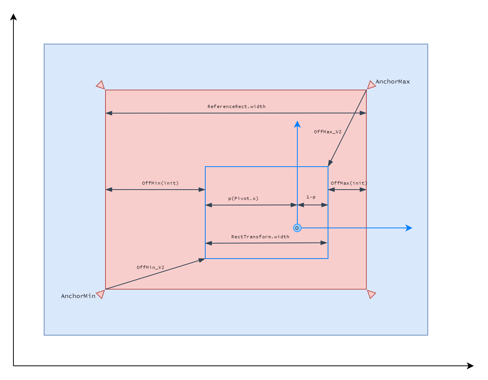
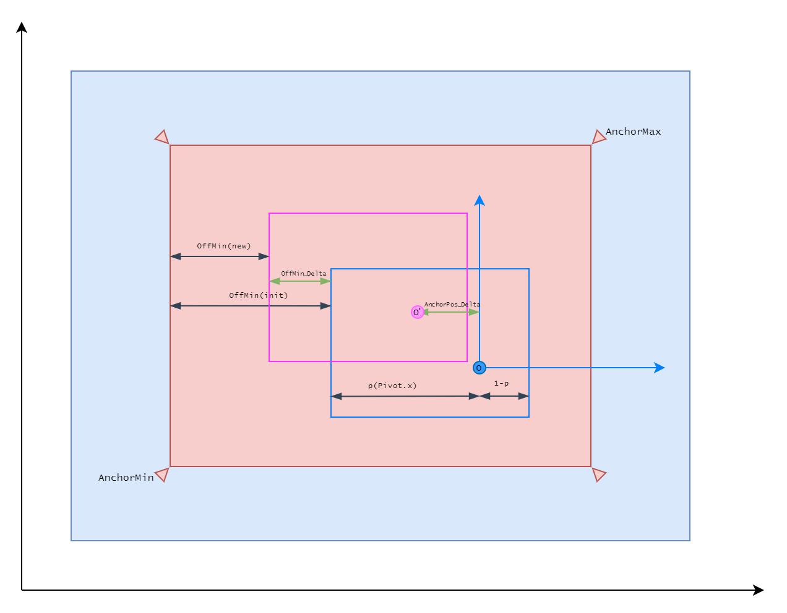
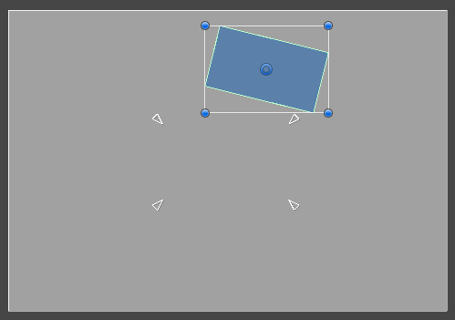

# Anchor Layout

理解一个UI元素如何定位，先确定它使用的坐标系。

Android，iOS，Windows等窗口系统只是简单的父子关系管理。兄弟控件共享相同的父窗口坐标系。坐标系的确定也十分简单，即左上角为原点，x轴向右为正，y轴向下为正。

uGUI中UI元素使用的坐标系的确定：基于父元素的RectTransform的Rect区域，anchor（相对比例，总是在0～1之间）在Parent Rect中划出一块子rect区域，称之为Anchor Rect。uGUI的每个UI元素具有一个Pivot，UI元素的定位、旋转、缩放都是基于这个Pivot。Pivot是按照相对比例在元素自身Rect定义的，但不限定在0～1之间。按照Pivot在Self Rect的比例在Anchor Rect确定一个点，这个点就是UI元素使用的坐标系的原点。X轴向右为正，Y轴向上为正。anchorPosition(3D)就是UI元素的Pivot点在这个坐标系中的位置（偏移）。

Anchor Rect和Self Rect四个角的偏移成为Offset Min/Max。这个Offset Min/Max是锚定系统的核心和目标。当父元素的Rect变化时，UI元素的Anchor Rect也会随着变化，因为它是给予Parent Rect计算的。但是Offset Min/Max保持不变，这样，Self Rect就会随之变化以维持Offset的不变性。这与Css中百分比定位是不同的，子元素随着父元素变化总是保持相对比例不变，但是uGUI中子元素保持的是Offset绝对向量的不变，相对比例肯定是变化的。因此，当Parent Rect小于Offset Min和Max之和，则Self Rect就会成为负的，导致UI元素不被渲染。

不同元素的参考坐标系几乎肯定是不同的，即使是兄弟节点（anchor可以不同，pivot可以不同）具有相同的anchorPosition，两个元素也不一定重合。因为anchorPosition是元素的Pivot在各自参考坐标系中的位置。

RectTransform的rect属性是基于Pivot局部坐标系定义的，即原点是pivot，而不是在参考坐标系中定义的。

两个兄弟元素，基于Parent Rect（在Parent Pivot局部坐标系定义的巨型），各自的Anchor，Pivot，就可以确定它们各自在Parent Rect中坐标系原点的位置，这样转化到同一个空间下，就可以相互参考定位Pivot的anchorPosition了。

Anchor Layout用于固定布局，Auto Layout用于不固定事先不预知的布局（动态添加元素）。

两个UI元素要想相互参考，必须转化到同一个坐标空间下，或者使用Parent坐标空间，或者使用RectTransform的Position（使用的是世界空间）。


Anchor Layout定义相对于Parent Rect的锚定和缩放，可以手动或程序控制position，之后锚定和缩放也随之更新。

自动布局是基于Anchor Layout基础上实现的。它只是一套计算机制，最终还是落实到Anchor Layout的参数实现定位。自动布局对Anchor参数的设置覆盖任何手动和程序的设置，相当于禁止了手动修改Anchor参数，在RectTransform的Inspector也会禁止修改。自动布局应该只看见高级的参数，例如spacing，padding，prefereed size等等。可以通过一个空白的RectTransform实现自动布局和手动布局混合的效果。类似于Css中的relative布局，即在自动布局基础上的手动偏移。

uGUI布局是基于RectTransform之上的一套计算机制，独立于Transform，但最终还是由Transform（Position，Rotate，Scale，Size实现）。

uGUI的UI元素就是普通的GameObject，具有Mesh和Material（Texture）。就像Sprite一样，具有在World中的大小。UI单位和世界单位之间存在一个映射比例，即ScaleFactor。UI单位乘以ScaleFactor就可以得到世界单位。因此可以通过操作RectTransform的position来移动定位UI元素，这是所有UI元素相同的参考空间。但是这种方法只能用于ScreenSpace（Overlay/Camera）模式的Canvas。

World模式Canvas，ScaleFactor参数是没有意义的，因为这个参数用来控制屏幕分辨率和world之间的映射。对于world模式Canvas来说，没有屏幕分辨率了，这个参数也就没有意义了，因为不需要随着屏幕空间调整Canvas大小了。此外，UI元素在World中是可以旋转的，因此UI屏幕可以3D空间的任何平面，而不仅是XY平面，这样就不能通过简单操作position来控制UI元素的位置了，只能通过anchor/auto layout来操作元素。

使用position定位通常是因为需要在两个ui元素之间做参考定位。ScreenSpace模式下，可以通过将Canvas坐标转化为世界空间坐标，然后在世界空间中定位就可以了。World模式下，由于Canvas坐标是在Canvas平面计算，而这个平面可以不和XY平面平行，因此转换很复杂。但是可以通过在要reference的ui元素（RectTransform）上添加一个空白的child元素，将child元素放置在想要的位置上，这样利用Anchor布局自动计算child的世界位置，然后将真正的UI元素的position直接set为child的position就可以了。使用空白元素参考定位是十分重要的技巧。这是css中relative position布局在uGUI中的实现方式。

Screen Space只是Canvas计算UI元素在世界空间中位置的方式，UI元素仍然是世界空间中的GameObject，可以像任何GameObject一样来操作它们。尽管它们显示为2D平面元素，仍然可以沿着3个Axis在3D空间中旋转。但是旋转时在layout之后进行的，围绕着pivot。正是因为UI元素本质上是GameObject，因此uGUI要比Flex布局更灵活，可以更容易地完成不可思议的效果。

UI elements可以保存为prefab，并作为任何RectTransform的child实例化，UI元素anchor就会相对于这个Parent RectTransform Rect进行定位。

RectTransform旋转总是围绕pivot，旋转总是在布局之后，即现在同一个屏幕上按照正常布局完成之后，RectTransform再围绕自己的pivot进行选择，类似于relative布局系统，即先正常layout，layout之后，在基于正常的位置进行偏移。

LayoutGroup的Padding和spacing可以调整留白（margin，可以为负值）和间距。

当有可用空间时，Child force expand控制子控件是否扩张占用可用空间。Control Child Size用来控制扩张的方式，当disable时，元素rect大小不变，只是扩展padding rect；当enable时，元素rect扩展为可用的空间大小。无论是padding扩张，还是rect扩展，都是按照layout elements的Flexible Width/Height用来控制兄弟RT之间的扩展比例的。

Anchor layout比普通的父子关系GUI甚至flex系统更灵活。Flex布局通过重新定义main axis和cross axis和正负方向完成灵活的布局。

Application.targetFrameRate控制渲染速率fps，渲染速率太低也会影响input的处理速度。

自动布局中，layout group给children分配空间时，是根据layout group元素的rect来分配的，但是child的min size是强制的，即无论如何都要分配这么大的空间，不可能更小。即使layout group的rect空间不够children的min size，则children仍然具有min size大小，这样children就会overflow了。如果layout group具有背景图片，就会很明显。perfered size是children理想的大小，当layout group空间大于min size，但是小于perfered size时，每个元素都会平均分配一些空间使得它们向着perfered size变化。当layout group空间超过perfered size时，才会按照flexible size分配额外空间。Control child size时，children最小也要保持min size变化。

Use Child Scale：layout group在计算child layout elements时，是否考虑child的scale。即使用scale之前还是之后的size进行layout计算。

Child Alignment：当有额外空间，而child layout element不扩展时，定义child如何在额外空间中对齐。

Grid Layout Group和其他Layout Group不同，它忽略包含元素的报告的minimum，prefered，flexible size属性，而是将它们统一视为一个固定size，即Cell Size（X & Y）。然后使用这个override的minimum，prefered，flexible size进行Layout计算。

min size强制分配，大于min size，小于等于prefered size时，超出min size的空间为每个元素平均分配，使得每个child元素都想着自己的prefered size grow，直到每个元素都达到自己的prefered size。超出prefered size的空间，按照flexible相对权重分配。

Image/Text这些native的元素的Layout Element size信息无法通过Layout Element组件覆盖。

Selectable组件用于实现normal，highlight，pressed，disable的现实功能，就像普通的按钮外观。例如给一个Image添加Selectable就可以使得Image像Button一样，再加上一个EventTrigger组件，配置PointerClick回调事件，就完全是一个Button了。

Selectable通过AnimatorController来配置UI动画，不仅仅是要使用Unity的动画系统，很多时候更是在使用CrossFade功能。这时，每个动画状态通常都没有多个frame，而是只有一个frame用来定义UI在这个状态下的状态。

```gpt
UGUI 中 gameobject 的 transform 的 x 和 y 的值表示的是什么?

在Unity的UGUI（用户界面图形用户界面）中，游戏对象（GameObject）的Transform组件的x和y值表示该对象在屏幕上的2D位置。这些值表示游戏对象在Canvas上的水平（x）和垂直（y）位置。

Canvas是UGUI中用于绘制2D用户界面元素的容器。游戏对象的Transform的x和y值是相对于Canvas的位置坐标。具体来说：

x值表示游戏对象相对于Canvas左边缘的水平偏移量。如果x为0，则表示游戏对象位于Canvas的左边缘上。
y值表示游戏对象相对于Canvas底边缘的垂直偏移量。如果y为0，则表示游戏对象位于Canvas的底边缘上。
这些值通常用于控制UGUI元素的位置，使其出现在所需的屏幕位置上。通过修改Transform的x和y值，您可以调整游戏对象在用户界面上的位置。这对于创建按钮、文本、图像等UI元素非常有用。
```

基于锚定的布局，改变 anchor，pivot，offsetMin/offsetMax，sizeDelta，以及 RectTransform parent 关系，所有布局数值立即改变，不需要等下一帧。因为它是基于 RectTransform 层级关系和固定的布局公式计算得到的。只有自动布局系统，改变元素大小，添加删除元素，才需要等待下一帧生效（布局位置），因为一帧中可能有很多布局元素的变化，它等到一帧的结束统一进行一次布局计算。

改变 RectTransform 的 parent 层级管线，元素在 Viewport 中的位置、旋转、大小都保持不变，只是各种 RectTransform 参数相应变化，来保持它的不变。

AnchorMin/AnchorMax 只能在 0-1 之间，它在父元素矩形中划出一块矩形空间，即 AnchorRect。PivotMin/PivotMax 可以超过 0-1，它在自身矩形中确定一个位置，作为定位、旋转、缩放的 pivot，然后再 AnchorRect 中按照相同的比例确定一个位置，它就是子元素参考的父坐标系的原点，然后x轴向右，y轴向上，子元素的 pivot 的在这个坐标系的位置就是 anchorPosition。因此即使同一个父元素的两个子元素的坐标系也是不一样的。

上面只是确定了自己的原点和父坐标系的原点，RectTransform 还有一个 rect 面积，它是用 offsetMin 和 offsetMax 用来确定的（它们都是可读写属性）。从 AnchorRect 左下角向右上偏移 offMin 就是 RectTransform 矩形的左下角，从 AnchorRect 右上角向左下偏移 offsetMax 就是 RectTransform 矩形的右上角。

sizeDelta = offsetMax - offMin.

sizeDelta 是 self Rect 与 AnchorRect 之间的 delta 大小（Vector2），大小的差分计算是基于元素的 pivot 的。因此 sizeDelta 和 offsetMin/offsetMax 实际是相互推算的关系。直到 sizeDelta 就能确定 RectTransform 的大小和位置，就能推算出相对于 AnchorRect 的 offsetMin/offsetMax，反之知道 offsetMin/offsetMax 也能确定 RectTransform 矩形的大小和位置，就能推算出 sizeDelta。

因为每个 RectTransform 的坐标系都是不同的，因此在不同元素之间的坐标系之间进行换算非常困难。换算的基础有一个共同的标准（共识）。uGUI 提供了 GetLocalCorners 和 GetWorldCorners 用来将元素矩形在 World 和 Local 进行转换，这样就可以通过 world 位置在不同元素的坐标系之间进行转换了。此外，GetWorldCorners 还可以用来确定 3D canvas 的元素在 world 的位置和大小，来和 world GameObject 进行交互。

The placement of their content is based on 7 RectTransform variables (anchoredPosition, anchorMax, anchorMin, offsetMax, offsetMin, pivot, sizeDelta), it’s actually only 5 variables.

rt.sizeDelta = rt.offsetMax - rt.offsetMin;

rt.offsetMin = -Vector2.Scale(rt.pivot, rt.sizeDelta) + rt.anchoredPosition;
rt.offsetMax = Vector2.Scale(Vector.one - rt.pivot, rt.sizeDelta) + rt.anchoredPosition

rt.anchoredPosition.x = Mathf.lerp(rt.offsetMin.x, rt.offsetMax. x, rt.pivot.x);
rt.anchoredPosition.y = Mathf.lerp(rt.offsetMin.y, rt.offsetMax.y, rt.pivot.y);

What about calculating the Transform‘s localPosition and world Position? It’s tricky because the localPosition and the RectTransform‘s rectangle is based off the pivot, anchors, and anchoredPosition. Not only that, but it also depends on the parent RectTransform and those issues also apply to the parent’s content and position – and the parent’s parent, and the parent’s parent’s parent, and… While there may be a simple formula, I can’t think of a generic one, and some non-trivial linear algebra and hierarchy traversal will probably be involved.

But, the RectTransform comes with helpful utility functions to get the local and world corners for you!
[RectTransform.GetLocalCorners][RectTransform.GetWorldCorners]

If you have pixel position in world coordinates, also don’t forget you can use the RectTransform’s parent-class’ Transform.InverseTransformPoint function to convert that world position to a local position, which will then should then be compatible with RectTransform.GetLocalCorners().

If you want the results of GetLocalCorners() but don’t care about ordered 3D points, but care about the final local size and position, RectTransform.rect is useful. I don’t find the position that useful, but I find myself getting the rect’s size very often for my procedurally generated GUIs.[example]

If you just need to do collision tests with pixels, the RectTransformUtility class has some helpful functions.

总是使用 Scale With Screen Size，它能指定一个参考 Screen 分辨率，然后在运行时根据实际设备对 Canvas 进行缩放，而设计 uGUI 时，只需要使用相对于参考分辨率的逻辑 UI 单位就可以了，与实际设备屏幕隔离，不用收到它的干扰，可以无所顾虑的使用任何 anchor 方法来定位、缩放元素，而无需担心在实际屏幕上变成乱糟糟的一团。UI Toolkit 也在 PanelSetting 中提供了相同的功能。

RectTransform 有两个坐标系空间：anchorPosition = 0 的参考 anchor 左边空间（anchorPosition 的位置在这个坐标空间中定义），和以 anchorPosition 为原点的自身 local 坐标空间（RectTransformUtility.ScreenPointToLocalPointInRectangle 在将 screen point 转换到这个坐标空间）。

## RectTransform

RectTransform 在 Transform 基础上增加了锚定 UI 的相关属性，这些属性决定了 UI 的位置和大小。AutoLayout 更是基于 AnchorLayout 构建。

- anchoredPosition
- anchoredPosition3D
- anchorMax
- anchorMin
- offsetMax
- offsetMin
- pivot
- rect
- sizeDelta

```
rt.sizeDelta = rt.offsetMax - rt.offsetMin;

rt.offsetMin = -Vector2.Scale(rt.pivot, rt.sizeDelta) + rt.anchoredPosition;
rt.offsetMax = Vector2.Scale(Vector.one - rt.pivot, rt.sizeDelta) + rt.anchoredPosition

rt.anchoredPosition.x = Mathf.lerp(rt.offsetMin.x, rt.offsetMax. x, rt.pivot.x);
rt.anchoredPosition.y = Mathf.lerp(rt.offsetMin.y, rt.offsetMax.y, rt.pivot.y);
```

这些公式在 x 轴和 y 轴方向是一样的，因此只需讨论在 x 轴方向上的情况。

后 4 个公式本质是一个公式。

### UI 大小和位置的确定



- 外部的蓝色区域为 Parent Rect
- 红色区域为 Anchor Rect
- 蓝色边框为 RectTransform Rect
- 点 O 为 Reference Anchor Point

1. 先根据 AnchorMin AnchorMax 在 Parent Rect 中锚定出 Anchor Rect，后面所有的所有讨论都是在 Anchor Rect 中进行。

   AnchorMin/AnchorMax 和 pivot 一样是在 0-1 之间标准化的，左下角=(0, 0)，右上角=(1, 1)，但是它们不限制在 0-1 之间。

   此后当 Parent Rect 大小变化时，Anchor Rect 也会按照 AnchorMin/AnchorMin 的比例随之缩放。但是 Rect 和 Anchor Rect 之间是固定的 OffMin/OffMax 的 delta 距离，它们会以相同的变化量随着 AnchorRect 进行变化。

2. 已知 Parent Rect 的大小，就知道了 AnchorRect 的大小。

3. 根据 pivot 在 Anchor Rect 确定一个点 O，它就是 Reference Anchor Point。它定义了一个坐标空间，Rect 在这个坐标空间中平移、旋转、缩放。它可以视为 Rect 的 Parent 坐标空间。当 Rect 的 Pivot 位于点 O 时，anchorPosition = 0.

4. 通过 Parent->AnchorMin/AnchorMax->AnchorRect->Pivot 得到 Rect 所在的坐标系空间，剩下的就是确定 Rect 在这个坐标空间中的位置和大小了。有两种方法确定 Rect 的位置和大小：

  4.1 指定 Rect 的位置和大小：设定 anchorPosition 和 sizeDelta
    
    确定 anchorPosition 之后，根据 AnchorRect 大小和 sizeDelta 得出 Rect 的大小，sizeDelta 的定义就是 Rect 和 AnchorRect 的差。在 anchorPosition 周围划出一个矩形区域，使得 anchorPosition 在这个区域中的标准位置（0-1）等于 pivot，这个矩形区域就是 Rect。这样就得到了 Rect 的大小和位置。

    知道 Rect 之后，Rect 的左下角与 AnchorRect 左下角的差就是 OffMin，Rect 的右上角与 AnchorRect 的差就是 OffMax。

  4.2 指定 Rect 在 parent 坐标空间中的四个边：设定 OffMin 和 OffMax

    从 AnchorMin 和 AnchorMax 分别偏移 OffMin 和 OffMax，确定一个矩形，这个矩形就是 Rect。Rect 与 Anchor Rect 的差就是 sizeDelta，等于 OffMax - OffMin。确定了 sizeDelta 后，anchorPosition 的位置在这个矩形内 pivot 处，这个点在 Reference Anchor Point（点 O）坐标系中的位置，就是 anchorPosition 的值。

  这两种方法是等价的，指定一种可以计算出另一种，这就是为什么说上面后 4 个公式是等价的。

  OffMin/OffMax 和 SizeDelta 不是标准化的比例，而是固定的绝对数量差值。当 Parent Rect 带动 AnchorRect 变化时，OffMin/OffMax 就像钢铁支柱拉动 Rect 一起变化。Anchor Rect 随 Parent Rect 的变化是按照 AnchorMin/AnchorMax 的比例的，但是 Rect 随 Anchor Rect 的变化则是绝对量的变化。

  Rect 的两个重要方面是位置和大小。位置使用 anchorPosition 记录，但是大小却没有用 width/height 记录，而是用的 sizeDelta（与 OffMin/OffMax 等价）。这是因为 UGUI 的设计理念是 Rect 的大小可以随着 Parent 一起缩放，Rect 的大小需要由 Parent Rect 派生出来，其大小不是固定的。而使用 sizeDelta（或 OffMin/OffMax）来记录 Rect 与 Parent Rect 的差则是固定的。因此记录的是这个固定的数据，而不是动态的 width/height。

  RectTransform.rect 记录了 Rect 的数据。它是只读的，在 RectTransform local 坐标空间中定义。RectTransform 局部坐标系原点位于 anchorPosition，x 轴向右，y 轴向上，然后经过 rotation 和 scale 的旋转和缩放。注意 anchorPosition 不一定位于图中的点 O 的位置。那个是 Rect 所在的坐标空间（parent 空间，它本身可能随着 Parent Rect 旋转缩放而旋转缩放），而不是 Rect 自身的 Local 坐标空间。

AnchorPosition + ScaleDelta 是两个独立的分量，互不影响，它们一起确定 Rect 的位置和大小。OffMin/OffMax 与 (AnchorPosition + ScaleDelta) 等价，可以相互推出。

简而言之，确定一个 RectTransform 的 Rect 的过程是，已知 Parent Rect，根据 AnchorMin/AnchorMax 得到 Anchor Rect。根据 Pivot 在 Anchor Rect 中确定 Reference Anchor Point，Rect 的 AnchorPosition 相对它定义。最后通过 AnchorPosition + ScaleDelta 或 OffMin/OffMax 确定 Rect。

以下公式只考察 x 分量，y 分量与 x 分量一样。

```
OffMax = Rect.RightTop - AnchorMax
OffMin = Rect.LeftBottom - AnchorMin

sizeDelta = offsetMax - offsetMin
```

如果 Rect 位于 Anchor Rect 内部，则 OffMin > 0， OffMax < 0. 因此通常 sizeDelta < 0. 这是满足定义的，因为 sizeDelta 的定义就是 Rect.size - AnchorRect.size。如果 Rect 比 AnchorRect 小，sizeDelta 就是负的。从图中可见，sizeDelta 的绝对值就是 offMin 和 offMax 的绝对值之和，即 Rect 外部到 AnchorRect 的空间。

Vector.Scale 是将两个 Vector 的对应分量分别相乘，即 (x0 * x1, y0 * y1)。

假设

- offMin = OffMin.x
- p = pivot.x
- anchorPosition = anchorPosition.x,
- sizeDelta = sizeDelta.x

```
offMin = -p * sizeDelta + anchoredPosition
offMax = (1 - p) * sizeDelta + anchoredPosition
```

在 Rect 大小不变的情况下，sizeDelta 总是不变恒定的，此时 anchorPosition 和 offMin/offMax 同等变化，即 AnchorPosition 偏移多少距离，offMin/offMax 相应偏移多少距离。

-sizeDelta * p 的含义就是当 anchorPosition = 0（恰好位于 Anchor Point 处）时 offMin 的值（初始 OffMin 的值）即图中的 offMin(init)。也就是 -sizeDelta * p 记录了 anchorPosition = 0 时的 offMin 的值，-sizeDelta = offMin(init)。则有

```
anchoredPosition(current) = offMin(current) - (-p * sizeDelta)
```

-p * sizeDelta 是个恒定值。当 anchoredPosition = 0 时，offMin(current) = offMin(init)，等式成立。此后 anchoredPosition 从 0 变化多少，offMin(current) 也相应变化多少来保持等式成立（几何意义是移动矩形同时保持大小不变）。这就是这个公式的含义。



offMax 的等式含义与 offMin 一样，(1-p) * sizeDelta 记录了初始 offMax(init) 的值。

```
anchoredPosition = Mathf.lerp(offMin, offMax, p);
```

因为 lerp(a, b, t) = a + (b-a) * t，因此有

```
anchoredPosition = offMin + (offMax - offMin) * p
```
因为 offMax - offMin = sizeDelta，因此有

```
anchoredPosition = offMin + sizeDelta * p
```

可见与上面的公式是一样的，这就是上面后 4 个公式等价的原因，公式的几何意义如上所述。上面 5 个公式核心展示的是如何已知 anchorPosition 和 sizeDelta 推出 offMin/offMax，以及反之。

- 已知 anchoredPosition + sizeDelta

  - offMin = -p * sizeDelta + anchoredPosition
  - offMax = (1 - p) * sizeDelta + anchoredPosition

- 已知 offMin/offMax

  - sizeDelta= offMax - offMin
  - anchoredPosition = lerp(offMin, offMax, pivot)

以上计算都是基于 Anchor Rect 和 Pivot 的，而 Anchor Rect 是基于 Parent Rect 和 AnchorMin/AnchorMax 的。

- 改变 anchorPosition 或 sizeDelta 会改变 offMin/offMax
- 改变 offMin/offMax 会改变 anchorPostion 和 sizeDelta
- anchorPostion 与 sizeDelta 相互独立，改变一个不会影响另一个。

在 RectTransform Inspector 中，Left、Right、Top、Bottom 就是调整 offMin、offMax 的。当 Anchor 的 x 或 y 合并时，这个方向上 Rect 的大小不再随着 Parent Rect 变化了，此时这个方向将变成 PosX + Width 或 PosY + Height。

还要注意，RectTransform Inspector 中 Right Top 显示的是 OffMax 的相反值。当 OffMax 为负时，Right Top 显示为正。这是为了在编辑器中更直观的展示 offset 的含义，即 Right 或 Top 分别距离 Anchor Rect 的 Right Top 有多少。

## RectTransformUtility

- bool ScreenPointToLocalPointInRectange(RectTransform rect, Vector2 screenPoint, Camera cam, out Vector2 localPoint)

  将屏幕上的一个位置转换为 RectTransform 的 local space 坐标系中的位置。如果 Canvas 是 Screen Space - Overlay 模式，Camera 参数应该为 Null，如果是 Screen Space - Camera，应该是其使用的 Camera。

  如果在一个 event handler 内使用 ScreenPointToLocalInRectangle，它提供的 PointerEventData 中可以得到正确的 Camera 参数，可以直接传入到这个函数中（自动根据 Canvas 的模式设置为使用的 Camera 或者 Null）。

  返回值 bool 指出 Screen Point 是否位于 RectTransform 所在的平面内，而不管 point 是否在 RectTransform 的内部。

  这个值对于 Screen Space Overlay/Camera 没有意义，因为它们的平面与 Camera 平行，Screen Point 总能落在这个平面上。这个返回值应该是用于 World 模式的 Canvas，3D UI 中 RectTransform 的平面可以是任意的，如果垂直于 Camera，Screen Point 没法落在 Rect 的平面上，也就没办法转换。因此这个值就是用来判断 3D UI 中，Screen Point 是否落在 Rect 的平面上（此时转换才有意义）。

  RectTransform 局部坐标系不是 RectTransform anchorPosition = 0 时初始位置（reference anchor point）开始的坐标系，而是 RectTransform 进行了任何位移、旋转、缩放后的，以当前 anchorPosition（不一定为 0）为原点的坐标系。

  

  RectTransform.rect 是在 RectTransform 的局部坐标系定义的，从 anchorPosition = 0 的参考 Anchor Point 平移到 anchorPosition 为原点，坐标轴向右向上，然后旋转、缩放的坐标系。rect 的 x 和 y 是 rect 左下角在局部坐标系的位置，width 和 height 是 RectTransform 的宽高。因此转换后的点可以用 rect.Contains 来判断其是否落在 RectTransform 的矩形内（即使矩形已经进行了旋转和缩放）。

- ScreenPointToWorldPointInRectange 

  类似 Camera.ScreenPointToWorldPoint，都是从 Screen 上的一点在 3D world 中发射一条射线，找到 3d world 中的一个位置。但是 Camera.ScreenPointToWorldPoint 只是简单地从 ray 的 origin 偏移一定 distance 来得到相应的位置，而这个函数是得到射线和 Rect 在 3d world 中的平面的交点。Transform 只能在 3D 空间中确定一个位置，而 RectTransform 因为具有 rect，它可以在 3D 空间中定义一个平面，UI rect 可以在 3d 空间中旋转的，它所在的平面也会相应的旋转。这个函数就是得到 screen ray 与这个平面的交点，无论交点是否在 Rect 内部。

## Misc

Canvas RectTransform 系统是建立在 Transform（3D world）系统上，它直接用 Transform(position, rotation, scale) 来存储 UI 的位置、旋转、缩放信息，只是基于此添加了 Rect 相关的信息。因此直接访问 RectTransform 的 Transform.position/rotation/scale 就可以获取 UI 的底层数据。

所有 UI 元素都是真正 3D world 中的 GameObjects，但是不一定都被 Camera.main 渲染。Camera 只渲染指定的 layer mask 的 GameObject。UI 元素都被标记为 UI Layer Mask，因此它们不会被 3D world 中的 Camera 渲染，而是被一个只渲染 UI layer 的 Camera 渲染。

对于 Screen Space - Overlay，不需要 Camera 渲染，直接覆盖在屏幕上，但是它的底层数据仍然是使用 Transform 数据存储的，因此仍然可以认为是 3D world 中的 GameObjects，只是不被 Camera.main 渲染.

对于 Screen Space - Camera 和 World 模式，UI 是 3D GameObjects 的概念就更明显。它们的位置、旋转、缩放就直接是 Transform 的 Position，Rotation，Scale。

无论 Canvas 是哪种模式，其内部使用一个独立的虚拟坐标系，这让它与 Transform 坐标系分开，只相对参考分辨率定义。这可以让它方便地进行整体缩放来适配真正的屏幕。Transform 数据只有位置的概念，没有 width 和 height 的概念。RectTransform 在 Transform 基础上添加了 width 和 height 的概念。但是 width/height 的单位是虚拟坐标系中的单位。所有 RectTransform 中 UI 坐标相关的属性，anchorPosition，sizeDelta，offMin，offMax 都是在虚拟空间中定义的，使用虚拟坐标空间的单位。

Transform 只有定义一个位置，没有大小（size/width/height）的概念，RectTransform 添加了大小的概念。

但是无论如何 Canvas（进而所有 UI 元素）还是要具有 3D 空间中的大小和真是物理屏幕上的大小。因此 Canvas（所有 UI 元素）具有 3 种 size：

- 虚拟坐标空间的大小

  由 Canvas Scaler 定义虚拟坐标空间中 Canvas 的 size（分辨率 width/height），进而定义了真实物理屏幕单位和虚拟坐标空间单位的比例，Canvas.scalerFactor。

- 3D world 空间中的大小

  - Screen Space - Overlay：因为虚拟空间坐标数据直接使用 Transform 存储，因此虚拟坐标数据的大小就是 3D world 中 Canvas 的大小。
  - Screen Space - Camera：Canvas 位于 Camera 视椎体的一个横截面，它的 3D world 大小就是横截面的大小。
  - World：Canvas（所有 UI 元素）完全变成 3D 空间中的 GameObjects，Canvas 也不必完全填充屏幕，可以是任意大小。虚拟空间坐标单位等于 3D world 单位。

- 真实物理屏幕的大小

  Screen Space Overlay/Camera 模式中 Canvas 总是完全填满整个物理屏幕。World 模式下 Canvas 是完全的 3D GameObject，可以是任意大小，不必覆盖整个屏幕。


虚拟坐标空间有 3 中定义方式（定义 Canvas 的 width x height，就是 CanvasScaler 的 UI Scale Mode）：

- Constant Pixel Size：使用真实物理屏幕的分辨率，再经过 CanvasScaler 的 scaleFactor 一致缩放后的结果，作为 Canvas 虚拟空间的大小（分辨率）
- Scale With Screen Size：手动明确指定一个参考分辨率，然后再按照 Match Mode 缩放，缩放后的结果作为 Canvas 虚拟空间的大小 
- Constant Physical Size：和 Constant Pixel Size 类似，只不过 Constant Pixel Size 是手动指定一个任意的 scaleFactor 来缩放真实物理屏幕的分辨率来作为 Canvas 的虚拟分辨率。而 Constant Physical Size 则 DPI PPU，自动缩放物理分辨率为真实的物理长度单位（点，毫米，厘米），这样真实物理屏幕的 size 将变成真实物理长度的 size（例如 5.4cm x 10.8 cm），然后这个物理长度 size 成为 Canvas 的 size，这样所有 UI 元素的单位都变成了真实的物理单位，即可以按照真实物理单位来设计 UI 大小。

可见，无论是哪种 UI Scale Mode，核心都是确定一个 scaleFactor，将真实物理屏幕分辨率进行缩放，缩放后的结果作为 Canvas 的虚拟空间 size。那么将 Canvas 虚拟空间 size 反向缩放就可以得到真实物理屏幕分辨率。无论使用哪种方法，最终的 scaleFactor 都可以通过 Canvas.scaleFactor 属性得到，因此：

- Canvas.width = Screen.width * Canvas.scalerFactor
- Canvas.height = Screen.height * Canvas.scalerFactor

这只对 Screen Space UI 有效，因为它需要在真实物理屏幕和虚拟空间之间缩放。对于 World UI，Canvas 的大小是自由任意的，跟真实物理屏幕分辨率无关，其单位也直接是 3D world 单位，不需要缩放。

## Unity 坐标系方向

Unity 中所有坐标系都是 x 轴向右的，不同是 y 轴方向

- 只有 UIToolkit 是 y 轴向下的，与 web css 中的坐标系一致
- 其他所有的坐标空间都是 y 轴向上的，包括 3D world（Transform），UGUI（Canvas/RectTransform），Screen 空间 和 ViewPort 空间。

不同的 y 轴方向也决定了原点的位置，y 轴向下的原点在上角，y 轴向上的原点在下角。x 轴上原点总在左角。除了 UGUI RectTransform 的原点在 anchorPosition 处，而不是在 Rect 的左下角。

