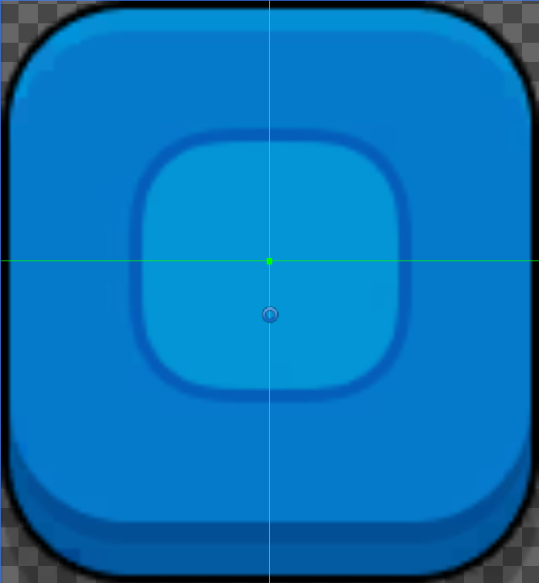
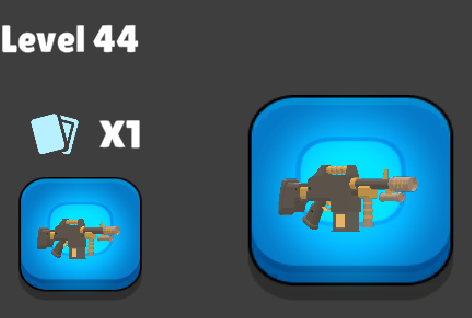
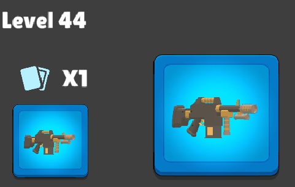

# Misc

Graphic Raycast Target 只能遮挡非 parent 的 Graphic 的交互。一个交互组件的（例如 Button）的 child Image/Text 设置为 Raycast Target 也不会阻挡这个 button 的交互。但是一个设置为 Raycast Target 的 Image/Text 会阻挡非 parent 的交互组件。

交互组件不仅包括内置的 Button 等，还包括带有 Event Trigger 组件的 Graphic。

交互组件会阻挡 Raycast，即使 parent 元素也是交互组件。

# uGUI Events

uGUI 事件系统包括 4 部分：

- EventSystem：处理实际物理设备输入，场景中要包含一个 EventSystem
- InputModule：只需要 Standalone Input Module，不再需要 TouchInputModule，它已经在 Standalone Input Module 中处理了
- Raycaster：包括 GraphicRaycaster，Physics2DRaycaster，PhysicsRaycaster
- EventTrigger

EventTrigger 用于在最终的 GameObject 上接受各种 Pointer 事件。

3 种 Raycaster 分别用于投射 GUI 元素，2D 物理 collider，3D 物理 collider。GraphicRaycaster 需要挂载到 Canvas 上，两个 PhysicsRaycaster 需要挂载到用于投射的 Camera 上。

每次创建 Canvas 时，自动挂载 GraphicRaycaster 组件。用于 uGUI 元素的交互。

- Blocking Objects: None/2D/3D/All，定义哪些 GameObject 可以遮挡 GraphicRaycaster 的投射
- Blocking Mask: Layers，定义哪些 layers 可以遮挡 GraphicRaycaster 的投射

Physic Raycaster(2D) 要挂载到 Camera 上

- Event Mask：Raycaster 的 layers 参数
- Max RayIntersection：Raycast 的 maxRayDistance 参数

任何 uGUI，2D Collider，3D Collider 要接受 pointer 事件，需要挂载实现事件接口的脚步，或者简单地挂载 EventTrigger 组件。每种类型都需要创建相应的 Raycaster，并设置好 layers。

The Raycaster raycasts against 3D objects in the scene. This allows messages to be sent to 3D physics objects that implement event interfaces.

创建一个 Canvas 组件，自动创建必需的 CavasScaler 和 GraphicRaycaster 组件。CanvasScaler 确定 Canvas 的模式和分辨率，Canvas 必处于一种 Canvas Scaler 模式中（Screen Overlay、Screen Camera，World）。GraphicRaycaster 用来处理 UI Pointer 事件。如果场景中没有 EventSystem，还会自动创建一个。

## PixelsPerUnit

对于 Sprite(2D or UI) Texture，需要设定 PixelsPerUnit，其他类型的 texture 没有这个属性。

When importing graphics as Sprites, Unity displays a parameter called Pixels per Unit (PPU). Now that we know all about units, this should be very clear. It's expressing how many pixels from your Sprite fit into a unit in the Unity scene when the GameObject is scaled 1,1,1

PixelsPerUnit 用于确定一个 texture 的多少个像素应该对应一个世界单位（或 uGUI 单位）。它关系图片作为 sprite 或 UI image 显示时的分辨率问题。当越少的像素对应一个世界单位（或 UI 单位），图片显示得就越清晰，反之越越模糊。

这个属性在很多地方都出现，从 Texture 的 import 属性，到 CanvasScaler，到 Image 组件的属性，最终的 PixelsPerUnit 取决于所有这些属性的比例。

这个属性对 Sliced Sprite 尤其重要，因为作为 border 的 sprite 部分是固定的，它因此映射的 世界单位（UI 单位）也是固定的，PixelsPerUnit 确定着 border 在 world/UI 上显示的大小。

例如下面是一个 sliced sprite texture：



当 PixelsPerUnit 设置为 50 时，border 非常宽：



当 PixelsPerUnit 设置为 150 时，border 比较细：




## Screen position to anchoredPosition

UGUI 最古怪的一个特性就是，一个 RectTransform 的位置 anchoredPosition 不是基于父坐标系的，而是基于自己的 anchor rect 和 pivot 的。对于传统的 GUI 系统，例如 UIToolkit，子元素的位置就是在父元素的坐标系中决定的。

RectTransform 的 anchoredPosition 是它 pivot 的位置，所参考的坐标系是 anchor rect。四个 Anchor 在 parent 的 rect 中划分出一个矩形作为子元素的 anchor rect，然后按照 pivot 的相对单位矩形的位置，在 anchor rect 中找到相应的位置，这个位置就是参考坐标系的原点，当 anchoredPosition = 0 时，pivot 就位于这个位置。坐标系（UGUI）是 x 轴向右，y 轴向上。

因此，即使在位于同一个父元素下，子元素之间的 anchoredPosition 相互之间也没有参考意义，因为它们都是相对自己 anchor rect 定义的。将 Screen Position 映射为任意元素的 anchoredPosition 更是没有便捷的计算方法。最简单的方式是通过 Canvas 转换。先获取屏幕坐标（例如通过相机将 world position 转换为 screen position，或者使用鼠标坐标），调用 RectTransformUtility.ScreenPointToLocalPointInRectangle(rectTransform, position, camera, out pos) 将屏幕坐标转换为 rectTransform 的局部坐标。这个局部坐标就是 rectTransform 自己的 anchor rect 坐标系，以 rectTransform 的 pivot 为原点，x 轴向右，y 轴向上系。这里 RectTransform 使用 canvas。然后将元素先设置为 canvas 的子元素，将它的 anchoredPosition 设置为 RectTransformUtility.ScreenPointToLocalPointInRectangle 返回的坐标，再将元素设置回原来的父元素下面。

RectTransformUtility.ScreenPointToLocalPointInRectangle 返回一个屏幕位置在 RectTransform anchor rect 中的位置。同时还返回这个位置在 RectTransform 矩形之外还是之内（这可以用来判断鼠标是否在元素矩形内，实现控价交互）。返回的坐标是相对于 RectTransform pivot 的，如果坐标=0，就位于 pivot 的位置。

anchor 布局中元素改变 Hierarchy 关系（更换父元素）时，在屏幕的位置总是保持不变，其他 RectTransform 参数，尤其是 anchoredPosition，相应进行改变，而且是瞬时改变，因为它们都是通过公式彼此关联的，在改变 hierarchy 后，立即更新，不像自动布局，改变元素的布局属性，至少要等到一帧的末尾 canvas 刷新布局后才生效。这是因为自动布局需要遍历整个 hierarchy 进行两遍自顶向下的计算，这些计算非常复杂繁重，为了避免每次改变自动布局都进行一次这样的计算，UGUI 只在一帧的结尾为当前帧进行的所有自动布局改变执行一次计算，以进行优化。如果需要立即更新，可以强制触发自动布局计算。

设计满足适配任何分辨率的 UI 时，尤其要使用 Canvas Scalar 的 Scale With Screen Size 的 UI Scale Mode。它定义一个虚拟的设计时 UI 参考的分辨率，然后在运行时保持 aspect ratio 缩放 Canvas 来匹配屏幕。在 Canvas 内部，总是使用设计时虚拟分辨率的单位，不需要考虑真是屏幕的分辨率，Canvas Scalar 在运行时会根据实际的屏幕分辨率来定义一个虚拟分辨率像素单位对应多少真是的物理屏幕像素，这是一个自动计算过程。这样可以在设计时完全不需要考虑担心真实的屏幕分辨率，而只需要使用虚拟参考分辨率即可。这样可以保证，无论设计 UI 的时候使用 anchor 布局，还是自动布局，无论 anchor 布局使用何种 anchor，pivot，和 anchorPosition，都能保证做见即所得，可以使用任何布局方法，只要能拼出想要的 UI 即可，完全不需要担心在不同分辨率的真实屏幕上 UI 效果不同甚至混乱的问题。而且还可以对 UI 元素安全地使用绝对像素坐标，因为 Canvas 中的绝对像素坐标也是虚拟分辨率的虚拟像素，Canvas Scalar 缩放 Canvas 时会将一个虚拟像素映射为一定数量的真实像素。能使用绝对坐标设计 UI 就太方便了，不需要像 web css 中必须使用百分比才能得到响应式 UI 这样的方法了。总之，使用 Scale With Screen Size 后，可以使用任何方法设计 UI，总能做见即所得，设计的是什么样，运行时显示的就是什么样。

这个方法太好用，UI Toolkit 的 UIDocument 的 PanelSetting 也包含了这个功能。因此在 UI Toolkit 中可以安全地使用绝对像素单位，不需要百分比单位。

这个所见即所得指的是相对于虚拟分辨率空间的，如果虚拟分辨率超过了 Canvas 有显示在屏幕之外的部分，有可能有部分 UI 显式在屏幕之外。因此通常使用 Expand 缩放模式。

虚拟的参考分辨率和运行时的真是屏幕分辨率的 aspect 很可能不匹配，可能更宽或更窄。如何缩放 Canvas（一个虚拟分辨率像素对应多少真实物理像素）通过 Screen Match Mode 决定。注意这里 Expand/Shrink 指的是 Canvas 相对于虚拟参考分辨率进行 Expand/Shrink:

- Expand: 按照 Screen 分辨率，扩展 Canvas，使得虚拟分辨率空间总是包含在 Canvas 中，没有 UI 显式在屏幕之外
- Shrink：按照 Screen 分辨率，收缩 Canvas，使得 Canvas 总是包含在虚拟分辨中空间中，可能有部分 UI 显式在屏幕之外，因为 Canvas 总是完全匹配 Screen，可能有部分虚拟分辨率空间在 Canvas 外面
- Match Width Or Height：= 0 时，等价于 Expand，= 1 时，等价于 Shrink

这里 Expand 和 Shrink 是使 Canvas 的 aspect 完全等于 Screen 的 aspect，水平垂直像素比总是 1:1，Canvas 大小总是完全匹配真实屏幕，但是不必匹配虚拟分辨率的 aspect，只是根据 Expand/Shrink 可以保证虚拟分辨率总是包裹在 Canvas 中或者反之 Canvas 总是包裹在虚拟分辨率中。

## Anchor Layout

Anchor Layout 尽管也可以用于不同分辨率屏幕上的适配，例如控制某个控件距离屏幕边缘（Canvas）多远，但是分辨率适配主要是通过 CanvasScaler 完成（整体缩放 UI，保证所见即所得）。Anchor Layout 的主要用途是实现自定义控件，控制控件子组件相对于控件的定位，使得任意缩放自定义控件时，其外观能尽量保证合理，因为自定义控件通常会作为 Prefab，并用在很多地方，分配给它的空间可能不尽相同。Anchor Layout 使得控件在被拖放到不同地方不同空间的时候，能保持大致合理，**而无需每次都再去手动调整**，这才是 Anchor Layout 的主要用途。然后 UI 通过 CanvasScaler 整体缩放来适应屏幕，UI 中的所有控件（无论是 AutoLayout 还是 AnchorLayout）都会保持它们原来（设计时）的样子，这样设计 UI 的时候（无论是使用 AutoLayout 还是 AnchorLayout）就无需担心各种不同分辨率的屏幕了。

因此设计某个自定义控件的时候通常应该要使用各种 Anchor/Pivot 组合，来相对 Parent 锚定 Child，使得任意改变 Parent 的大小，子控件都能保持合理布局。这主要是为了更方便地调整控件大小，而不是为了屏幕分辨率适配。因为 UI refine 的时候需要调整各种控件的大小来得到满意的效果。通过合理设置子组件的 Anchor 和 Pivot，在精细微调 Parent 控件的时候，只需要简单轻微调整 Parent RectTransform 的 size 就可以了，子控件会按照定义好的 Anchor/Pivot 布局随着 Parent Rect 自动定位。如果只是简单地使用 Middle Center 不考虑任何 Anchor/Pivot 布局，那么每当需要调整 Parent Rect（以得到想要的效果）时，都可能需要调整子组件的位置来适应新的 Parent Rect 大小，这使得 UI Refine 几乎不可行。

Anchor Layout 是为了 UI refine 精细调整用的（通过调整组件自身的 RectTransform 大小即能调整所有子组件的布局，子组件更具 Parent Rect 的变化自动调整），不是为了分辨率适配。一旦设计好所有 UI 组件的布局，CanvasScaler 会将 UI 整体缩放来适应真实的屏幕，整体 UI 外观会所见即所得的保持它们设计时的样子，Canvas 内部使用逻辑虚拟的坐标单位，无论是 AutoLayout 还是 AnchorLayout 都不用担心真实的设备屏幕分辨率，设计时值参考设定的虚拟分辨率设计就可以了。

Auto Layout 也是一样，不需要考虑真实屏幕的分辨率，只需要参考设定的虚拟分辨率设计，只要在虚拟参考分辨率中达到想要的效果。

无论是 AutoLayout 还是 AnchorLayout，调整 UI 的位置和大小是为了在设计时得到想要的效果，而不是为了在真实屏幕上根据实际分辨率动态调整 UI 来适配屏幕，屏幕适配是通过 CanvasScaler 完成的。因此设计时只需要考虑参考分辨率，可以以任意方法使用 AutoLayout 或 AnchorLayout，只要能在参考分辨率中得到满意的 UI 就可以。只是在设计的时候，为了 UI refine 的方便，要设计好 Anchor/Pivot 或 Layout 属性，使得在精细调整 UI 控件时，只需要调整 Parent 的 RectTransform，而不必再去调整其子组件的位置和大小。

只考虑设计时为了方便调整大小的缩放，而不用考虑运行时针对真实屏幕的缩放。

UIDocument 也是一样。

## 自适应、带背景图和 margin 的 TextMeshUGUI

实现一个根据 text 内容自适应的，带背景图和 margin 的组件。

TextMeshUGUI 上面不能再添加 Image 组件，它们都是基本组件，每个实现 Graphic 接口。

- 首先为 text 组件添加 ContentSizeFitter 组件。注意 ContentSizeFitter 是根据 Layout 参数控制自身 RectTransform，而不是控制 Children
- 创建一个 HorizontalLayoutGroup 或 VerticalLayoutGroup 作为 text 的容器，将 text 作为它的 child。在它上面添加 Image 组件，作为背景
- 在 HorizontalLayoutGroup 和 VerticalLayoutGroup 上添加 ContentSizeFitter 组件
- 设置 Margin 有两种方法

  - 使用 HorizontalLayoutGroup/VerticalLayoutGroup 的 padding
  - 使用 TextMeshUGUI ExtraSetting 中的 margin

- 在 text 组件上添加 LayoutElement 设置最小宽度和高度

TextMeshUGUI 之所以要加上 ContentSizeFitter 组件，是因为它自身和普通 UI 组件一样，不具有根据自身内容调整自身大小的功能，需要显式设置 Width 和 Height。如果 text 不能适应 rect 会直接 overflow。但是 TextMeshUGUI 可以向上报告自身需要的空间。ContentSizeFitter 的作用就是根据组件自身报告（Layout 的第一阶段）的大小需求，设置自身 RectTransform 的 size（Layout 第二阶段）。

因为 TextMeshUGUI 是基本 Graphic 组件，它不能再添加 Image 组件，因此需要外面再用一个 LayoutGroup 容器附加 Image 组件，作为 Text 背景，而且 LayoutGroup 也必须随着 Text 适应而适应。这需要：

- 先接收 Child（text）的大小报告，这是 LayoutGroup 本身的作用
- 根据这个包括，设置 LayoutGroup 的自身大小，这是 LayoutGroup 上附加的 ContentSizeFitter 的作用

即 LayoutGroup 用于接收 Child 的大小报告，ContentSizeFitter 作用在 LayoutGroup 之上设置 LayoutGroup 的大小。

TextMeshUGUI 的 margin 被算到它自身的 size 上。

在 TextMeshUGUI 上添加一个 LayoutElement，可以设置它的最小 size，ContentSizeFitter 捕获的 size 报告会被 clamp 到 Minimum Width/Height 大小。

但是这样设置后，在运行时发现 LayoutGroup 不能及时随着 Text 的内容变化而变化，几乎是每 2 次改变 text，才会重新布局，适应 text 的大小，除非手动显式改变某个布局属性。在编辑器中，LayoutGroup 可以随着 Text Inspector 改变 text 而自动适应新大小，但这也是有延迟的，而且与运行时结果不一致，猜测是 Editor 中会定时重新强制布局。

这个问题的原因可能是 LayoutGroup 和自身上的 ContentSizeFitter 配合使用的结果。尽管 ContentSizeFitter 目的是作用在 LayoutGroup 之上，但是运行时，有可能 ContentSizeFitter 先发挥作用，然后 LayoutGroup 才去适应 Text 的大小，但是 ContentSizeFitter 已经不能再次调整 LayoutGroup 的大小了，而且 LayoutController 都标记为 NoDirty，因此后续帧也不会在重新布局了，除非显式改变某个布局属性强制重新布局。

要强制布局这个 LayoutGroup，必须使用

```
LayoutRebuilder.ForceRebuildLayoutImmediate(RectTransform)
```

在改变 text 后，调用这个方法可以强制 Layout 重新计算，可以使得 LayoutGroup 适应新 text 大小。

调用 MarkLayoutForRebuild 也是没有作用的

```
LayoutRebuilder.MarkLayoutForRebuild(RectTransform)
```

另一个办法是编写一个脚本放在 LayoutGroup 上，自动适应 Text 的大小。

总之 UGUI 最适合用于简单布局，不适合 Hierarchy 很复杂的嵌套布局。如果需要很复杂的嵌套布局，最好使用 UIToolkit。UIToolkit 可以和 UGUI 一起使用。上面的例子在 UIDocument 中可以非常容易的实现，而且 Text 组件本身就可以使用 Image 作为 Background。

使用 UIToolkit 可以参考 YouTube 上 CSS 特效相关 channel 来实现各种很酷的组件。

