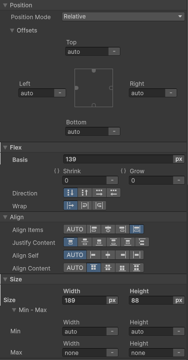
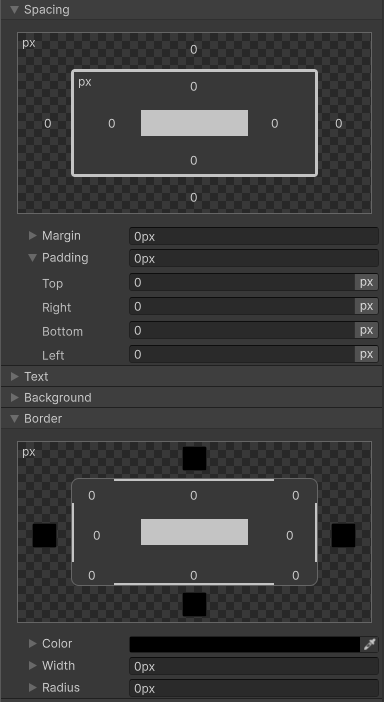

学习要总结 Cheatsheet，最简化记忆关键信息，其他细节查找文档详细了解，建立知识框架，但不要将所有细节都携带。

# Background

主要思想：让 container 有能力调整其 item 的 size(width/height) 和 order，来最好地填充可用空间。Flex Container 扩展 items 填充可用的剩余空间，或者 shrinks item 来防止溢出可用空间。

最重要的，flexbox layout 相比传统 layouts（垂直布局的 block，水平布局的 inline）是方向无关的。后者很适合 pages，但是缺乏灵活性以支持更大、更复杂的应用（尤其是当需要改变 orientation，resizing，stretching，shrinking 等等）。

Flexbox layout 最适合一个应用程序的组件（控件），和 small-scale layout，而 Grid Layout 适用于更大规模的 layout，例如页面整体框架。

# Basic and terminology

Flexbox 包含一组属性，有的用于 container，有的用于 item。

Items 会沿着 main axis 或 cross axis 排列：

- main axis：从 main-start 到 main-end
- cross axis：从 cross-start 到 cross-end

main axis 是主轴，cross axis 是相对主轴的另一个垂直轴。这并没有绑定到水平或垂直方向，main axis 既可以是水平轴或垂直轴，相应地，cross axis 是另一个轴，具体是哪个方向，依赖 flex-direction 属性。

每个 container 有自己的 main axis 和 cross axis。

- main axis：main axis 是 flex item 排列的主轴。
- main-start/main-end：flex item 在 container 从 main-start 到 main-end 排列。注意 main-start/main-end 不一定是从左到右、从上到下，也可以是从右到左，从下到上。
- main-size：一个 flex item 的 width 或 height，具体是哪个就看哪个是沿着 main axis 的，这是 item 的 main size。
- cross axis：这个轴垂直 main axis，称为 cross axis。它的方向依赖 main axis 的方向。
- cross-start/cross-end：Flex lines（从左到右填充的一行）沿着 cross axis 从 cross-start 到 cross-end 排列。
- cross size：一个 flex item 的 width 或 height， 具体是哪个就看哪个是沿着 cross axis 的。

Flexbox（除了可选的 wrapping）是一个单方向布局概念。

# Flexbox properties

## Flex Container 的属性

- display：flex

  为所有 children 创建一个 flex context（容器）。

- flex-direction：row | row-reverse | column | column-reverse

  定义 main-axis。

- flex-wrap：nowrap | wrap | wrap-reverse

  默认 flex items 会尝试填充到一行。wrap 让 items 可以断行，开启新一行继续排列。

  - 不折行
    - items 最小宽度/高度总和超过 main axis size：items 紧凑排在一起，放在一行，即使超出容器。超出的行为被 overflow 控制
      - 什么都不做，就让 items 超出容器
      - 隐藏超出的容器的部分
      - 创建一个滚动条，可以滚动展示全部内容
    - 不超过：按照 justify-content 排列 items
  - 折行
    - items 最小宽度/高度总和超过 main axis size
      items 紧凑排在一起，如果超出了容器范围，就向下新建一行，继续排列，直到所有 items 都排列完。
      新建的行就像普通的新行一样，遵守 justify-content 和 align-items。
    - 不超过：按照 justify-content 排列 items
  
  无论是 wrap 创建的新行，还是普通定义的行，行与行之间都不是不重叠的。每行都取 item 的最高点和最低点，定义这一行的高度。

- flex-flow：column wrap

  flex-direction 和 flex-wrap 的简写属性，一起定义 container 的 main/cross axis。默认值是 row nowrap。

- justify-content：flex-start | flex-end | center | space-between | space-around | space-evenly

  定义沿着 main axis 的一行中的 items 如何分布剩余的可用空间。

  当所有 flex items 是 inflexiable（指定了明确的 width/height），或者 flexiable 但达到最大 size，还有剩余可用空间，这个属性定义如何分配它们，同时也定义了 items 如何在这个 line 中排列。

  - flex-start（默认）：items 全部紧凑排列在 start，剩余可用空间留在 end
  - flex-end：items 全部紧凑排列在 end，剩余可用空间留在 start
  - start：items 全部紧凑排列在书写模式方向的 start（跟本地语言系统有关）
  - end ：items 全部紧凑排列在书写模式方向的 end（跟本地语言系统有关）
  - center：items 全部紧凑排列在 center，剩余可用空间留在两边
  - space-between：items 在 line 中均匀排列，第一个 item 在 start，最后一个 item 在 end，剩余可用空间平均分配在 item 中间
  - space-around：items 在 line 中均匀排列，剩余空间为每个 item 平均分配，并分成 2 份，一个放在 item 之前，一个放在 item 之后。这样 item 之间具有相同的空间长度，start 之前，end 之后也具有空间，但是长度是 item 之间空白的一半
  - space-evenly：items 在 line 中均匀排列，剩余可用空间在 item 中间和 start 之前、end 之后平均分配

- align-items：flex-start | flex-end | center | stretch | baseline

  justify-content 定义了 item 在 main axis 方向的排列。但是 cross axis 方向，items 的 height 仍然可能各不相同，也需要指定如何放置。这就是 align-items 的工作。

  注意这是在一行中确定 item 在 cross axis 方向如何放置。

  - flex-start：items 的 top 对齐在一起，行的底是高度最高的 item 的底
  - flex-end：items 的 bottom 对齐在一起，行的顶是高度最高的 item 的顶
  - center：items 的 cross-axis 方向的中心对齐在一起，高度最高的 item 的顶和底定义行的高度
  - stretch：items 拉伸到相同高度，并尝试填满容器

- align-content：flex-start | flex-end | center | stretch | space-between | space-around | space-evenly

  justify-content 和 align-items 定义了一行内 items 如何分布。行定义了 main axis 方向如何排列 item。但是所有行还需要在 cross axis 方向排列分布，类似一行中 item 沿 main axis 如何分布，这是由 align-content 定义。

  stretch：lines 拉伸到相同高度，并尝试占据全部的剩余空间。

- gap，row-gap，column-gap

  gap 显式控制 flex items 之间的空间。它只应用在 items 之间，但不应用在 items 与 edge 之间。

  这个行为可以视为一个强制的最小间隔，因为间隔可以更大（例如由 justify-content：space-between 导致的空白）。只有当 space 比定义的 gap 更小时，gap 才会发挥作用，强制一个最小间隔空间。如果因为添加 gap 导致 items 超出容器，超出部分的行为就是 overflow，由 overflow 属性控制。

## Flex Item 的属性

- order

  默认 items 按照声明的顺序排列。order 属性可以控制排列的顺序。更高的值排列在右边。

- flex-grow

  它定义 flex item grow 的能力。它接收一个无单位的值作为比例值。Flexbox layout 先按照 flex item 的 flex-basis（width/height）分配空间，然后比较所有元素的总和与容器大小。如果比容器小，就出现多余空间。多余空间会根据每个 item 的 flex-grow 进行分配。所有 item 的 flex-grow 加在一起的总和作为分母，每个 item 的 flex-grow 除以这个分母得到的分数，就是这个 item 分配得到的剩余可用空间的比例。

  注意它定义的是 item 本身 size 如何扩展，不是 item 周围的 space，space 由容器的 justify-content 控制。而且一旦有至少一个 item 有大于 0 的 flex-grow，就不会有剩余可用空间分配在 item 之间，因为所有剩余可用空间都会被分配给 items 自身的 size。只有所有 item 的 flex-grow 都是 0（即不伸展），才可能有可用的剩余空间分配给 items 之间。
  
- flex-shrink

  flex-shrink 是 flex-grow 的反面。当 item 的 flex-basis size 相加超出容器范围，每个 item 收缩的比例系数。

- flex-basis

  无论是 flex-grow 还是 flex-shrink，都是确定沿着 main axis 方向的 size 的。

  flex-basis 也是定义 main axis 方向的基础 size 的。

  它定义在 main axis 上分配剩余可用空间之前 item 的默认 size。它可以定义为 px 或者百分比，还可以是关键字 auto。

  如果是 auto，basis size 由 Size 属性对应 main axis 的属性（width 或者 height）定义。

  如果 flex-basis 不是 auto，明确定义了 size，则 Size 中对应的属性将被忽略，只看 flex-basis 的值。

  无论 flex-basis 是 auto 还是明确值，cross axis 方向的 size 总是根据 Size 中对应的属性（width 或者 height）定义。

  Size 区块还包含对 min-size 和 max-size 的定义。它作为最后一步的 clamp，之后就得到最终 size。

无论是 flex-grow 还是 flex-shrink 还是 flex-basis 定义的基础 size，计算的结果 size 还需要被 min-size 和 max-size clamp，才得到最终的 size。

- align-self

  一行中 item 在垂直方向上的放置，默认被容器的 align-content 定义。但是 item 还可以为自己定义一个不同的值，覆盖容器的 align-content 定义。

  align-content 的属性值与 align-self 的属性值，为每个 item 指定一个对齐基线，或者是top，或者是 bottom，或者是 center，或者是 baseline。无论是哪种，简单将所有 item 的对齐基线对齐在同一条直线即可。因此即使 item 自身 align-self 定义的对齐基线与容器为其他 item 定义的对齐基线不同也没关系，简单将它们对齐即可。对齐之后，item 的最高点和最低点定义了 line 的高度。

# 工作流

1. 定义 main axis（flex-direction）
2. 定义 flex items 超出容器宽度后是否断行重新开启一行继续排列
3. 定义一行中 item 的水平排列（justify-content）
4. 定义一行中 item 的垂直排列（align-items）
5. 定义行在 cross axis 方向的排列（align-content），类似一行中 item 的排列
6. 定义 item 的 flex size（flex-basic，flex-shrink，flex-grow）
7. 可选地定义 item 对容器 align-item 属性的覆盖，align-self

## 属性定义工作流

Container 定义

1. flex-direction：main axis 方向
2. flex-wrap：是否断行
3. justify-content align-items：一行中，item 在水平和垂直方向如何放置
4. align-content：所有行在 cross axis 方向如何放置

Item 定义：主要是定义 item 的 flex size，最终确定 item 的 size

1. flex-basis
2. flex-grow
3. flex-shrink

可选地定义 order 和 align-self。

每个 item 的 size，首先有一个定义的基础 size（flex-basis，width/height），然后定义 flex-grow/flex-shrink），然后 min-size 和 max-size 定义一个 clamp 的范围。这些最终确定每个 item 有多大。但是 item size 的总和可能比容器宽度小，于是就有了剩余空间，剩余空间的分布则基于容器的 just-content 进行分布。

# Unity UIToolkit USS

UTK Builder 涉及元素布局和定位区块的包括：Flex、Size、Space、Border。

## 定位与布局属性

### Size

定义初始 preferred size 和 min/max size。

preferred size 定义元素的参考大小 width/height。

auto 表示元素大小由内容决定的自然大小。

px 和 % 明确定义元素的大小。

注意 Flex Basis 会定义 main axis 上的基准 size（或为 width，或为 height，看哪个轴是 main axis）。

- 如果 Flex Basis 是 auto，则 basis 大小就是 Size 定义的大小
- 如果 Flex Basis 明确指定了大小，main axis 上的 size 就使用这个值，Size 中定义的被忽略
- cross axis 上的大小，如果 align-items 不是 stretch，就是 size 定义的大小（width 或 height），否则 item 的 cross axis size 被缩放到 line 的高度

min-size 和 max-size 不一定会将元素设置到这个大小，它们只是设定了一个 clamp 的范围，保证元素不小于 min-size，不大于 max-size。但元素不一定是这么大。auto 表示不进行 clamp。

Basis size 作为分配剩余可用区间之前元素的大小，然后在此基础上对剩余空间（如果由剩余空间）进行按照 flex-grow 进行 grow 或者按照 flex-shrink 对元素进行 shrink。

### Flex 和 Align

定义 Flexbox layout 的各种 Flex 属性。

flex 区块的属性：

- Basis：item 属性，在 container main axis 上的 basis size。
- Shrink 和 Grow：item 属性，默认都是 0，即不拉伸或收缩，只使用 Size 和 Basis 定义的 size
- Wrap：container 属性，是否折行

align 区块的属性：

- Align Items：容器属性，定义 item 在一行的垂直(cross)方向上如何对齐。它为 item 指定一个对齐基线：top、center、bottom、baseline，然后将 item 的对齐基线排列在一条直线上。还有 stretch，将所有 item 拉伸到相同高度（高度最高的元素）。无论哪种对齐，所有元素的最高点和最低点定义了一行的高度
- Justify Content：容器属性，定义 item 在一行的水平(main)方向上如何排列、分布，只在所有 item 的 flex-grow = 0 时有用
- Align Content：容器属性，定义所有 lines 在容器的垂直方向（cross）上如何排列，分布，和 Justify Content 在水平方向上的作用一样
- Align Self：item 属性，item 自己定义一个 Align Items 属性，定义自己在一行的垂直方向上的对齐基线（top、center、bottom、baseline）（如何对齐），覆盖容器为它定义的 Align Items

Shrink 和 Grow 缩放的都是 item 的本身大小，不是分配剩余空间到 items 之间。

注意只有任何一个 item 的 grow > 0，就不会有剩余空间，剩余空间完全分配给元素。只有所有 item 的 grow 都是 0，剩余空间才会在 items 之间分配，至于如何分配，通过 justify-content 控制。

### Spacing

定义 Box 属性：margin，padding，包围在 box 外围的空间。

Flexbox layout 布局使用的 box 大小，而不只是元素本身的大小。margin 添加到 box 的 border 之外（不属于元素内容区域大小，但是作为 flexbox 布局的 box 大小），padding 添加到 box 的 border 之内（属于元素内容区域大小）。

Box 大小：content + padding + border + margin。

### Border

定义元素的边框，参与 Flexbox 布局的 box 的大小。

可以定义颜色、边框宽度、四个角的圆角半径。

### Position

定义元素的定位。只有两种：Relative 和 Absolute。

- Relative：元素通过 Flexbox Layout 确定位置（定位）
- Absolute：元素不参与 Flexbox Layout 布局流，完全基于 Parent Element 进行绝对定位

无论是 Relative 还是 Absolute，都需要定义 Anchors：Left、Top、Right、Bottom。

- 对于 Relative，Anchors 定义元素在布局之后，基于计算后的布局位置，可以做的进一步偏移，不影响布局流

  此时，只有 Left 和 Top 有意义，定义了 offset 向量（x，y）。Right 和 Bottom 被忽略，因为元素的大小已经被计算好了。

  即使 Size 为 Auto，也不会被 Right 和 Bottom 定义，因为元素自身（尤其是内置元素）也有定义好的 preferred size（通常不是 0），还有 flex size 的属性，元素大小被它们定义，因此 Right 和 Bottom 被完全忽略。
 
- 对于 Absolute，Anchors 定义元素在 Parent Element 中的绝对位置

  Left，Top 定义元素在 parent 中的左上角的位置。对于 Right 和 Bottom，是否有意义根据 Size 的定义决定：

  - 如果 Size 无论哪个方向（width 还是 height），定义了明确的值，相应的 Right 或 Bottom 被忽略，没有意义，元素大小由 Size 定义
  - 如果 Size 定义为 Auto，则 Right 或 Bottom 为右边缘、下边缘距离 Parent 的右边缘、下边缘的距离，因此 元素的大小由 Right 或 Bottom 定义

### Display

item 在 container 中排列不需要约束在容器中，可以自然地排列到容器之外（overflow）。如果 item 按照 basis size 排列在一起超过容器大小，那么它们就排列在一行，然后 overflow 到容器之外。

要解决 overflow 的问题由三个方法：

- Display overflow 设置为 hidden，直接将容器之外的内容剪裁掉
- Flex Wrap 设置为 Wrap，让 item 排列满一行之后，新起一行，继续填充。新创建的行，就像普通定义的行一样，遵循一样的 flexbox layout 原则，直到填充完所有的 items
- 使用 Scroll View，让容器足够大，让 item 不会超过容器，但是约束在 scroll view 的视口内，通过滚动条滚动查看

Display 属性：

- Opacity：指定元素的不透明度
- Display：元素是否显示。隐藏时，元素被排除在布局流之外，因此会影响布局
- Visibility：同样控制元素是否显示。只是控制元素是否渲染，元素仍然会正常布局
- Overflow：当 item 行超出容器之外，直接显示，还是剪裁掉 clip

## 其他属性

### Text

元素内部的文本的相关属性，包括字体的 family、style，字体大小，文字颜色。还有三个文本布局相关属性：

- Align：定义文本在元素的水平和垂直方向的对齐
- Wrap：连续的文本行是否断行，还是显示为一行
- Text Overflow：文本超出元素大小时，直接显示还是剪裁掉（并显示省略号，至少有文本被剪裁）。要剪裁并显示省略号，Display 的 Overflow 也要设置为 Hidden

### Background

设置文本背景颜色或图片（重复或缩放）。

### Transform

元素定位并渲染后，将其作为一个普通的 graphical 元素（类似 sprite 或 texture），进行正常的 Transform 变化。这与 Flexbox 布局已经无关了，而是作为普通的 Game Object 元素。

- 可以定义元素变化的 pivot，作为 scale 和 rotation 的原点
- 相对于 Flexbox 布局之后的位置和大小，进行 Translate，Scale，Rotate

如果仅是 Translate，类似 Relative Position 的 offset 的作用。

### Transition

定义 USS 动画。
