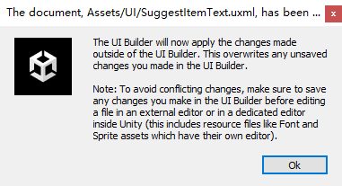
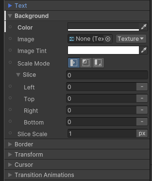
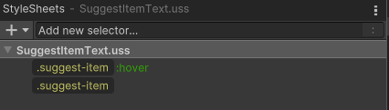

# StyleSheet

UXML 样式可以在 inline 指定，也可以在外部的 USS 文件指定。inline 样式优先于 USS 文件样式。无论是 inline 样式还是 USS 样式，都只指定一部分样式，但是 UIBuilder 的 inspector 中显示全部的样式。每个样式都有默认值。为了提示 inline 或 USS 文件指定了哪些样式，UIBuilder 在 Inspector 的属性前面显示一条白线：

这表示这个属性（Background Color）样式被显示指定。

通常会有多个 selector 以及 inline 规则修改同一个属性，而最终效果取决于它们的优先级，因此明确哪个规则指定了哪些属性非常重要。

例如，可能想要添加一个样式规则使用 :hover 伪类修改元素高亮时的 background color，但是如果 inline 样式已经显式指定了 background color，这个 :hover 样式规则就不会起作用，因为 inline 总是优先级最高。要解决这个问题，就不能在 inline 样式中指定 background color，而是添加一个 selector 选中这个元素，然后设置 background color，再然后创建一个 :hover selector 设置高亮时的 background color。

这个问题非常微妙，稍不注意就可能产生预料不到的结果。最简单的办法就是不使用 inline 样式，全部都用 selector 样式规则。因为 inline 样式显式指定的规则导致任何外部的 selector 样式规则无效。inline 只应该用于那些不会改变的样式。

要指定 uss selector，首先需要创建 USS 文件。在 UIBuilder 左上角 add new selector 时会自动提示创建新 uss 文件。然后在这个文件下面就可以添加样式了。

一个 UXML 可以添加多个样式文件。
