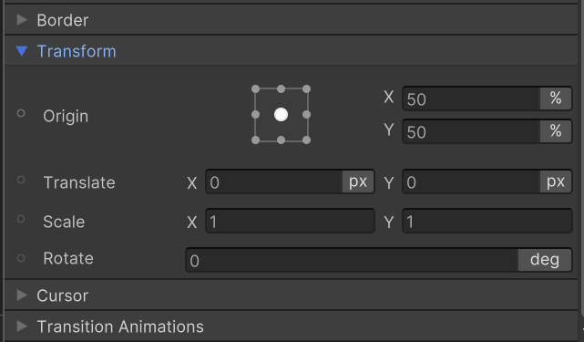

# USS transform

Transform 属性应用一个 2D transform 到一个 visual element 上。你可以用它们选择、缩放、或移动一个 visual element。

如果你改变一个 element 的 layout，Unity recalculates 同一个 hierarchy 上其他元素的 layout。这个 recalculation 可能降低 animation frame rate。应用 transform 到一个 element 降低 recalculations，因为它不改变 hierarchy 上其他元素的 layout。

可以用 transform 来定义一个 visual element 的静态外观。然而，transform 最适合用于 changes 和 animations。例如，如果你想当发生了一个事件时创建一个 visual element，使用常规的 layout 属性，例如 top 和 left 来设置 visual element 的位置，然后使用 translate 对齐到相对于它的 initial position 的一个 offset。

默认元素都是 Relative Position（相对定位）的。相对定位布局中，每个元素不考虑偏移（top，left，bottom，right），先执行一遍正常的布局计算。然后在每个元素确定了它在布局流中的位置后，在基于元素自己的这个 initial position 偏移。此时的偏移不会影响布局（不影响其他元素），每个元素的 initial position 和 rect 都已经确定了。Absolute Position（绝对定位）的元素则完全脱离正常布局流，直接相对于 parent 元素绝对定位，不与其他任何元素的布局发生关系。

Transform 没有指定元素的 position 和 rect，它指定的是基于 initial position 和 rect 的变换（translate，rotate，scale），无论 initial position 和 rect 是从相对定位计算出的，还是从绝对定位计算出的。

Transform 包含以下属性：

- Transform Origin (transform-origin)：执行 rotate，scale 变换发生的 origin 点
- Translate (translate)：在水平或垂直位置上偏移 visual element（相对于它的初始位置）
- Scale (scale)：改变 visual element 的 size，padding，border，margins。负数值沿着 scale axis flib visual elements（镜像翻转元素）
- Rotate (rotate)：旋转一个 visual element。正数值顺时针旋转，负数值逆时针旋转。可选的单位包括 deg，grad，rad，turn。详细信息可参考 CSS 规范中的数据类型

所有变换按照以下顺序进行（SRT）：

- Scale
- Rotate
- Translate

这与 Unity 构建矩阵的方法约定是一致的 TRS：先在本地缩放，然后再本地旋转，最后进行偏移。

既可以用 Position 中的 offset 来控制元素的偏移，也可以用 Transform 中的 Translate 控制元素的偏移。但是 Position offset 通常用于静态的元素偏移（通常是用于元素的定位，满足 UI 设计）。而 Transform 的 Translate 通常用于元素的动画。

## Transform controls in UI Builder

可以在 UI Builder Inspector 中的 Transform section 来设置 visual element 的 transform 属性。

这意味着也可以在 USS 或 C# 中显式指定元素的 Transform。
