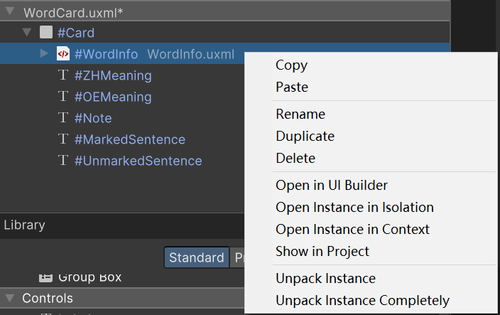
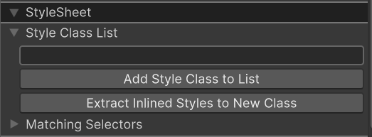
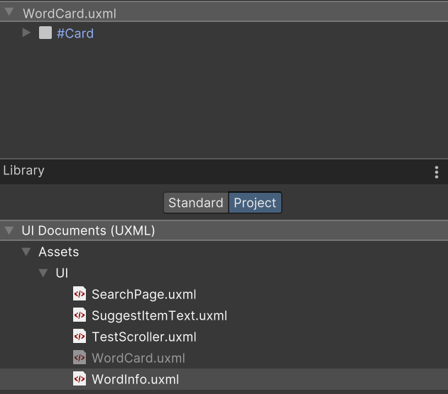

# Visual Element

当前没有 z-index 支持，但是可以通过 hierarchy 控制渲染顺序：

- parent 先于 child 渲染，child 在 parent 上面
- 前面的 sibling 先于后面的 sibling 渲染，后面的 sibling 在前面的 sibling 上面

当前没有办法复制 VisualElement，更不用说 VisualElement Tree。因为这不仅涉及元素样式，还包含元素很多内部属性，以及元素上注册的回调函数。

通常复制一个 VisualElement 主要是复制它的外观，而 UITK 的外观完全通过样式定义。因此简单复一个元素的方法就是创建一个相同类型的 VisualElement，然后指定相同的样式。但是在 C# 中 VisualElement.style 是只读的，不能直接全部复制样式。唯一能赋值的是 stylesheet，而它引用的是外部 USS 资源。

因此重用 VisualElement 和 VisualElement Tree 的唯一方法就是使用外部的 UXML 和 StyleSheet。

UGUI 可以很方便地重用、赋值一个元素和 tree。但是 UGUI 不能方便地改变整体 UI 外观，实现样式主题功能，而 UITK 通过样式表则可以很方便地实现。

有几种方法可以加速 UITK 重用的过程：

- 创建 Template

  右键点击 UIBuilder Hierarchy 的某个子树，右键选择 Create Template。这会将这个子树导出到 Project 中一个 UXML 资源。同时当前 UIBuilder 编辑的 UXML 将以 Template 引用这个子树。导出的子树会同时将 inline style，USS class 一并导出到 UXML 中。Template 以一个容器元素包装整个子树，这个 Template 元素自动创建，并以 position=relative，shrink=1，grow=1 添加到当前 UXML tree 中。

  类似 GameObject Prefab，以 Template 引用的子树可以 unpack，移除容器元素：
  
  

- 将一个元素的 inline style 全部导出到一个 class，保存到一个 USS 文件中。这样元素上就没有内置样式，而是完全依赖 USS 样式表应用

  

- 在 UIBuilder 中以 Template 导入子树

  在 Library 中，选择 Project 选显卡，选择一个 UXML 资源文件，然后拖拽到 Hierarchy 中：

  

  这种 Template 导入 tree，效果和在 C# 中引用 VisualTreeAsset，并调用 CloneTree 是一样的。

尽量不使用 inline style。每次创建一个 UXML，先在 StyleSheet中创建一个新的 USS 文件。然后为每个目的的样式创建一个 class，使用 class 样式设置 UI 外观。
