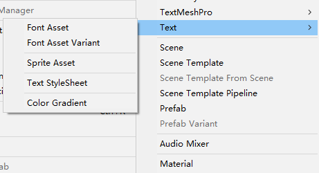
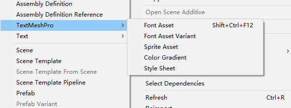
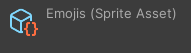
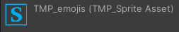
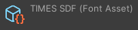

# Font Assets

UI Toolkit 使用 TextCore 来渲染 text，这是一个基于 TextMesh Pro 的技术。TextCore 允许高级 styling 能力，并且可以在各种 point sizes 和分辨率中清晰低显示文本。它利用 Signed Distance Field(SDF) font rendering，即使在旋转和放大的情况下，它也可以生成清晰整洁的 font assets。

当前不可以修改 Editor UI 的 Panel Text Settings（UI Builder）。UI Builder 中的字体设置和 Runtime 不同。

Unity 中应用到 Text 的是 Font Asset。Font 先转换为 FontAsset。如果指定 Font，Unity 会在后台自动进行转换。

## Character Set

font 文件中的字符不会自动包含到 font asset 中。你必须指定你需要哪些字符。可以选择一组预定义的字符，提供一个要包含的字符列表，或者包含一个现有 font asset 或 text asset 中的所有字符。

Font assets 作为 fonts 的容器。使用 assets，你可以包含 font 到项目中，并从一个 font 文件创建字体的变体，而不改变原始的字体。创建 font assets 的另一个原因是处理包含大量字符集的语言，例如中文。你可以只包含需要的字符，而不是包含所有的字符。

可以转换 TrueType(.ttf) OpenType(.otf) TrueType Collection(.ttc) 字体到 font assets 中。一个 font asset 包含一个 font atlas texture 文件，它包含所有的字符。创建 font asset 时可以选择一些 atlas populate modes 和 render modes。

## Atlas population modes

TextCore 支持 Static Dynamic 和 Dynamic OS atlas population modes。

### Static font asset

Static font asset 预烘焙（pre-bake）字符到 atlas texture 中。使用 static font assets 来包含项目中已知的文本，例如 labels，和 section titles。当创建一个 static font asset，font atlas（font 图集）默认是空的。你必须手动生成 font atlas 来包含需要的所有字符。Project build 不要包含 font source file，因此它既快又高效。

### Dynamic font asset

Dynamic font assets 以一个空的 atlas texture。Dynamic font assets 在一个 source font 文件中查看字符，并随着你在一个 UI 中使用将字符动态添加到 atlas texture。Dynamic font assets 用于可能包含未知文本的 UI，例如 input fields。Dynamic fonts assets 很灵活，但是它们有额外的性能消耗，因为 project build 需要包含所有的 font files。

### Dynamic OS font asset

Dynamic OS font assets 是一个 dynamic font asset，它引用操作系统上的 font file，而不是 source font file。相比 Dynamic font asset，dynamic OS font assets 有更少的内存消耗。Project build 不需要包含 font source files。确保 fonts 位于 targeted platforms 的操作系统上。Dynamic OS font assets 是 fallback font assets 的极好的 candidates。

要创建一个 dynamic OS font asset，从 operating system 导入这个 font 到 project 中，然后用它创建一个 dynamic font asset，并将 Atlas Population Mode 设置为 Dynamic OS.

## Atlas render modes

TextCore 支持 atlas render modes：bitmap 和 Signed Distance Field(SDF)。

SDF rendering 生成的 font assets 在旋转和缩放的时候，字体看起来都很清晰整洁（类似于矢量图），还支持 outlines 和 drop shadows 效果。

## Font asset variant

如果你只想改变 font assets 的 metrics，可以基于一个 font asset 创建一个 font asset variant，而不是创建一个新的 font asset。一个 font asset variant 可以具有和原来的 font asset 不同的 style，而不需要额外的 textures 空间。

Create > Text> Font Asset Variant 来创建 font asset variant。

## Enable Multi Atlas Texture for large texture

对绝大多数 fonts，如果要包含所有的 ASCII 字符，使用 512x512 纹理就可以。要支持上千个字符，使用更大的纹理，并且开启 "Multi Atlas Textures" font asset 属性。当 main textures 满了的时候，这会自动创建新的相同大小的 textures。

也可以在移动平台上开启这个选项，在那里一个强制的 texture size 阻止了完全的 glyphs 集合填充到一个 atlas 中。

## 使用 font asset

要使用 font asset，在 Inspector window 中的 Font Asset 选择 font。

注意：Font 字段是为了向后兼容，新的项目应该使用 Font asset。如果你为遗留项目使用 Font，则 Font Asset 必须设置为 None。否则 Font 不会起作用。

可以在 USS 中为一个 text element 应用一个 font asset:

```css
-unity-font-definition: <resource> | <url>
```

例如，

```css
Label {
    -unity-font-definition: url("/Assets/UI Toolkit/Resources/Fonts & Materials/LiberationSans SDF.asset");
}
```

## 最佳实践

- User input text：使用 Dynamic 或 Dynamic OS population mode，以及 SDFAA mode 用于快速生成。你可能需要为本地化添加 fallbacks
- Generic lables：使用 Static population mode，以及更小 sampling point size 的 SDF16
- Titles：使用 Static population mode，以及更大 sampling point size 的 SDF16
- Pixel Art：使用任何 bitmap render modes
- Padding：Use a sampling to padding ration of 1:10
- 对大纹理使用 Multi Atlas Textures

## 注意资源类型

TextCore 使用的是和 TextMeshPro 一样的技术，它们也具有相似的概念。但是它的资源各自具有不同的脚本类型，无法互换使用。TextCore 用于 UIToolkit，TextMeshPro 用于 UGUI 和 3D Text。因此创建 Font Asset 或 Sprite Asset 时，注意是为哪种 UI 创建：





查看 Font Asset 或 Sprite Asset，通过 Inspector 中显示的脚本类型确定它是用于 TextCore 的还是用于 TextMeshPro 的。








