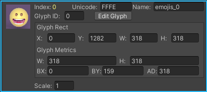

# Include sprites in text

要在 rich text tags 中使用 sprites，例如 emojis，你需要一个 sprite asset。可以从包含一组 sprites 的 atlas textures 创建 sprite assets。

可以使用任意多个 sprite atlases（sprite 图集）。然而，如果对每个 text object 使用多个 atlases，将导致多个 draw calls 应用到这个 object 上，并且消耗更多的系统资源。通常来说，当你 import 多个 sprites，将他们打包到一个 atlas 来减少 draw calls。确保 sprite atlas 有一个适合 target platform 的 resolution。

使用 \<sprite> rich text tag 在 text 中包含 sprites。

## Create a sprite asset

从 atlas textures 创建 sprite assets。尽管 sprite assets 和它们的 source textures 是不同的实体，但是你必须在创建 sprite assets 后将 source textures 保留在项目中。

1. Import sprite atlas
2. 选择 atlas 并改变以下 texture 选项：

   - Texture Type：Sprite(2D and UI)
   - Sprite Mode：Multiple

3. 打开 Sprite Editor 将 texture 分割为一个个 sprites
4. 右键点击 sprite 并选择 Create > Text > Sprite Asset，创建一个新的 sprite asset
5. 在 Inspector window 中，可以进一步定制每个 glyph 的外观和名字，尤其是设置每个 glyph 的偏移，即 offset。看起来 UIToolkit 没有考虑 Sprite 自身的 pivot，而需要显式指定每个 glyph 的 pivot。因此如果发现 sprite 没有出现在正确的位置上，注意修改它的 pivot(BX, BH)：

   

6. 将 sprite asset 放在 Panel Text Setting 指定的路径中

一旦创建了 sprite asset，可以将 atlas textures 的 Texture Type 设置回它原来的设置。

## 使用 Sprite asset

在 rich tag 中使用 sprite。

```plain
<sprite="assetName" name="spriteName"> 
<sprite="assetName" index=1>
```

对于 runtime UI，如果在 Panel Text Settings 中设置了default sprite asset，可以忽略 asset name：

```plain
<sprite name="spriteName"> 
<sprite index=1> 或 <sprite=1>
```

## 为一个 sprite 指定和使用 Unicode

你可以为一个 sprite 指定一个 Unicode，并在 text 中直接使用 Unicode 而不是 \<sprite> 标签。

例如，smiling face emoji 的 Unicode 是 U+1F160A，要将它指定给 sprite asset 中的一个 sprite：

1. 在 sprite assset Inspector Window 中，找到 Sprite Character Table。可以按 index 或 name 搜索
2. 点击 glyph 来开启 edit mode
3. 在 Unicode box 输入 +1F60A
4. 点击 Unicode label 保存修改。Unicode 改变为 0xF1F60A。

要在 text 中使用 smiling face emoji，输入 \U00F1FF60A。

## Sprite Asset properties reference

- Update Sprite Asset

  同步 Sprite Editor 最后一次修改。

- Fallbak Sprite Asset List

  当一个 glyph 不在这个 sprite asset 时，TextCore 搜索 sprite assets list 来查找缺失的 glyph。这是一个 local fallback list。local fallback list 优先与 Panel Text Settings 中的 global fallback list。

- Sprite Character Table

  管理 asset 中的 sprites。

- 定义 Sprite 的 pivot 和 baseline
