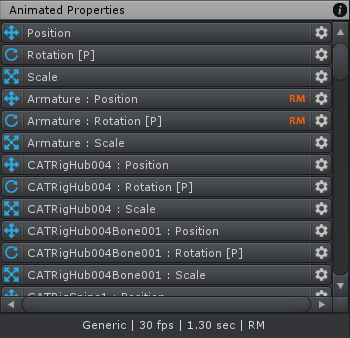
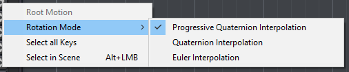

Animated Properties List 位于 Clip Editor 的左侧。Animated Properties List 显示当前 project rig 的所有 animated properties。

List 中每一行都可以在 Dopesheet 中跟踪以找到相关的 keys。

- 每个 animated property 左侧的 icon 指示 property 类型

- icon 后面跟着 animated property 相关的 bone/transform 名字，以及 property 类型

- 橙色的 RM 指示这个动画属性被 Root Motion 驱动

  Root Motion 就是一个指定 bone 的 motion。这个 bone 可以在 Animation Tab 的 Motion 中指定。Root Motion 只用于 Position 和 Rotation。

- 右键点击属性或者左键点击齿轮打开 context menu

- 按住 ALT 并左键点击一个属性，相应的 bone/transform 将在 Scene View 中被选中

| Menu Item | Description |
| --- | --- |
| Root Motion | 开启/关闭动画属性的root motion，只用于 position 和 rotation 属性 |
| Rotation Mode | 为动画属性选择 Rotation Mode（只用于 rotation properties）。如果多个属性被选中，这只影响选择中的所有 rotation 属性 |
| Select all Keys | 在 Dopesheet/Curves view 中选择动画属性的 keys |
| Select in Scene | 在 Scene View 中选择相应的 bone/transform |
| | |
