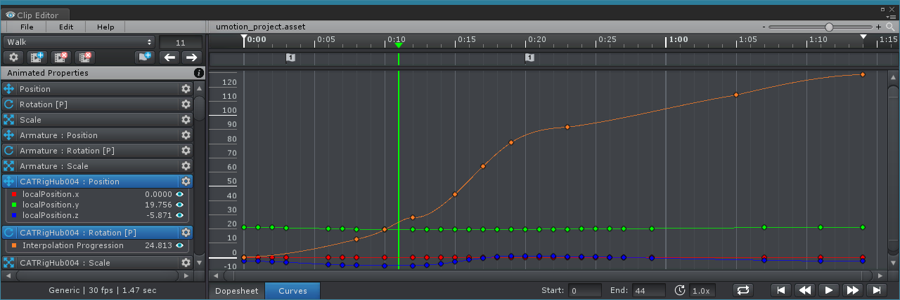

Curves View 显示一个选择的动画属性的曲线。还可以选择多个动画属性。

选择的动画属性自动在 animated properties list 中扩展，以显示所有的channel。

- 每个 channel 的当前 value 在右侧显示
- channel 名字前显示曲线的颜色
- 点击眼睛图标可以显示隐藏 Curves View

选择 keys 可以通过拖放改变 time（frame）和 value。拖拽时按住 Shift 将只改变 value（垂直拖拽），按住 Alt 将只改变 frame。

如果在 Project Setting 中选择了 Chain Neighbor Keys（默认开启），同一帧所有 channel 的 key 被一起操作，因为它们是同一个属性的，例如沿时间轴拖放，复制，剪切，粘贴，删除，和插入。属性每个 channel 有自己的曲线。

如果动画属性被设置为 Quaternion Interpolation，key 的 value 不能编辑。可以操作切线，但是强烈建议保持 tangent mode 对于同一帧每个 channel 都是相同的。还有不应该使用 Free mode，因为它将产生预期之外的旋转。

