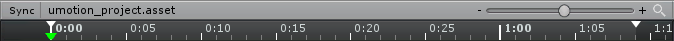

## Time Ruler

Timer Ruler 的单位是 frames。Units 被标记为 second:frame。1:20 表示 1 秒又 20 frames。

当帧率时 30fps，如上图显示，新的一秒在 30 frames 开始（0:29 -> 1:00）

### Time Ruler Navigation

- 绿色箭头是 frame cursor（帧光标）。动画的 GameObject 总是预览当前 frame cursor 位置的动画 pose
- 通过左键点击 Timer Ruler 的某个地方，frame cursor 将设置在那个位置上
- 通过左键点击并拖拽，将拖动 frame cursor。动画的 GameObject 也会相应地更新。这可以用来预览动画。当按下 Escape，拖放被终止，frame cursor 被重置到它的原始位置
- 当 frame cursor 被改变时，但是当前 pose 有未应用的修改，一个对话框窗口将弹出并询问修改是否应该被丢弃，或者它们应该在为新的 frame 保存
- 白色箭头指示预览 playback 的 start 和 end frame。通过点击 Playback Navigation 的 play button，两个箭头选择的 time span 被播放。这只是用于预览，对导出的动画没有任何影响。如果 playback end index 在动画的最后一帧，当最后一帧被移动或者添加新的 keys，它会自动停留在 end（相应调整）

### Sync Button

这个 button 用于同步 Clip Editor 和 Unity 的 Timeline/Animation Window。

## General Controls

下面的控制同时用于 Dopesheet 和 Curves View。

### Zoom 和 Panning

- 使用鼠标滚轮可以 zoom in 鼠标当前位置。在 Curves View 中，两个轴同时 zoom
- Clip Editor 右上角的 slider 可以只用于 zoom time axis
- 按住 Control 并操作滚轮，只有 time axis 被缩放（对 Curves View 很有用）
- 按住 Shift 并操作滚轮，只有 Y 轴被缩放（只用于 Curves View）。当鼠标光标 hovering Curves View 的 y-axis ruler（坐标尺），即使 Control 没有按下，也只有 y-axis 被缩放
- 通过点击并拖放水平滚动条 end（或者在 Curves View 中的垂直滚动条），也可以 zoom in/out
- 通过点击 Alt + 左键或者鼠标滚轮，Dopesheet 和 Curves View 可以被拖拽

### Selecting

- 左键点击选择一个 key 或者 event，并清除之前的选择
- 左键点击并拖拽可以矩形选择
- 点击一个 key 或 event 并按下 Control，它添加到选择中或从其中移除
- 左键点击一个 key 或 event 并按下 Shift，同一个行所有的 keys 或 events 中，之前选择的到点击选择的之间都被选择

### Context Menu

在 Dopesheet 或 Curves View 执行 Context Menu 时，弹出 Context menu

| Menu Item | Description |
| --- | --- |
| Add Keys To All Properties | 只有当鼠标在 Master Keys（最上面一行的 keys）或 Animation Events section 上点击才显示这个菜单项。 它为所有动画的属性在当前 hovered frame 上创建新的 keys。如果对这个动画属性已经有任何 key frames，它还创建一个适应当前曲线的 key。如果对一个动画属性还没有任何 key，它将 key（添加关键帧）配置的 Reference Pose |
| Add Keys | 为动画属性的所有 channels 以及当前 hovering 的 frame 添加新的 keys。如果对动画属性已经有任何 key frames，它将会为适应当前曲线的每个 channel 创建 keys。如果对一个动画属性还没有任何 key，它将 key 配置的 Reference Pose |
| Add Event | 添加新的动画事件到鼠标 hovering 的 frame |
| Delete | 删除选择的 keys/events |
| Edit Key | 只用于 curve 不是 read only 的 Cuvers View。在 Curves View 中打开一个小的对话框窗口，可以被用于编辑选择的 keys frame 以及 value |
| Cut | 复制选择的 keys/events 到剪贴板，并删除它 |
| Copy | 复制选择的 keys/events 到剪贴板 |
| Paste | 粘贴剪贴板中的 keys/events。现有的 keys 被覆盖，现有的 events 被 merged |
| Insert | 插入之前赋值的 keys 到当前选择的 frame，向后移动现有 keys |
| Reverse | 沿着时间轴翻转所有选择的 keys（这样动画就会反向播放）|
| Crop to Playback | 将当前动画剪切到选择的 playback area（时间尺 time ruler 上白色箭头之间的部分）。这影响动画片段的所有 animation layers |
| Broken Tangents | 设置或清除选择的 keys 的 Broke Tangents mode。Broken Tangents 意味着这个 key 左右切线相互独立。当 tangents broken，它们可以被设置为 Free，Linear 或 Consant |
| Left or Right Tangent/Free | 设置选择 keys 的左右切线为 Free mode。切线可以在 Curve View 中自由地调整 |
| Left or Right Tangent/Linear | 切线 handle 在 Curves View 中不可用。tangents 总是和之前之后 key 对齐为直线 |
| Left or Right Tangent/Constant | 切线 handle 不可用。切线在两个 keys 之间保持常量。Left key 的值决定线段的值 |
| Both Tangents/Weighted | 切线 handle 的长度可以改变。更长的 handle，切线对曲线曲率的影响更大 |
| Both Tangents/Clamped Auto | 默认的 tangent mode。自动关闭 Broken tangents。Tangents 被自动设置以使 curve 平滑通过 key。当编辑 key 的 frame 或 value（struct = time + value），tangents 相应调整以防止曲线 overshooting target value。Tangent handle 在 Curves View 中可用。第一个和最后一个 key 的 tangents 被计算为运动在开始和结束平滑地加速或减速。这对于只播放一次的动画片段没问题，但是对于循环播放的片段会导致明显的 seam。因此当在 Playback Navigation 中开启 looping 时，第一个和最后一个 key 的 tangents 被计算为 seamlessly blend。Playback Navigation 设置只影响 UMotion 中的 animation preview。使用 Clip Settings 中的 loop setting 为导出的 clips 开启这个行为。这不影响首尾 key 的值，只影响前后变化速率，即插值平滑度 |
| Both Tangents/Auto | Clamped Auto 的 legacy version，不能防止 overshooting target key 的值，即 key 不一定是局部极值点 |
| Both Tangents/Free | 左右 handles 都变成 Free |
| Both Tangents/Free Flat | 将左右 handles 设置为水平的，使 key 成为局部极值点，然后设置 handle 为 Free |
| Both Tangents/Linear | 自动打开 broken tangents mode。Handle 不可用，切线总是和之前之后的 key 对齐为直线 |
| Both Tangents/Constant | 自动打开 broken tangents mode。Handle 不可用。Left Key 决定 segment 的值 |
| Both Tangents/Weighted | 左右都是 weighted handle |
| Select and Set Frame Cursor | 将 frame cursor 移动到点击的 key 的位置。对于调整/打磨动画非常有用，尤其是使用快捷键 Alt + 左键的时候，因为动画也会随着 frame cursor 跳到当前位置预览 |
| | |

所有的核心知识点、关键概念只有总结为最短才算是理解了。一旦长篇大论地描述就说明没有理解。