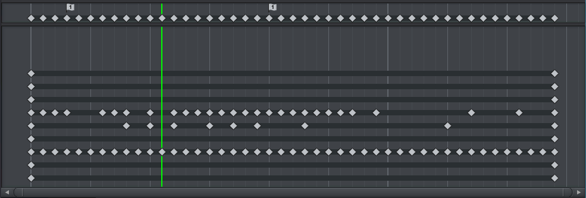
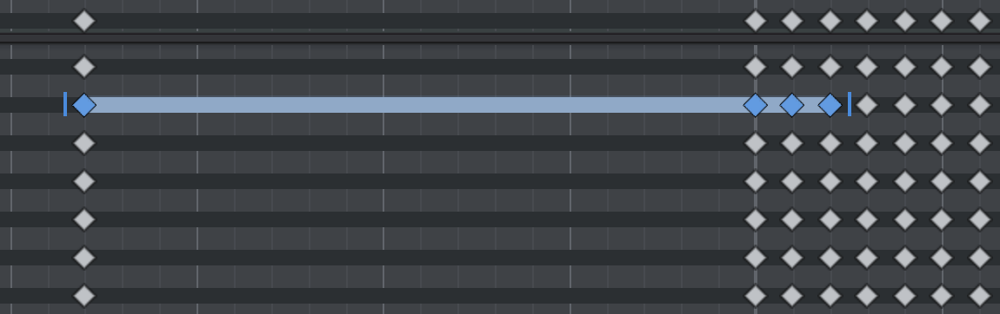

Dopesheet 被分割为两部分。上面被 Animation Events 和 Master Keys 使用。下面显示每个动画属性的 keys。

## Animation Events

- 动画事件在动画回放时间经过那一帧时被触发（只在游戏中）（这里没有 Animancer 的 End 事件，只有最后一帧上的 Animation Event。前者无视 loop 只触发一次，并在之后每帧触发。后者每次 frame cursor 经过它时都会触发）。Event 函数通过 SendMessage 发送给 Animator GameObject 的所有脚本（动画是在 Animator 上播放的）
- 动画事件展示为一个 flag icon 和一个数字在其中。数字表示这个 animation event 应用的函数的数量

双击 flag icon，打开对话框编辑指派的事件函数。每帧只能有一个事件，但是可以有多个事件函数。如果将另一个 event 拖放到同一帧上，两个 event 被合并到一起（事件函数合并为一组）

## Master Keys

Master Keys 在所有 keys 上面显示。每一帧如果至少有一个 key，就会显示一个 master key。如果 master 被选择，那一帧所有的 keys 都被选择。任何执行在 master key 上的操作影响这一帧的所有 keys（拖放、复制、删除...）。Master Key 只用来整体操作这一帧所有 keys 的 time。

## Keys Per Animated Property

主题部分显示每个动画属性的所有 keys。Window 中的每一行对应一个活动属性。

一个动画属性的 keys 之间（不同 frame 的 key）通过黑线连接。帮助你确定当前 key 后面是否有任何 key。如果多个 key 被选择，它们之间的线会被高亮显示。

选择的 keys 可以被拖放来改变 keys 的时间（frames）。

一个动画属性可能有多个 channels。只有这个属性的一个 channel 在当前帧有 key，就为这个属性创建一个 key。操作一个 key 会操作它的所有 channel。在 Dopesheet 不能改变 key 的 value，Dopesheet 只用来改变 key 的时间（frame）。
