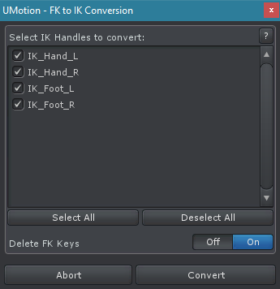

这个对话框自动创建 IK keys，它会产生和 FK keys 相似的动画。这非常适合将现有动画转换为 IK。使用 IK 的动画被 FK 更容易修改，因为要操作的骨骼更少。只记录 IK effector 的 motion，然后依赖于 Unity 内置的 IK 系统在运行时计算骨骼链上骨骼的运动，而不是依赖于 FK 中 key 的输出。

FK to IK conversion 可以在 importing animations 时直接执行。

这个转换可以在各种 3D 模型上工作，不管是 human，robot，spider 还是什么。在转换开始前，IK 需要被设置。

FK to IK Conversion Dialog

这个对话框列表列出在 animated GameObjects rig（IK Setup Wizard）中设置的每个 IK handle。选择应该被转换的 IK handles。Converter 自动为 IK handle 创建 key（time + value），以模拟被 FK keys 定义的动画。转换的 IK 动画和原始的动画可能稍有不同。

如果当前动画已经有关于要转换的 IK handles 的 keys，这些 keys 将会被自动移除。

Delete FK Keys：当这个选项开启时，将被转换为 IK 的 FK keys 将会被删除。使用 FK Pose 作为参考的 IK handles 需要它们的 FK keys 正常工作，这样那些 FK keys 将不会删除。

## Improving Conversion Accuracy

当使用 IK 时，通常不太可能绕着它们自己的 axis 旋转 chain 中的 bones（twist/roll rotations）。意味着可以绕着 pole axis 旋转整个 IK chain（或者使用 pole rotation 属性，或者使用 pole handle），但是不可能只绕着它自己的 axis 旋转特定 bone。这样，如果被转换为 IK 的 animation 包含 IK chain 中的 bones 的这样旋转，这个旋转通常不会在 IK animation 中重现。这可能导致可见的不同。有两种方式可以补偿这个问题：

- 设置 IK 约束的 Reference 为 FK Pose。这样，twist 旋转就从 FK pose 中获取。缺点是，为了使这个方法工作，转换之后，FK keys 不能从 clip 中移除，因为他们仍然需要。更进一步，FK pose 和 IK pose 紧密耦合使得编辑动画更困难
- 默认地，IK 约束的 Target Rotation 被设置为 FK Rig。假设我们有一个通过 IK 控制的 arm，而 IK target 是 hand。使用 rotation mode 将会使用 hand 在 FK rig 中的 local rotation，并复制到 IK rig。这样，如果前臂有一个略微不同的旋转（因为丢失了 twist rotation），这将导致一个不同的全局 hand 旋转。对于 global target rotation 需要和原始 FK pose 保持相同的 poses（例如当 hand 握着一支枪），建议设置 IK constraint 的 Target Rotation 为 IK Handle。这将确保 IK target 的全局 rotation 和它在 FK 动画中的完全一样，尽管剩余的 IK chain 略微不同

转换的是 3-joints（2-segments）这样简单的 LimbIK 骨骼，三角函数 IK 算法，只需要复制 end effector Transform 并调整 pole target（2nd joints）就可以了。
