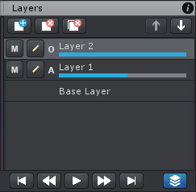

和图像处理程序中图层的原理相似，可以为 UMotion 中的 animation clips 添加多个 layers。这可以用于修改复杂的现有动画（通过 layer 隔离）（例如动作捕捉动画片段），为动画添加额外的细节，而不改变基本动画，更好地组织一个动画。

添加一个新的 layer 可以指定名字和混合模式

每个 layer 对每个属性都可以有 keys。Dopesheet/Curves View 总是显式当前选择的 layer 的 keys。

混合模式：
- Additive：这个 layer 记录的 keys 的修改被添加到现有动画上（下面的 layer 上）
- Override：这个 layer 记录的 keys 覆盖下面 layers 的值。如果属性在这个 layer 上没有 key，则不会被覆盖下面的属性

每个 layer（除了基础 layer）有一个 blend weight，显示为 layer name 下面的蓝色滑动条。它定义这个 layer 对最终动画的影响程度。

- 可以开启和关闭一个 layer 的 muting。Muted layer 对 UMotion 中的预览模式或导出的动画片段没有影响
- 打开对话框编辑 layer 的名字和 blending mode

UMotion 中的 layer 就像 GIMP 中的图层，是用来编辑的。最终导出的动画片段是所有 layer 混合之后的结果。Unity 动画系统的 Layer 是运行时混合。这就好像 Blender 中的 IK 是用来编辑动画的，而 FinalIK 是在游戏运行时修改动画的。

## 特殊对待的 channels

以下 channels 在 additive layers 中不支持

- FK/IK Blend（IK Constraint）
- Parent（Child-Of Constraint）
- IK Pinning（Child-Of Constraint）

Child-Of constraint 不支持 weighted layer blending，因为这将会 mix 不同空间中的 value。

附加 Child-Of constraint 的 object 将会保持 topmost layer 的值，直到这个 layer 的权重被减为 0.
