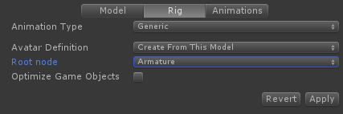
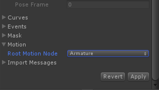

有两种类型的 animations

- In Place
- Root Motion

In Place 动画或者根本不移动 animated character，或者一旦动画完成就重置它的 position。

Root Motion 动画应用相对于世界空间应用 motion。一个 walking 动画应该连续移动 character，即使 animation loop restart。

## Humanoid Root Motion

UMotion 的 Humanoid project 默认总是为 hip bones 开启 root motion，不可能选择别的 bone。

    Root Motion 就是将指定的 “root” bone 在世界空间的 transform 应用到 Animator GameObject 上。可以在 Animation Tab 中的 Motion 中选择一个 root bone。Apply Root Motion 总是确保 root bone 相对于 Animator GameObject 是 identity 和 Vector.zero 的。根据这个锚 anchor 来计算其他 bones 的 transform，保持 pose。

    动画片段记录选择的 root bone 的世界空间曲线，在应用时，将曲线应用到 Animator GameObject 上，同时保持 root bone 相对于 Animator GameObject 静止和 identity。

    Apply Root Motion 就是将 root motion 连续应用到 Animator GameObject 上，即使动画循环重新开始。In Place（不应用 RM）就是不应用 Root Motion 曲线，每个骨骼按照动画片段中记录的数据直接输出，动画循环时，重置所有 bones 到 start 的位置和旋转。

    Bake Into Pose 是保持 root bone identity 来播放动画，即想 Appply Root Motion 一样播放动画，然后调整所有其他 bones，保持 pose 不必，这会调整各个 bones 的 transform，因为它们在动画片段中是独立记录的（在 root 正常运动时记录的），这是一种对动画片段的后处理。然后将这个过程中各个 bones 的 transform 重新记录到动画片段中。这样，即使不应用 Root Motion，也会像应用了一样自然。

    Bake Into Pose 用于将 Apply Root Motion 时的 pose 烘焙到动画片段中，然后在 Not Apply Root Motion 时应用，此时通过其他系统来移动 Animator GameObject（root bone 相对它保持静止和 Identity）。为了动画平滑无缝，Bake Into Pose 需要动画在指定的选项上（Y-Rotation，Y-Position，XZ-Position）是 loop match 的，然后 Loop Pose 将 start 和 end 之间的细微差别分配在整个动画片段上，是首尾完全匹配。

## Generic Root Motion

对于 Generic animations，Root Motion 需要手动开启。Legacy Generic 动画不支持 Root Motion。

为 Root Motion 准备动画模型之前，首先应该完成下列步骤：

- 在 Project window 中找到模型并选择它。确保模型当前没有在 Pose Editor 中使用，因为不然的话选择它是不可能的。Inspector 将显示模型的 import settings
- 打开 Rig tab，并选择应该用于驱动 Root Motion 的 bone/transform 的 Root node。使用在 3D 建模程序中用于驱动 Root Motion 相同的 bone/transform。如果在不同的文件中有现有的动画，也在这里选择相同的 Root node。如果模型还没有 Root Motion，选择一个最适合你的 bone/transform。使用最上层的 bone（通常是 Root，Armature 或 Bip001）或者选择 none。对后一种情况将使用 GameObject 的 root。

  

- 如果你有现有的 Root Motion 驱动的动画，在 import settings 中切换到 Animations tab，然后在 Motion 中选择相同的 bone/transform

  

- 在 UMotion 的 Clip Editor 中，在 model import setting 选择的 bone/transform 需要被设置为 drive root motion。在 Animated Properties List 上打开相应属性的 context menu。点击Root Motion。Root Motion 可以为 position 和 rotation 属性激活。

- Unity 不支持 generic root motion 曲线的 Euler Rotation

## 使用一个 Root Motion Animation

一旦动画导出为 *.anim 文件，它可以和 Unity Animator Controller 一起使用。Animator Controller 上的 Apply Root Motion 需要被开启。
