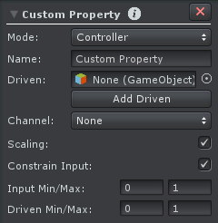
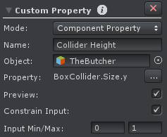

Custom Property 可以添加新的属性到 joint/transform 上。有 3 个操作模式：

- Controller
- Component Property
- Animator Parameter

Custom Properties 出现在 Clip Editor 的 Animated Properties List 和 Pose Editor 的 Channels List。它们可以想任何其他属性一样被 key。

Custom Properties 可以被约束，意味着输入值可以被限制到一个最小值和最大值。一个约束属性在 Channels List 上会显示一个滑动条。

可以为每个 joint/transform 添加多个 Custom Property Constraints，但是名字必须唯一。

## Controller

控制一个或多个现有属性。这允许给现有属性更具描述性的名字，并简化动画，因为多个属性可以被一起控制（在 FK/IK Blend properties 需要被同时一起控制时很有用）。

这个属性驱动一个或多个现有现有属性，但是具有更加描述性的名字和 min-max 约束。

通过开启 scaling 选项，Custom Property 可以使 -1~0 的输入值缩放到 -45~45 用于被驱动的属性。只有 float 属性可以被驱动。

被驱动的属性设置为 read only。它不可以在 Pose Editor Tool 或 Curve View 操作。

| UI | Description |
| --- | --- |
| Name | Custom Property 的名字 |
| Driven | 属性值应该被这个 Custom Property 控制的 joint/transforms 的列表 |
| Channel | 应该被这个 Custom Property 控制的 channel。只支持 float channels。选择的 channel 在被驱动的 joints/transforms 上将被设置为 read-only 的 |
| Scaling | 开启关闭 Custom Property 输入值的缩放 |
| Constrain Input | 开启关闭 Custom Property 输入值的限制 |
| Input Min/Max | 开启 Constrain Input 时可见。定义 Custom Property 的 input 范围。如果 Constrain Input 开启，这个 limit 不能被超越。如果 Scaling 开启，这些值用于缩放（Input min/max value 将映射到 Driven min/max value） |
| Driven Min/Max | 开启 Scaling 时可见，映射到 Input Min/Max |
| | |

## Component Property

Custom Property 用来动画 animated GameObject 上的一个 MonoBehavior Component 的属性。

典型应用是：

- 动画 Blend Shape weight（用于动画面部表情）
- 动画一个 collider size（当蹲下时减少 collider 的高度）
- 动画一个 Light 组件的强度属性，用于一个开火动画

一个组件（或一个 blend shape）的属性只可以被一个 Custom Property 动画。Custom Property 可以被附加到一个和应该被动画的组件完全不同的 joint/transform 上（即在一个 joint/transform 组件上操作另一个 joint/transform 的组件属性）。

在导入包含用于 blend shapes 或 component 属性的曲线的 animation clips 之前，这些属性的 Custom Property 需要被配置。没有相关 Custom Property 的 Curves 将不会被导入。

### Blend Shapes

TODO

### Setup

| UI | Description |
| --- | --- |
| Name | Custom Property 名字 |
| Object | 被动画属性值所在的 object |
| Property | 被动画的属性值 |
| Preview | 开启时，animated component property 的值被写入 Pose Mode。这使得可以在 UMotion 中预览改变。改变在 animated GameObject 不再被 Pose Editor 控制时被恢复 |
| Constrain Input | 开启关闭 Custom Property input value | 
| Input Min/Max | 约束 Custom Property 输入值的范围 |
| | |

## Animator Parameter

Custom Property 用于动画 Animator Controller 上的一个 Parameter。这类似于动画曲线被添加到 model import settings。

## Boolean Curves

float 曲线，0 表示 false，非 0 表示 true。建议显式使用 0 和 1，同时曲线切线模式设置为 Constant。
