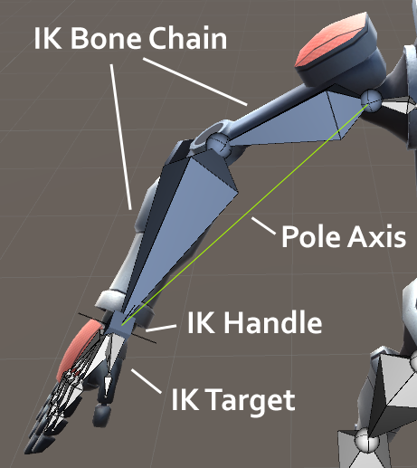
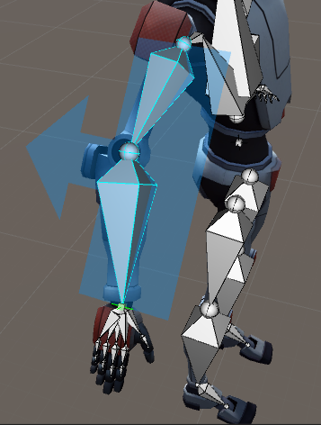
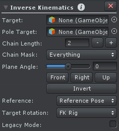

有两种方法在 UMotion 中修改 bones 的旋转。

- 传统的 FK 方法允许直接修改每个 bone 的旋转。这是简单直接定义 poses 的方法
- IK 允许修改一个骨骼链的 end point。例如 hand positino 可以被直接修改，然后 arm 所有的 bones 相应地更新。这导致一个更快的 workflow，但是还允许新的可能性，例如将 hands 粘在世界空间中的一个位置

## Rig Layers

使用 FK 还是 IK 绝大多数情况下依赖于那种方法更合适。UMotion 允许你无缝地在两种方法之间切换。这种功能由 Rig Layers 完成：

FK 和 IK 各有一个 layer。这就像 animated GameObject 有两个骨架，一个被 FK 影响，一个被 IK 影响。每个 IK constraint 有一个开关，可以用来在两个 skeletons 之间平滑地切换。

这不是运行时在 FK 和 IK Pose 之间混合，而是在编辑时，编辑一个 FK Pose，再编辑一个 IK Pose，然后使用一个 weight 在二者之间混合，得到的结果记录到 clip 的 key 中。通常是因为 FK 和 IK 都不能完全直接得到想要的 Pose，因此在两个 rig layer 各定义一个 pose，然后通过在 Editor 中编辑二者的混合来得到满意的 pose。

## 概念

IK Handle 是附加 IK Constraint 的 joint/transform。它控制一个骨骼链的旋转，而骨骼链的 end 就是 IK target。

IK Handle 是 FinalIK 中的 target，是骨骼末端要到达的位置。IK target 是骨骼末端，即 end effector。通过移动 IK handle 移动 IK target，进而移动整个骨骼链。

Pole Axis 是 IK chain 中第一个 bone 的 start 和 target bone 的 start 之间的连线。

IK constraint goal 是旋转 chain 所有 bones 使得 IK target 的 position 和 IK handle 的 position 相同。因此通过在 Pose Mode 中移动 IK handle（所有 Constraint 在 Config Mode 期间关闭），整个 IK chain 将会被自动更新。

IK constraint 使用的 IK solver 是一个 Rotate Plane Solver。这个类型的 solver 尤其容易使用并产生健壮的结果（没有抖动，突然的骨骼运动）。这个算法投影 bone chain 和 IK handle 到一个 2D 平面，并在 2D 空间中应用 IK solving 算法。肘，膝盖等只在 IK plane 箭头指向的方向上弯曲。Bone chain 被选中使得它指向 IK handle 的位置，让 IK target position（末端效应器）匹配 IK handle 的位置。

当配置一个 IK constraint 时，IK plane 应该总是指向肘，膝盖弯曲的方向。Plane 的表面定义了 bones 被 IK 算法完全或拉伸的空间。

IK handle 不能是骨骼链 bone chain 的一个 child（否则就会造成死循环，IK handle 影响 bone chain，bone chain 影响 IK handle）。

IK handle 的 parent 可以被设置为 hips，这样 hands 将会相对于 hips 保持相同的位置。如果 parent 被设置为 animated GameObject 的 root，在 hips 移动时，hands 将不会移动，这样就可以将 hands 钉在一个特定的位置上（对于 climbing 动画很有用）。

每个 joint/transform 只能有一个 IK constraint。

IK Pinning

Child-Of Constraint 可以使用 IK pinning 功能来扩展 Inverse Kinematics Constraint。当 IK handle 被钉住时，它保持在当前位置，即使 rig 的其他部分被移动。当 IK handle 没有 pinned，它和 rig 的剩余部分一起移动。

## Setup

| UI | Description |
| --- | --- |
| Target | 骨骼末端，end effector。应该被 IK Constraint 控制的 joint/transform。IK 将会尝试找到一个方式旋转所有 bones 使得 target joint/transform 位于附加 IK Constraint 的 joint/transform 的相同的位置（尽量）（即 IK handle）|
| Pole Target | 一个可选的 joint/transform 可以被添加为 pole target。通过移动 pole target，可以绕着 pole axis 旋转整个 IK chain，而 IK plane 的箭头总是指向 IK pole target（弯曲方向）|
| Chain Length | 被 IK 影响的骨骼数量。增加这个值会添加 target joint/transform 更多的 parent 到 chain 中 |
| Chain Mask | chain mask 可以用来排除骨骼链中特定骨骼，使其不被 IK solver 影响。这对于排除 twist 或 roll bones 尤其有用。应该类似 FinalIK 中跳过骨骼的功能，跳过的骨骼被认为和上一个没有跳过的骨骼是一体的（刚体）|
| Plane Angle | 应用 IK 算法 的 plane 的角度。这个 plane 应该旋转使它指向 knee，elbow 弯曲的方向 |
| Front/Right/Up | 设置 plane angle 使它相应的方向（快速设置 Plane Angle）|
| Invert | 翻转 plane angle 180 度（快速设置 Plane Angle）|
| Reference | 在 IK Constraint 执行之前，骨骼链上所有 bones 被重置到 reference pose（IK 算法的输入 pose）。IK 算法从那里尝试旋转所有的 bones 使 target joint/transform 到 IK handle 相同的位置。  Reference Pose 对 IK 结果看起来是否自然有极大影响。IK 通常会选择一个最短方式从 reference pose 旋转到 target position。由于这个事实，reference pose 某种程度上还提供给算法一些关于 elbow 和 knee 应该向哪个方向完全的提示。  如果 elbow 或 knee 在应用 IK 时以奇怪的方式旋转，应该在 reference pose 中略微弯曲一下（这是给 IK 算法的输入）。  IK constraint 的 reference 可以是 Config Mode 中设置的 reference pose，或者 FK rig layer 当前的 pose。后者在想要不同的 clips 或一个 clip 中不同的 situations 具有不同 reference poses 时非常有用。它给你对 IK Constraint 的最终结果以极大的控制。|
| Target Rotation | target joint/transform 可以通过复制 IK handle 的 rotation 使得 target 的 rotatin 可以通过 IK handle 旋转改变，或者通过复制 FK rotation 来改变 |
| Legacy Mode | ... |
| | |

## Animated Properties

- FK/IK Blend

  像上面提到的，UMotion 有一个 FK rig layer 和一个 IK rig layer。使用这个属性你可以平滑地调整每个 rig layer 在 mesh 的影响。

  0 意味着 mesh 应该被 FK 100% 影响，1 意味着 mesh 应该 IK 100% 影响。

  这个属性只影响相关的 IK constraint 的 bone chain。如果有多个 IK constraint，blending 必须为它们的每一个调整。一个 Custom Property Constraint 可以被用于一起控制所有 blending properties。

- Pole Rotation

  只在没有 Pole target 时可见。它控制绕着 pole axis 的旋转。
