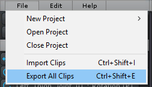

UMotion 可以在 edit mode 或 play mode 中使用。在 play mode 中编辑动画在绝大多数场景中有极大优势：

- 因为动画可以在它被使用的相同场景测试，迭代的次数会大大减少
- 精细调整动画使它完美适合游戏场景和 scene geometry 非常容易

要在 play mode 使用 UMotion，点击 Pause Button 来暂停游戏。

UMotion 现在就可以通过打开一个 project 并在 Pose Editor 中选择一个当前 scene 中的 animated GameObject，来像在 edit mode 中使用了。但是一旦继续 Playing，它的原始值将被恢复。

Play mode 期间的所有 changes 被存储在 UMotion project 中。

在 UMotion 中编辑动画之后，需要点击 File -> Export All Clips 来导出动画。这会自动更新之前导出的动画。新的 clips 将会被立即在当前 play session 中使用。

