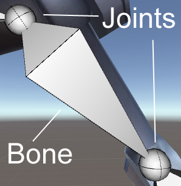

Config Mode 用来配置当前 UMotion project 的 animation rig（bones 的父子关系结构）。

Animation rig 是 animated GameObject 的骨架 skeleton。它包含 bones 和 transforms。每个 bone 在 start 和 end 各有一个 joint。Joints 通常在上下文中也指 bones。

Bones 通常在 3D 建模程序中创建。Bones 操作一个 3D 模型的过程称为 skinned。Skinning 也在 3D 建模程序中完成。这个过程是 mesh 的顶点被绑定在 bone 上（加权）来定义哪个骨骼变形 mesh 的哪个部分。可以在 UMotion 中创建特定骨骼，但是它们不能 skinned，它们称为 transform。

Transform 描述 animated GameObject hierarchy 上的其他 object 的 position，rotation，和 scale。Transform 只影响整个 mesh，而不是它的一部分。
