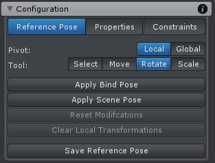

## Reference Pose

Reference pose 描述当没有 key frames 定义时应用到 joints/transforms 的 initial pose（用到动画片段的 pose 数据）。它还可以被用作 IK Constraint 的 reference pose。

Reference Pose 用于定义 FK 和 IK 的初始 Pose。每个 FK key 和 IK key 都基于 Reference Pose。

IK Constraint 需要有一个输入 pose，一个骨骼链，一个 target，一个 end effector，然后产生一个输出（如何旋转骨骼链）。这个 reference pose 就是 IK Constraint 计算的 input pose。FinalIK 这样的运行时 IK 每次总是使用当前帧的动画系统结果作为输入 pose。而 UMotion 是为了编辑动画，因此使用一个静态的 reference pose 作为输入。

以下工具基本代替 Unity 的各种工具。

| UI | Description |
| --- | --- |
| Pivot | pivot mode 改变 move，rotate，scale 工具的 pivot（local and global）|
| Select Tool | select tool 允许选择 joints/transforms。也可以使用其他每个工具选择，但是 select tool 不显示 tool handle。这很有用，因为 tool handle 经常被要选择的 joint/transform 占用。使用左键点击选择一个 joint/transform. <li>点击时按住 Control，之前的选择仍然保留</li><li>点击时按住 Shift，点击的 joint/transform 的所有 children 都被选择</li> |
| Move Tool | 使用 move tool 改变 joint/transform 的位置。Shift 允许 free move mode，可以在所有 3 个维度自由移动 |
| Rotate Tool | 改变 joint/transform 的旋转 |
| Scale Tool | 改变 joint/transform 的 local scale。scale tool 只支持 local pivot mode。通常不使用这个 tool 修改 Joints/Bones，只用来修改 Transforms |
| Apply Bind Pose | 重置所有 bones 到 3D 建模程序中 skinned 时的位置（T-Pose）。Transforms（non-Joint）不被这个功能影响 |
| Apply Scene Pose | 重置所有 bones 和 transforms 到 animated GameObject 在应用到 Pose Editor 之前的 pose（Original Pose）|
| Reset Modifications | 重置选择的 joint/transform 的修改。这会显示一个上下文菜单来选择选中的 jonits/transforms 的哪些属性被重置到之前爆出的 pose（丢弃刚才做的修改）。被修改的 bones 显示为红色 |
| Clear Local/Gobal Transform | 依赖于选择的 pivot mode 将选中的 joints/transforms de  local 或 global transforms 归零。这会显示一个上下文菜单选择哪些 transform properties 应该被清理 |
| Save Reference Pose | 保存当前 pose 为 reference pose。这会保存所有修改 |
| | |