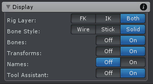

设置 Scene View 中 rig 的可视化效果。可以用于显示和隐藏各种东西。

| UI | Description |
| --- | --- |
| Rig Layer | 显示隐藏 rig layers。有两个 rig layer。FK rig layer 和 IK rig layer |
| Bone Layer | bones/transforms 渲染的风格 |
| Bones | 在 Scene View 中显示隐藏所有 bones |
| Transforms | 在 Scene View 中显示隐藏所有 transforms |
| Names | 在 Scene View 中显式隐藏所有 bones/transforms 的名字 |
| Tool Assistant | 显示隐藏 Tool Assistant。Tool Assistant 是当前选择的 Scene View 中显示的一个小窗口。它为当前选择的工具提供额外信息和输入可能性 |
| | |

输出到动画片段中的 pose 数据在 FK rig layer 和 IK rig layer 混合得到。
