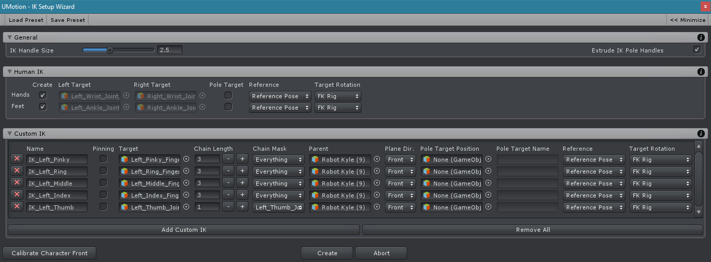
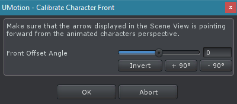
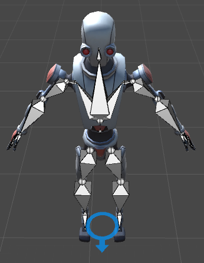

IK Setup Wizard 极大简化了 IK Rigs 的创建。它支持为任何类型角色创建 rigs。为一个 human like 的角色创建一个简单的 IK 尤其简单。

这个 wizard 的所有设置都保存在 UMotion project。可以多次使用 wizard 创建一个 IK rig（通常带有改变的设置）。现有的 transforms 将被更新。如果 names 或 parents 被修改，旧的 transforms 将不会自动删除。

## 校准 Character Front

这个窗口在 IK Setup Wizard 第一次打开时总会显示。为了使 IK Setup Wizard 正常工作，有必要让 wizard 知道从 animated character 的视角，哪个方向是 forward。在 Scene View 中，一个 arrow 显示在 character 的 root position。如果这个 arrow 没有指向 character 视角的 forward，使用 Front Offset Angle 设置让它朝向 forward。

这个对话框可以通过 IK Setup Wizard 窗口中的 Calibrate Character Front 按钮在任何时候访问。

## Menu Bar

可以保存 wizard setting 作为 preset，并在另一个 project 加载这个 preset。这样使用 presets 可以加快 workflow，因为有可能在不同的模型中共享相同的设置。

Presets 保存为 *.assets 文件。确保将它们正确命名，或者放在 presets 目录中，以免和 UMotion project 文件混淆（它也被保存为 *.asset）。

当处理 generic/legacy characters 或者自定义 IK 时，你必须知道 bones 使用它们 **transform hierarchy path** 存储。这意味着当一个 preset 引用 "Root/Hips/UpperLeg"，而 preset 加载时 project 中没有这样的骨骼，将出现一个警告信息，而且指定的 field 将会是空的。

Maximize 按钮用于最大化窗口。

## General

Handle Size 定义作为 IK handles 创建的 transforms 的大小。

当 Extrude Pole Handle 开启时，创建的 pole handles 将会沿着 IK plane 指向的方向轻微 extruded（推挤）。

## Human IK

Human IK 可以用来为 humanoid、generic、和 legacy generic 角色创建一个 IK rig。它自动为 hands 和 feet 创建具有 IK pinning 功能的 IK chains。当 project 是 humanoid 类型，IK targets 被自动检测（Limb：hands + feet）（通过 avatar）。当 project 是 generic 或 legacy generic，有必要手动指定 hand 和 foot bones 到相应的字段。

一个人物动画既可以是 humanoid 的，也可以是 generic 的，都能正常播放。Humanoid 的好处是可以约定一些解剖学的约束，定义在 avatar 中，然后执行一些跟 human 相关的功能，例如 Limb IK 等。还有就是 Animation retargeting。

| Item | Description |
| --- | --- |
| Create | 只为 humanoid project 显示。Enables/disables 相应 IK 配置的创建 |
| Left Target | 应该被 IK 控制的左手或左脚的 joint。在 humanoid projects 中自动创建 |
| Right Target | 应该被 IK 控制的右手或右脚的 joint。在 humanoid projects 中自动创建 |
| Parent | 创建的 IK handles 应该在的 parent |
| Twist Bones | 只为 generic project 显示。出现在 arm/leg hierarchy 中的 twist bones 的数量。一个 twist bone 可以在 lower 或 upper arm/leg 中。<li>None：没有 twist bones</li><li>Lower：lower arm/leg 中一个 twist bone</li><li>Upper：upper arm/leg 中一个 twist one</li><li>Lower And Upper：upper 和 lower arm/leg 各一个 twist bone</li> |
| Pole Target | 开启时，创建一个用作 pole target 的 transform |
| Reference | 应该被 resulting IK constraint 使用的 reference mode |
| Target Rotation | 应该被 resulting IK constraint 使用的 target rotation mode |
| | |

## Custom IK

使用 Custom IK 来定义你自己的不适合 Human IK scheme 的 IK chains。

| Item | Description |
| --- | --- |
| Name | 将为这个自定义 IK 定义创建的 IK handle 的名字 |
| Pinning | 当选中时，一个 Child-Of constraint 被添加到创建的 IK handle 以开启 IK pinning 功能 |
| Target | 应该被 IK constraint 控制的 joint/transform（end effector，末端效应器）|
| Chain Length | 应该被影响的 bones 数量 |
| Chain Mask | 用于排除 chain 中特定 bones 的 chain mask，以免于被 IK solver 影响 |
| Parent | 创建的 IK handle 应该在的 parent |
| Plane Dir | IK plane 应该指向的方向（相对于 character）。这定义应该在哪个方向弯曲膝盖、肘关节等 |
| Pole Target Position |（可选）创建 IK pole target 所在的 joint/transform 位置 |
| Pole Target Name |（可选）被创建的 IK pole target 的名字 |
| Reference | 应该被 resulting IK constraint 使用的 reference mode |
| Target Rotation | 应该被 resulting IK constraint 使用的 target rotation mode |
| | |

