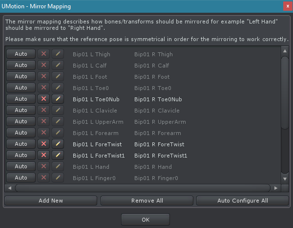

Mirror mapping 定义哪个 bone/transform 应该映射到另一侧的哪个 bone/transform（例如 Right Hand 映射到 Left Hand）。它被 Pose Mode 的 Copy to Other Side 和 Mirror Editing 功能使用。

点击 Rig Hierarchy 的 Mirror Mapping 按钮打开 Mirror mapping 对话框。

当一个新的 GameObject 被应用到 Pose Editor 时会自动创建一个初始 mirror mapping。一个自动 mapping 算法基于 bone/transform hierarchy 完成 mirror mapping。绝大多数时间它能给出很好的结果，但是因为 rig 构成有太多不同的方式，因此这个算法不能为每个模型产生 100% 正确的结果。有时有必要使用 configuration dialog 手动修正 mapping。自动 mapping 功能也可以通过 configuration dialog 使用。

The mirror mapping describes how bones/transforms should be mirrored for example "Left Hand" should be mirrored to "Right Hand". Please make sure that the reference pose is symmetrical in order for the mirroring to work correctly.

Mapping 总是双向的。Humanoid bones 的映射是硬编码的（因此总是正确的）并且不能编辑。

- Auto 按钮

  使用 automatic mapping 算法自动为所有 child bones/transforms 产生 mapping

- X 按钮

  删除 mirror mapping entry

- 铅笔按钮

  打开 dialog 窗口编辑 mirror mapping entry

- Add New 按钮

  打开 dialog 窗口来添加一个新的 mirror mapping entry

- Remove All

  移除所有 mirror mapping entries

- Auto Configure All

  使用 automatic mapping 算法为 UMotion Project 文件中的所有 bones/transforms 生成 mapping

自动 mapping 算法考虑骨骼的名字（left、right）和拓扑结构。
