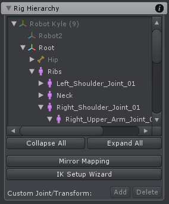
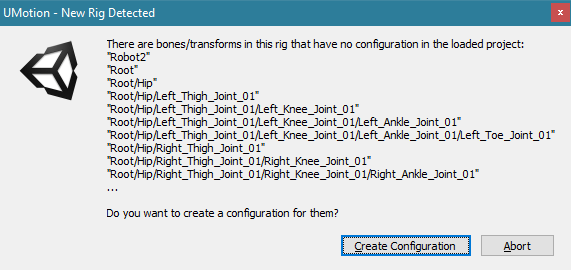

Rig Hierarchy 显示在当前 UMotion project 中配置的所有 joints 和 transforms。

在 Rig Hierarchy 中选择 joint/transform，也会自动在 Scene View 中选中，反之亦然。

- joints 是可以进行 skinning 的 bones
- transforms 是不进行 skinning 的 bones

## 添加一个新的 Rig

每次选择一个具有不在当前 UMotion project 的 joints/transforms 的 animated GameObject 时，会弹出一个消息框：

"There are bones/transforms in this rig that have no configuration in the loaded project: ... Do you want to create a configuration for them?"

所有的 bones/transforms 都使用 hierarchy 路径标识。因此如果换了一个 animated GameObject，只有 bones/transforms 的路径名对的上，就能匹配到相应的骨骼。

点击 Create Configuration，那些 joints/transforms（路径名-> bone）自动添加到 project 中。

## Icon Description

Rig Hierarchy 中有 3 个 icon 表示 3 个类型的 bone：

- 指示一个 transform
- 指示一个 generic joint/bone。Bones 是特殊种类的 transforms，它操作 mesh 的一部分。Generic bones 也可以出现在 humanoid character rigs（骨架）上，但是它们默认是锁定的。在 humanoid projects 中动画 generic bones 是可能的，但是不建议，因为 generic bones 不能 retargeted
- 指示一个 humanoid bone。Humanoid characters 有某种预定义的解剖学。匹配解剖学的 bones 在导出动画时被转换为 muscles。这允许 retargeting 动画，在不同的角色之间共享它们。Humanoid bones 不能被 scaled 或 moved，只能 rotated

## Buttons

- 点击左边的下箭头符号显示或隐藏它的 children。如果同时按下 Alt，所有 child items 一起扩展或收起
- Expand All 和 Collapse All 按钮展开或收起 Rig Hierarchy 中所有的 items
- 点击 Mirror Mapping 按钮，显示 Mirror mapping configuration 对话框
- 点击 IK Setup Wizard，打开 IK 窗口，只需要点击几下就可以创建 IK Rigs
- 点击 Add 按钮，创建一个自定义 joint/transform，作为当前选择 joint/transform 的一个 child。如果多个 joints/transforms 被选择，为每个选择的 joint/transform 创建一个 child
- 点击 Remove 按钮移除自定义 joint/transform。只有自定义 joint/transform 可以移除（即那些通过 Add 创建的 joint/transform）

## Custom Joints/Transforms

自定义 joints/transforms 在 Rig Hierarchy 中显示为浅绿色。它们用来创建高级的 IK Rigs（例如 IK Target，IK Pole）。创建的骨骼就直接在 GameObject 的 Hierarchy 中了，并且它的运动在编辑的 Animation Clip 中被记录。

## Missing Joints/Transforms

如果在 UMotion project configuration 有 joints/transforms 没有出现在当前选择的 animated GameObject（通过 Hierarchy 路径匹配），将会显示一个警告。即动画片段中有相应路径的骨骼的动画数据，但是 animated GameObject 中没有对应的骨骼。如果播放这些动画，这些数据只是被白白读取而已，以为没有相应的骨骼来应用这些数据。另一方面，如果 animated GameObject 的有骨骼，当时在动画中没有相应的数据，这些骨骼就只是不被操作而已，因为没有数据（有骨骼没数据 vs 有数据没骨骼）。

所有在 animated GameObject 没有找到的 joints/transforms 现实为黄色警告。点击 Cleanup 按钮，所有这些未使用的 joints/transforms 以及所有相应 key frames 都被删除。

