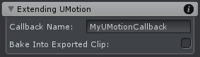

Visuals：所有可视性效果的设置，存储到 project file 中。相同的选项也可以从 Pose Mode 或 Config Mode 中访问。

可以通过定义回调来扩展 UMotion 的功能。这些回调在 animated GameObject 上所有的组件上被自动调用。回调方法在 UMotion 采样 animation pose 之后立即调用，这样允许组件（脚本中回调）覆盖当前 pose。这种方法可以扩展 UMotion 以新的功能，例如一个 Look-At constraint。

GameObject Hierarchy 中更高的 Components 优先调用。

| UI | Description |
| --- | --- |
| Callback Name | 应该被 UMotion 调用的方法名。方法必须声明为 non-static，但可以是 public，protected，或 private。返回类型必须是 void，参数必须为空。派生方法只能声明为 publi 或 protected 的。  <b>C# Example</b> private void MyUMotionCallback() { Debug.Log("Hello World!")； }  这个方法不管是否应用了 ExecuteInEditMode 属性都会被调用，但是 GameObject 必须是 active 的，Component 需要是 enabled 的。但是 Awake()，OnEnable()，Update() 这些方法不会调用 |
| Bake Into Exported Clip | 开启时，callback 方法在 export 过程中也会对 animation clip 的每一帧调用。这样扩展 UMotion 功能脚本的结果被烘焙到 animation clip 中。 Baking 自定义功能到 animation clips减少了运行时 CPU 负载（组件可以从 GameObject 上移除了，即把运行时 constraint 烘焙到 animation clip 中。 这个功能只对 Humanoid project 可用 |
| | |

提示：Custom Property Constraint 中的 Component Property 模式可以用来 animate 扩展 UMotion 的组件的属性。

和 Final IK 集成：如果想在 animation 中使用 Final IK 组件（并或许想烘焙它们的结果到导出得到 animation clip 来减少 CPU 负载），使用 UpdateSolver 作为回调函数名。这个方法被所有 Final IK solver 组件定义，并执行 IK solver 计算。这样在 animated GameObject 上附加的 FinalIK 组件的 UpdateSolver 就会被 UMotion 在每次采样动画 pose 之后被调用。
