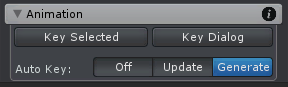
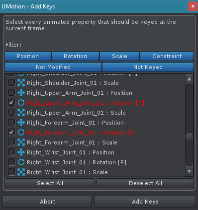

想当前 animation clip 添加 keys 的工具。

## Key Selected

为选择的 joints/transforms 在当前 frame 创建 keys。点击时，出现一个菜单：

| Menu Item | Description |
| --- | --- |
| Key All Modified | 为选择的 joints/transforms 所有被修改的属性添加 keys |
| Key All | 为选择的 joints/transforms 的所有属性添加 keys |
| Key Position | 为选择的 joints/transforms 的所有 position 属性添加 keys |
| Key Rotation | ... |
| Key Scale | ... |
| Key Constraints | 只在选择的 joint/transform 有一个 constraint 时可见 |
| | |

## Key Dialog

打开一个对话框，显示所有动画属性的列表以及过滤选项，来选择应该为哪些动画属性添加 key（time + value）。

过滤选项包括：Position、Rotation、Scale、Constraint、Not Modified、Not Keyed

当一个 filter 被开启，相应的属性在 list 中显式。

### Buttons

| UI | Description |
| --- | --- |
| Select All | 选择 list 中可见的每个动画属性 |
| Deselect  All | ... |
| Abort | 关闭对话框而不添加 keys 到 animation clip |
| Add Keys | 为所有选择的动画属性在当前帧添加 keys 到 animation clip 中，并关闭对话框 |
| | |

## Auto Key

Auto key 在一个属性变化时自动在当前 frame 创建、更新 keys。Changes 可以通过 Scene View 中的 Pose Tools 完成，通过直接在 Channesl View 操作值，或者任何其他操作属性当前值的功能。

| Mode | Description |
| --- | --- |
| Off | 不自动 keying。Keys 需要手动创建和更新 |
| Update | 在当前 frame 自动更新现有 key 的 value（不改变 time）|
| Generate | 在当前 frame 创建一个新 key 或更新现有 key 的 value |
| | |

