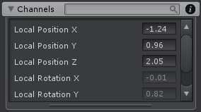

Channels List 显示当前选择的 joints/transforms 的所有 channels。

- Position channels
- Rotation channels
- Scale channels（Transform 系统处理 position/rotation/scale 数据）
- Constraint channels（Constraint 系统处理 constraint 数据）

在上面的 search box 通过名字过滤选择的 joints/transforms 的 channels。

右键点击 channel 名字弹出上下文菜单

| Menu Item | Description |
| --- | --- |
| Reset Channel | 重置 channel（例如 localPosition.x）没有 keyed 的 modification |
| Reset Property | 重置 property 的每个 channel 的没有 keyed 的 modification |
| Zero Property | ... |
| Key Channel | 为点击的 channel 在当前 frame 创建一个 key。这只在 Project Settings 中关闭 Chain Neighbour Keys 时可用 |
| Key Property | 为 property 的每个 channel value 创建 keys |
| Select Property in Clip Editor | 在 Clip Editor 的 Animated Properties Lisst 中选择 property |
| Select Property Keys in Clip Editor | 在 Clip Editor 中选择属性在当前 frame cursor 处的所有 keys |
| | |