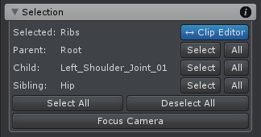

选择 joints 和 transforms 的工具

Joints 和 Transforms 可以通过在 Scene View 或 Unity Hierarchy 中通过点击选择。

Parent，Child，Sibling 旁边的 buttons 可以选择相应的 joint/transform 或全部（例如全部的 parents，全部的 child，全部的 sibling）。

| UI | Description |
| --- | --- |
| Selected | 当前选择的 joint/transform |
| Clip Editor | 开启或关闭 Pose Editor 和 Clip Editor 之间选择的同步。当开启时，在 Clip Editor 中选择 animated properties 将会在 Pose Editor 和 Scene View 中选择相应的 bone/transform。反之亦然，当在 Scene View 或 Pose Editor 中选择一个 bone/transform，相应的动画属性在 Clip Editor 中被选择。动画属性基于当前选择工具被选择 |
| Parent | 选择的 joint/transform 的 parent 名字 |
| Child | ... |
| Sibling | ... |
| Select All | 选择当前 animated GameObject 的所有 joints/transforms |
| Deselect All | ... |
| Focus Camera | 在最后选择的 Scene View 中聚焦选择的 joints/transforms |
| | |
