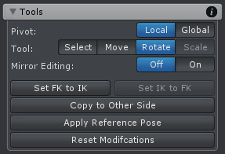

Pose Mode 用于创建动画需要的不同 poses。它包含一组创建 pose 的工具。

这些 tools 用于在 Scene View 中修改 animated GameObject 的 bones/transform，来创建动画需要的不同 poses。

| UI | Description |
| --- | --- |
| Pivot | 参加 Config Mode Configuration Tool |
| Select Tool | ... |
| Move Tool | ... |
| Rotate Tool | ... |
| Scale Tool | ... |
| Mirror Editing | 开启时每个 editing action 自动复制到镜像的另一侧。它使用 Mirror Mapping 定义哪个 bone/transform 映射到另一侧的哪个 bone/transform |
| Set FK to IK | 在 FK rig layer 中选择的 Bones/Transforms 将会被旋转到 IK rig layer 的方向 |
| Set IK to FK | 设置当前选择的 IK handle 到它的 IK target 在 FK rig layer 中的位置和旋转 |
| Copy to Other Side | 复制选择的 bones/transforms 的属性到另一侧镜像的部分。当两侧的 bones/transforms 都被选择，它们的 pose 被交互。这有效地镜像选择的 bones/transforms pose。选择全部 bones/transforms 来镜像完整的 pose |
| Apply Reference Pose | 应用在 Config Mode 配置的 Reference Pose 到选择的 bones/transforms。但如果当前 layer 是 additive 的，position/rotation/scale 值被设置为 0 |
| Reset Modifications | 重置选择 joint/transform 的修改到之前保存的 pose 数据。即丢弃刚才做出的修改 |
| | |
