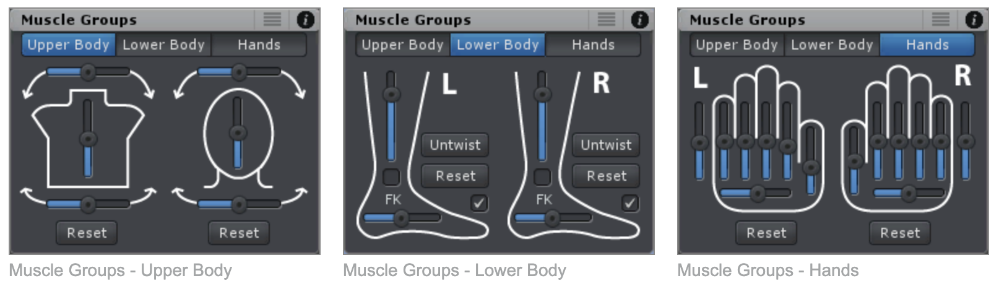
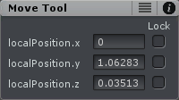
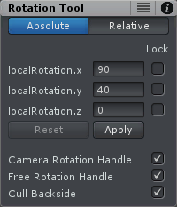
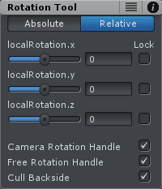
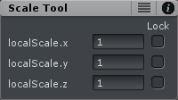

Tool Assistant 是显示在最后或当期选择的 Scene View 中的小窗口。它对 move，rotate 和 scale tool 都可用，并补充了额外的信息和设置。

如果当前 UMotion project 是 humanoid 类型，而没有选择任何 bones/transforms，会显示 Muscle Groups。Tool Assistant 可以在 Pose Editor 的 Displays section 中开启或关闭。

Muscle Groups 就是一组具有运动范围约束的 bones 集合。原始 bones 是没有运动约束的，有约束的 bones 就成为 muscles。

可以通过拖放自由选择 Tool Assistant 窗口的位置。

## Muscle Groups Assistant

Muscle Groups Assistant 在 humanoid projects 中没有任何 bones/transforms 选择时可见。Muscle Group Assistant 分为 3 个 tabs：

### 功能

Muscle 是具有约束的 Bone，Muscle Group 是一组可以通过一个选项同时控制的 Muscle 的集合。

- 每个 slider 同时控制多个 humanoid muscles，使得允许更快更方便的 pose 编辑
- reset buttons 设置相关 humanoid muscles 到 Reference Pose 或最后一个 keyed pose（Reset Modification，丢弃修改）

### Lower Body - Tab

- 对于一些模型，可能需要使用 Untwist 按钮来确保在使用 leg-stretch slider 时更好地弯曲 legs
- checkboxes 可以被用于 钉住 pinning 脚踝 ankle 或脚趾 toes 到地面上。这对让角色蹲下或者绕着脚趾翻滚很有用
- 在 FK 模式，pinning 通过移动 hips 达成，这种移动使 pinned 身体部分保持在相同的地方
- 如果使用 IK，foot roling 通过移动 IK handle 完成，这种移动使 toes 保持在相同的地方
- 请注意 leg（stretch）slider 在 IK 模式不可用。当使用 IK 时要使角色蹲下，确保 IK Handles 是 pinned 的（IK Pinning），然后简单地向下移动 hips

提示：当使用 Muscle Groups Assistant 时，开启 Mirror Editing 来同时编辑两侧

## Move Tool Assistant

Move Tool Assistant 显示选择的 bone/transform 的当前 local 或 global position，依赖当前 Pivot 模式。

checkbox 可以用于锁定这个 axis。这在 Scene View 中关闭那个 axis 的 handle，并使 input field 只读。

## Rotate Tool Assistant

- Relative Mode

  相对于当前 rotation 旋转。可以正确旋转 bone/transform 甚至它在一个 Gimbal Lock 中。

  UMotion UI 中所有的 slider 都可以使用 ESC 来终止改变，并恢复到原始值。

- Absolute Mode

  可以用来设置选择的 bone/transform 的旋转到想要的 euler angle。输入 euler angles 之后，需要点击 Apply 按钮。

  值得注意的是，应用一个 rotation 之后，有可能 3 个值都被更新并显示不同的额值。这在输入的 euler angle 导致一个 Gimbal Lock 时发生。新的值会产生 3D 空间中完全相同的方向。Unity 底层总是使用 Quaternion 表示旋转。

- Other Features

  - checkbox 锁定这个 axis。这会关闭 Scene View 中的那个轴的 axis 并使输入框可读
  - Camera Rotation Handle：它是 rotation handle 外面的白色 ring，并可以用于在当前 camera space（Scene View 视角）中执行一个旋转
  - Free Rotation Handle：它是 rotation handle 内部的白色 ring，可以用于在所有方向上自由旋转
  - Backside Culling：开启时 rotation axis 的 rotation handles 的方面 backside 被剔除 culled

## Scale Tool Assistant

